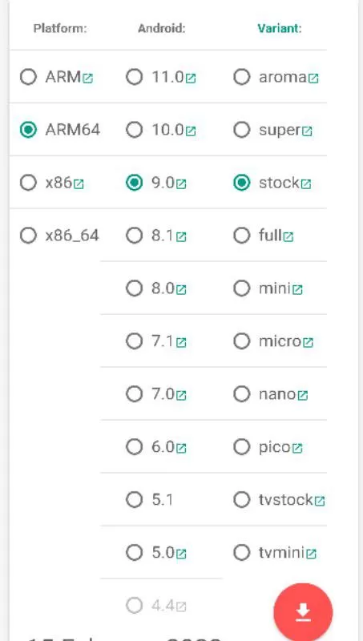
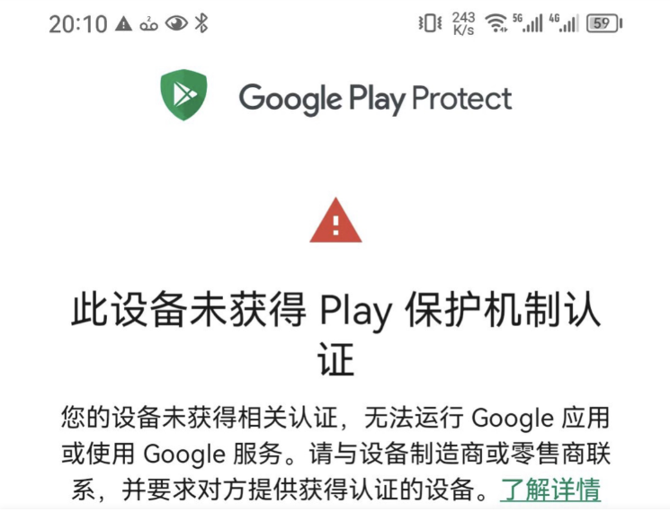
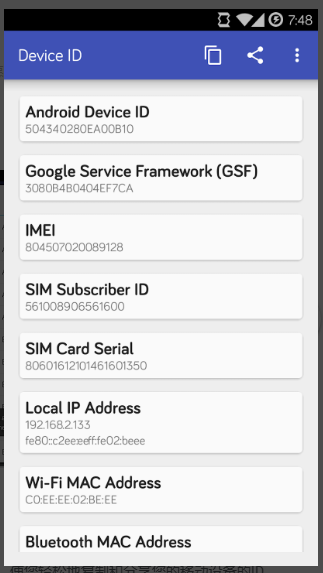
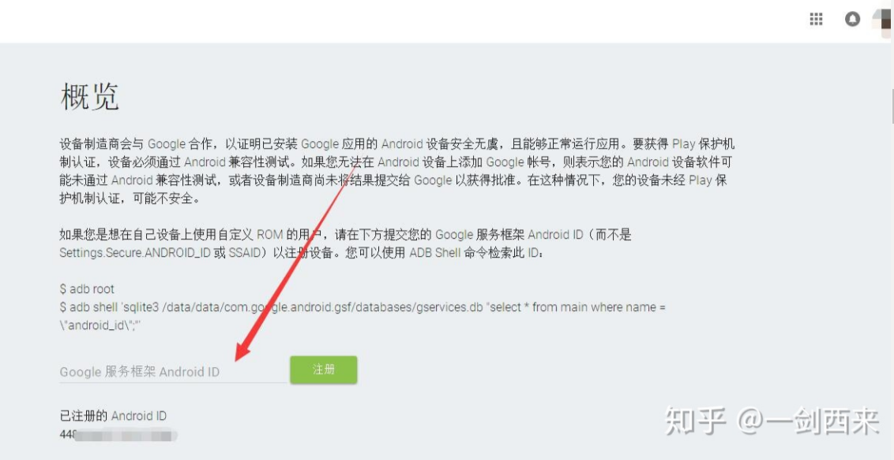

# 安卓设备安装Google框架方法汇总(持续更新)

本文由 `High Ping Network` 的小伙伴 GenshinMinecraft 进行编撰，首发于 [本博客](https://blog.highp.ing)

## 前言
目前，国内手机不内置`GMS`已经是常态，转而使用自家的生态以及服务。

但是总有人需要`Google框架`进行使用，所以就有了以下的安装方法。

请注意，本文教的是`货真价实的Google框架`，不是`MicroG`这种*非官方服务*！

还有，**不root或从Recovery刷入**安装的`Google框架`基本是**废的**，大多数情况为`xxxx 已停止运行`，无法使用！

一般来说，一个*完整可以运行*的`Google框架`至少需要包含以下三件东西：
- Google Services Framework
- Google Play services
- Google Play Store

这三件东西**缺一不可**，且在新版本**无法使用默认的`软件包管理器`进行安装至`/data`目录下**！

所以，请在**Root**/**刷入第三方Recovery**的情况下再查阅以下的文章！

## 第一种方法：Gapps (Recovery)

按道理来讲，使用**第三方Recovery**刷入`Gapps`是最稳定也是最快捷的方法，但是这一方法需要系统的`/system`分区拥有足够的空间，但手机普遍可以刷入一个最小的`pico`

### 1. 寻找适合你的`Gapps`版本

可以按照下面的表格寻找适合你的`Gapps`版本：(本表来源于[Gapps](https://github.com/opengapps/opengapps/wiki/Package-Comparison))

--------分界线--------

|Legend | Description |
|:-------:|------------|
|X      | Installs application by default |
|O      | Replaces the Stock/AOSP version of the application by default |
|\+    | Only installed if Google Calendar is NOT installed |
|4.4   | Application is installed on Android 4.4 only |
|7.1   | Application is installed on Android 7.1 only |

|Application Name    |gapps-config keyword|p i c o|n a n o|m i c r o|m i n i|f u l l|s t o c k|s u p e r|
|:-----------------:|:-------------:|:--:|:--:|:--:|:--:|:--:|:--:|:--:|
|            Google Play Services             |                                   |  X  |  X  |  X  |  X  |  X  |  X  |  X  |
|              Google Play Store              |                                   |  X  |  X  |  X  |  X  |  X  |  X  |  X  |
|             Google System Base              |                                   |  X  |  X  |  X  |  X  |  X  |  X  |  X  |
|              Android Auto stub⁵             |        ``GearheadStub``           |  X  |  X  |  X  |  X  |  X  |  X  |  X  |
|            Google Calendar Sync             |            ``CalSync``            |  X  |  X  | \+  | \+  | \+  | \+  | \+  |
|              Dialer Framework               |        ``DialerFramework``        |  X  |  X  |  X  |  X  |  X  |  X  |  X  |
|            Google Text-to-Speech            |           ``GoogleTTS``           |  X  |  X  |  X  |  X  |  X  |  O  |  O  |
|          Google Package Installer           |    ``PackageInstallerGoogle``     |  O  |  O  |  O  |  O  |  O  |  O  |  O  |
|                   Sounds                    |          ``SoundPicker``          |     |  X  |  X  |  X  |  X  |  X  |  X  |
|           Device Health Services            |         ``BatteryUsage``          |     |  X  |  X  |  X  |  X  |  X  |  X  |
|                Google Markup                |            ``Markup``             |     |  X  |  X  |  X  |  X  |  X  |  X  |
|             Google App (Search)             |            ``Search``             |     |  X  |  X  |  X  |  X  |  X  |  X  |
|            Offline Speech Files             |            ``Speech``             |     |  X  |  X  |  X  |  X  |  X  |  X  |
|          Google Digital Wellbeing           |           ``Wellbeing``           |     |  X  |  X  |  X  |  X  |  X  |  X  |
|              Actions Services²              |        ``ActionsServices``        |     |     |  X  |  X  |  X  |  X  |  X  |
|              Google Calendar¹               |        ``CalendarGoogle``         |     |     |  O  |  O  |  O  |  O  |  O  |
|          Google Exchange Services¹          |        ``ExchangeGoogle``         |     |     |  O  |  O  |  O  |  O  |  O  |
|                    Gmail                    |             ``Gmail``             |     |     |  X  |  X  |  X  |  O  |  O  |
|            Google Now Launcher²             |           ``GoogleNow``           |     |     | 4.4 | 4.4 | 4.4 | 4.4 | 4.4 |
|                 Pixel Icons                 |          ``PixelIcons``           |     |     | 7.1 | 7.1 | 7.1 | 7.1 | 7.1 |
|               Pixel Launcher²               |         ``PixelLauncher``         |     |     |  O  |  O  |  O  |  O  |  O  |
|              Google Wallpapers              |          ``Wallpapers``           |     |     |  O  |  O  |  O  |  O  |  O  |
|             Google Calculator¹              |       ``CalculatorGoogle``        |     |     |     |  O  |  O  |  O  |  O  |
|              Carrier Services               |        ``CarrierServices``        |     |     |     |  X  |  X  |  X  |  X  |
|                Google Clock¹                |          ``ClockGoogle``          |     |     |     |  O  |  O  |  O  |  O  |
|                 Google Maps                 |             ``Maps``              |     |     |     |  X  |  X  |  X  |  X  |
|              Google Messages¹               |           ``Messenger``           |     |     |     |  O  |  O  |  O  |  O  |
|                Google Photos                |            ``Photos``             |     |     |     |  X  |  X  |  O  |  O  |
|                Google Tags¹                 |           ``TagGoogle``           |     |     |     |  O  |  O  |  O  |  O  |
|                   YouTube                   |            ``YouTube``            |     |     |     |  X  |  X  |  X  |  X  |
|              Google Play Books              |             ``Books``             |     |     |     |     |  X  |  X  |  X  |
|                Google Chrome⁴               |            ``Chrome``             |     |     |     |     |  X  |  O  |  O  |
|                 Cloud Print                 |          ``CloudPrint``           |     |     |     |     |  X  |  X  |  X  |
|                Google Drive                 |             ``Drive``             |     |     |     |     |  X  |  X  |  X  |
|              Google Keep Notes              |             ``Keep``              |     |     |     |     |  X  |  X  |  X  |
|           Google Play Movies & TV           |            ``Movies``             |     |     |     |     |  X  |  X  |  X  |
|              Google Play Music              |             ``Music``             |     |     |     |     |  X  |  X  |  X  |
|                 Google News                 |           ``Newsstand``           |     |     |     |     |  X  |  X  |  X  |
|              Google Play Games              |           ``PlayGames``           |     |     |     |     |  X  |  X  |  X  |
|         Google Accessibility Suite          |           ``TalkBack``            |     |     |     |     |  X  |  X  |  X  |
|               Google Recorder               |           ``Recorder``            |     |     |     |     |  X  |  X  |  X  |
|                Android Auto                 |          ``AndroidAuto``          |     |     |     |     |     |  X  |  X  |
|               Google Camera¹                |         ``CameraGoogle``          |     |     |     |     |     |  O  |  O  |
|              Google Contacts¹               |        ``ContactsGoogle``         |     |     |     |     |     |  O  |  O  |
|                Google Phone²                |         ``DialerGoogle``          |     |     |     |     |     |  X  |  X  |
|                 Google Duo                  |              ``Duo``              |     |     |     |     |     |  X  |  X  |
|                 Google Pay                  |           ``GooglePay``           |     |     |     |     |     |  X  |  X  |
|              Google Keyboard¹               |        ``KeyboardGoogle``         |     |     |     |     |     |  O  |  O  |
|     Google Print Recommendation Service     |      ``PrintServiceGoogle``       |     |     |     |     |     |  O  |  O  |
|            Google Smart Storage             |     ``StorageManagerGoogle``      |     |     |     |     |     |  O  |  O  |
|              Google Translate               |           ``Translate``           |     |     |     |     |     |  X  |  X  |
|             Google VR Services              |           ``VRService``           |     |     |     |     |     |  X  |  X  |
|           Android System Webview¹⁴          |``WebViewGoogle`` ``WebViewStub``³ |     |     |     |     |     |  O  |  O  |
|               Better Together               |        ``BetterTogether``         |     |     |     |     |     |     |  X  |
|          Google Apps Device Policy          |            ``DMAgent``            |     |     |     |     |     |     |  X  |
|                 Google Docs                 |             ``Docs``              |     |     |     |     |     |     |  X  |
|                Google Earth                 |             ``Earth``             |     |     |     |     |     |     |  X  |
|                 Google Fit                  |            ``Fitness``            |     |     |     |     |     |     |  X  |
|        Google Connectivity Services         |              ``GCS``              |     |     |     |     |     |     |  X  |
|               Google Hangouts               |           ``Hangouts``            |     |     |     |     |     |     |  X  |
|            Google Indic Keyboard            |             ``Indic``             |     |     |     |     |     |     |  X  |
|            Google Japanese Input            |           ``Japanese``            |     |     |     |     |     |     |  X  |
|             Google Korean Input             |            ``Korean``             |     |     |     |     |     |     |  X  |
|             Google Pinyin Input             |            ``Pinyin``             |     |     |     |     |     |     |  X  |
|                 Project Fi²                 |           ``ProjectFi``           |     |     |     |     |     |     |  X  |
|                Google Sheets                |            ``Sheets``             |     |     |     |     |     |     |  X  |
|                Google Slides                |            ``Slides``             |     |     |     |     |     |     |  X  |
|             Google Street View              |            ``Street``             |     |     |     |     |     |     |  X  |
|             Google Zhuyin Input             |            ``Zhuyin``             |     |     |     |     |     |     |  X  |

--------分界线--------

一般来说，选择`pico/nano/micro`版本已经足够，更大的版本不仅是`/system`装不下，而且也很多冗余的物品！

### 2.下载你所需版本的刷机包

前往着一个网址：<https://opengapps.org/>

在图中选择你设备的`架构(一般为ARM64)`、`安卓版本`、`你所需要的Gapps的版本`

然后点击`下方的下载图标`，就可以跳转到<sourceforge.net>进行下载了！

### 3.从第三方Recovery刷入(例TWRP)

由于Rec模式不好截图，这里就用文本描述！

重启至`Recovery`，按照普通方式在`安装/Install`模式下选择保存在手机内的`Gappsxxx.zip`即可！

### 4.重启 享受谷歌服务

刷入完成后重启即可，一开机就会发现有**标准的谷歌服务以及套件**了！

## 第二种方法：LiteGapps (Magisk模块)

`LiteGapps`是一个`Gapps`的分支，其拥有比原版`Gapps`更小的体积，但是功能也一点没有减少

其官网为：<https://litegapps.site/>

`LiteGapps`模块在[Magisk资源分享](https://magisk.suchenqaq.club/)网站上有分享，可以通过下面的链接下载模块并安装：

[LiteGapps模块(来自于Magisk资源分享)](https://downloads1.suchenqaq.club/magisk_module/tool/[MAGISK]LiteGapps%20%20_v2.3_official.zip)

详细的模块安装方法就*不介绍*了，安装完重启即可享受**标准的谷歌服务以及套件**！

## 附：解决`Google Play 设备未获得Play保护机制认证`

在一些*冷门或是国产设备*上使用上述方法安装`Google 框架`时，会出现`Google Play 设备未获得Play保护机制认证`这一提示：

### 1.安装DeviceID

在 [Google Play](https://play.google.com/store/apps/details?id=com.evozi.deviceid&hl=zh) / [Apkpure](https://apkpure.com/store/apps/details?id=com.evozi.deviceid&hl=zh) / [本站](https://c1oudf1are.link/com.evozi.deviceid_1.3.2-8_minAPI14(nodpi).apk) 任选一个**你可以访问**的地址下载

随后**安装并打开**即可

### 2.获取GSFID

如图，在第二行的`Google Service Framework (GSF)`中获取你自己设备的**独一无二的**ID！

复制保存下来，下一步**需要用到**！

### 3.注册ID

前往 <https://www.google.com/android/uncertified/>

登入你的`Google账户`，并输入你上面获取的`GSFID`:(图来自知乎)

点击`注册`，等待一会即可！

### 重置Google Play数据

进入 **系统设置-软件-Google Play-储存空间-清除数据** ，确认后*重启设备*，就可以正常使用`Google Play`了！

## 小结

安装过程挺简单的，希望大家都能用上Google 框架！

如有问题，可以来 Telegram:[@C1oudF1are](https://t.me/C1oudF1are) 找我，免费咨询任何我所知道的问题！

欢迎加入 High Ping 大家庭:
- [官网](https://highp.ing)
- [Blog](https://blog.highp.ing)
- [@HighPingNetwork](https://t.me/HighPingNetwork)
- [@HighPingChat](https://t.me/highpingchat)