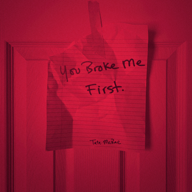
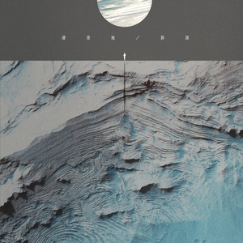
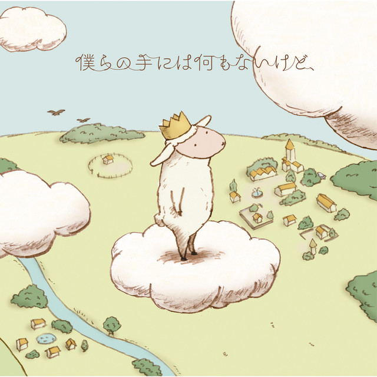

# 🎵音乐推荐🎵

本文由 `High Ping Network` 的小伙伴 GenshinMinecraft 进行编撰，首发于 [本博客](https://blog.highp.ing)

## 前言

虽然说是音乐推荐，其实就是**我的歌单**啦！

我的口味*很复杂*，啥歌曲*都听*

下面推荐的也是我每天**单曲循环必备**的音乐

在每一首歌曲的下方都会配上**试听链接**与**个人评价**，很*主观向*的哦！

## 推荐

### You Broke Me First

> "You broke me first, oh"

`《You Broke Me First》`是加拿大歌手`Tate McRae`创作的一首歌。是一位好友将其发在一个群内，听完马上感到**舒适**的歌曲

很适合**单曲循环**，比如我写*这篇博客*的时候就在**循环**

而且，他还有一种~~BUFF加成~~**神奇的功效**：**单曲循环时让你干啥效率都变高！**

这也是我每天**不听这首歌就难受**的原因

所以，你应该知道为什么本文的副标题为`You Broke Me First YYDS!`了吧

试听链接：

<https://blog.highp.ing/p/greatmusic/YouBrokeMeFirst.mp3>

### 凄美地

> "嘿 等我找到你

> 试探你眼睛

> 心无旁骛地 相拥

> 那是我 仅有的温柔也是我爱你的原因"

`《凄美地》`我相信你们都应该听过，毕竟是近期短视频的`网红歌曲`，是`郭顶`创作的一首收录于`《飞行器的执行周期》`的歌曲

不知道怎么评价，总之算是华语里面**比较好听**也**比较耐听**的了

也是我**听过次数最多的中文歌**，没有之一

试听链接：

<https://blog.highp.ing/p/greatmusic/凄美地.mp3>

PS：`《飞行器的执行周期》`里面的歌曲都挺好听的，譬如`《水星记》`，与`《凄美地》`齐名

### 僕らの手には何もないけど、 (儘管我們的手中一無所有)

很好听的一首**治愈系**歌曲，出自`RAM WIRE`

~~治愈死我了~~

说来第一次听见这首歌，还是填词

当年菜鸟：<https://www.mcbbs.net/forum.php?mod=viewthread&tid=942232>

一首MC拜年祭的曲子，原曲就是`《僕らの手には何もないけど》`

试听链接：

`《僕らの手には何もないけど》`：<https://www.youtube.com/watch?v=TXpGWhdwXuo&list=WL&index=15>

`《当年菜鸟》`：<https://blog.highp.ing/p/greatmusic/当年菜鸟.mp3>

### 都选C

> 为梦想灼伤了自己

> 也不要平庸的喘息

> 我要的并不在这里

> 你给的答案没意义

`《都选C》`是由`赵英俊`作词作曲，`大鹏`演唱的歌曲，歌曲电影MV由`缝纫机乐队`演唱

它出自于电影[`《缝纫机乐队》`](https://baike.baidu.com/item/%E9%83%BD%E9%80%89C/22140063)的音乐，我很喜欢这部电影，更喜欢里面的这首歌

这首歌曲，里面**致敬了**很多*摇滚乐团以摇滚音乐*：
- 前奏和主歌部分伴奏是`涅槃`的`《come as you are》`；
- 副歌部分伴奏采用的是`枪花`的`《Sweet Child O‘ Mine》`；
- 间奏和尾奏的riff是`林肯公园`的`《paper cut》`。

其作词也是非常厉害的，毕竟是`赵英俊`写的。

它的电影也是很好看的，讲的摇滚，可以去看一下啦！

再次缅怀赵英俊！

试听链接：https://www.youtube.com/watch?v=7vgE9WHYf8M

## 未完待洗

## 小结

这个列表将会永远更新，一直存放我喜欢的歌曲，也可以不定期来看一眼，补充一下自己的音乐列表！
