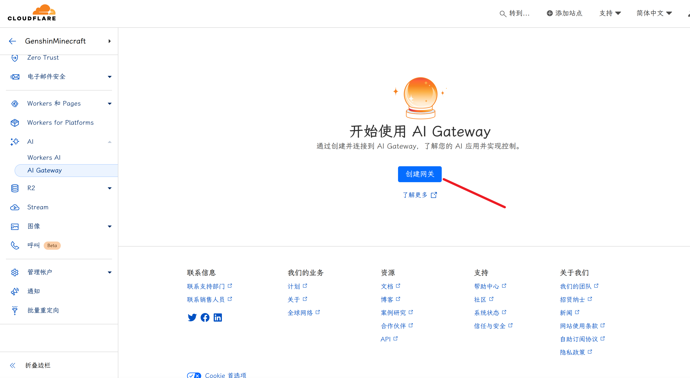
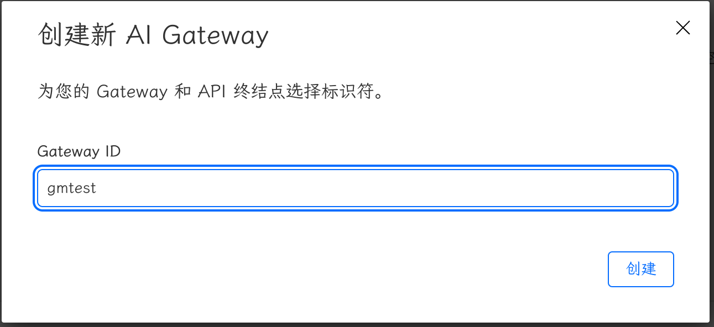
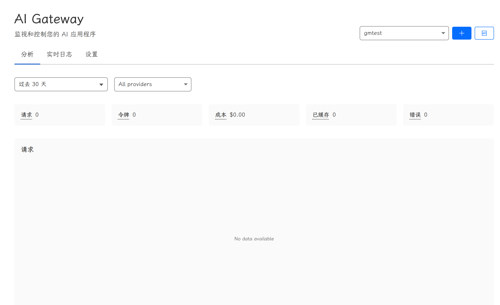
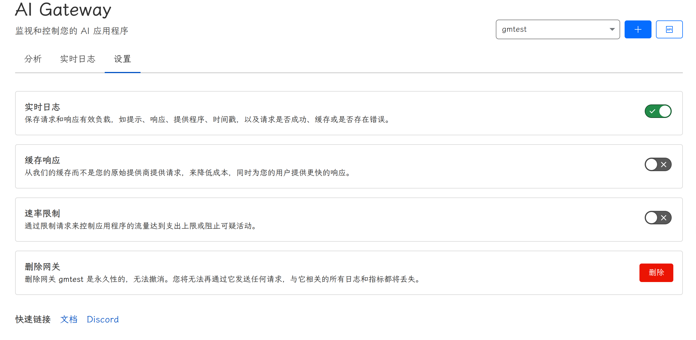
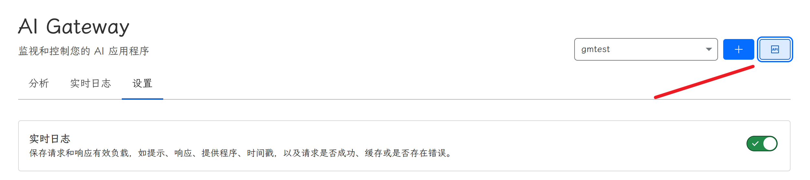
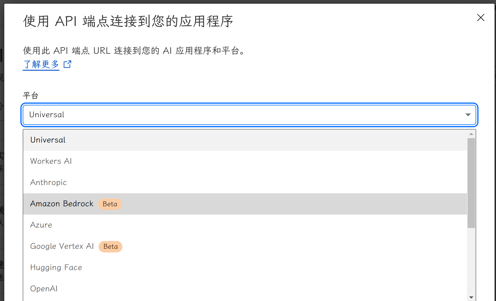
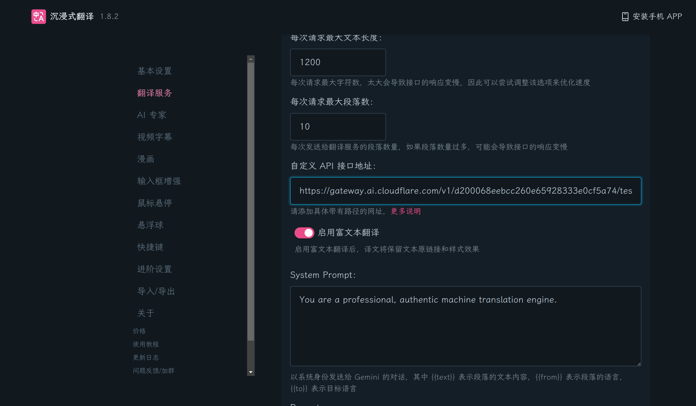
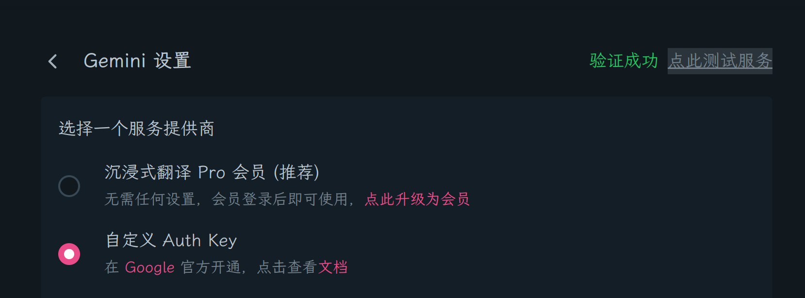
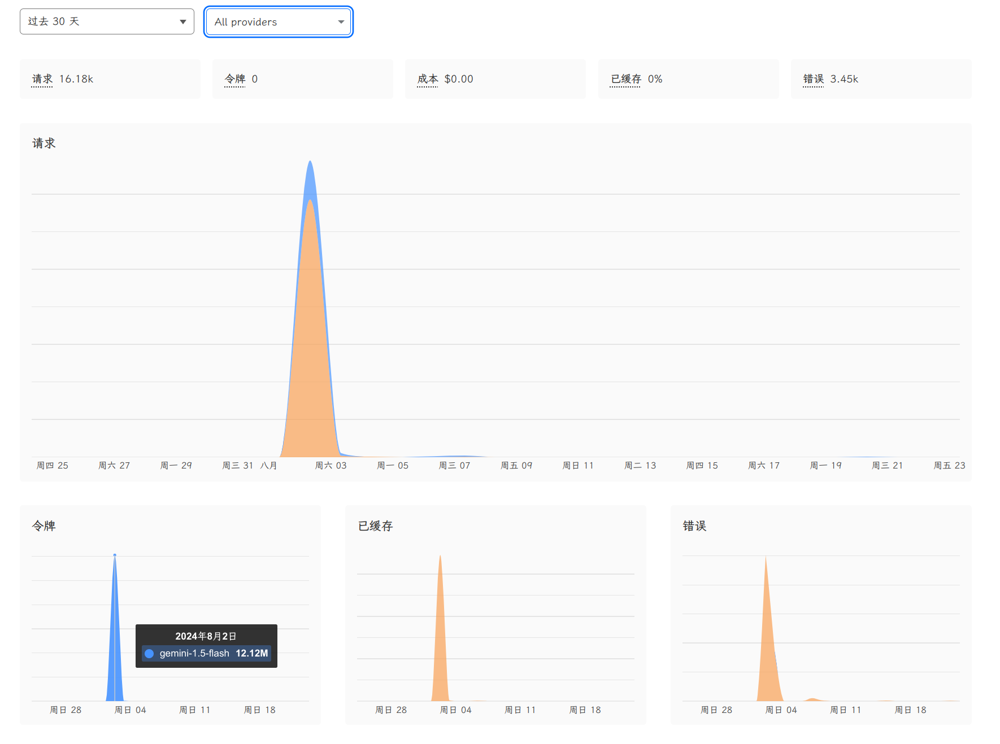
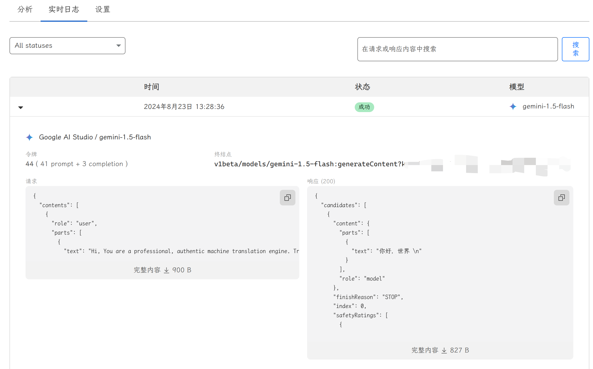

# 初探 Cloudflare AI Gateway

本文由 `High Ping Network` 的小伙伴 GenshinMinecraft 进行编撰，首发于 [本博客](https://blog.highp.ing)

## 前言

最近 Cloudflare 大爹推出了许多和 AI 有关的东西，这次就来玩玩 AI Gateway

AI Gateway 其实就是**把多个 AI 服务商提供的服务整合成一个 API 里面**，并提供相当不错的**可视化检测**，实时记录*请求 / 返回*与消耗的 Tokens 等信息

现在已经支持了下面的 AI 云服务商: (From [Cloudflare Docs](https://developers.cloudflare.com/ai-gateway/providers/))

- Amazon Bedrock
- Anthropic
- Azure OpenAI
- Cohere
- Google AI Studio
- Google Vertex AI
- Groq
- HuggingFace
- Mistral AI
- OpenAI
- Perplexity
- Replicate
- Universal Endpoint
- Workers AI

需要注意的是，AI Gateway 其实就是各个服务商的 AI API 的代理，与源服务商 AI API 的请求 / 返回内容是一样的

当然，虽然是代理，但是源服务商封禁的地区依旧无法正常使用

还有，目前尚不支持自定义端点，如果有第三方服务商 API 需求可能并不适用于 AI Gateway

## 创建 AI Gateway

创建非常简单，仅需要在 [Cloudflare Dashboard](https://dash.cloudflare.com) 的侧边栏找到 `AI-AI Gateway` 即可: 



名字可以随意填写，建议是使用较好记忆的名称: 



随后，创建即可: 



## 设置

你可能会需要先去设置一些东西:



- 实时日志: 最重要的功能，*非常建议开启*

- 缓存响应: 当请求内容与之前的请求相同时，则直接返回之前的请求的相应，而不返回源服务商。这对于一些翻译类的程序可能有用，*自行选择*

- 速率限制: 为了防止触发源服务商的各种检测，建议开启 (如个人使用可关闭)

请根据自身情况设置！

## 获取 API 地址

你可以在该界面的左上角查看基本 API 调用方法:





该界面可以选择你所需要的 AI 云服务商，常用的有 Azure / Google AI Studio / OpenAI 等

如果你并不是开发者，则不用理会下面的代码示例，仅需要记住上方的 **API 端点** 即可

API 端点一般由下面的格式组成: 

```url
https://gateway.ai.cloudflare.com/v1/{Cloudflare Account ID}/{上方设置的 AI Gateway 名字}/{AI 服务商}
```

## Demo: 沉浸式翻译

这里以沉浸式翻译 + Google AI Studio 作为例子:



在沉浸式翻译的 `自定义 API 接口地址` 中，替换原来的地址为:

```url
{你的 AI Gateway URL}/google-ai-studio/v1beta/models/{model}:generateContent?key={key}
```

随后测试并保存，只要显示 `验证成功` 即可: 



请注意: 你不需要改动任何其他的设置 (包括但不限于 API Token 等)，**仅需要改动自定义接口地址即可**

## 接入其他客户端

同理，你可以用 Cloudflare 提供的 URL 接入任何可自定义 API 端点的服务，比如 LobeChat / NextChat 等

如果你是一名开发者，也可以直接在代码里自定义端点，**所有的调用方式与源 API 无异**

## 在后台查看调用数据

用 AI Gateway 的一大好处就是可以实时查看使用者的调用情况:



在这里，你可以看到任何时间下所有 AI 服务提供商的调用情况 (比如某天我用了 12.12M Tokens 来翻译东西)

也可以在实时日志查看每一个请求的详细信息: 



## Universal 使用

小白用户可以止步于此了


Universal Endpoint 可以保证服务的稳定性: 


当第一个请求返回错误时，则使用第二个请求; 当第二个请求返回错误时，则使用第三个请求......


每一个请求都可以使用 不同的服务商 / 不同的模型 / 甚至是不同的问题


听起来很高大上，其实就是一个个备份，对于稳定性要求非常高的服务还是有用的


他的请求大概类似于: 

```json
[
  {
    "provider": "workers-ai",
    "endpoint": "@cf/meta/llama-3.1-8b-instruct",
    "headers": {
      "Authorization": "Bearer {cloudflare_token}",
      "Content-Type": "application/json"
    },
    "query": {
      "messages": [
        {
          "role": "system",
          "content": "You are a friendly assistant"
        },
        {
          "role": "user",
          "content": "What is Cloudflare?"
        }
      ]
    }
  },
  {
    "provider": "openai",
    "endpoint": "chat/completions",
    "headers": {
      "Authorization": "Bearer {open_ai_token}",
      "Content-Type": "application/json"
    },
    "query": {
      "model": "gpt-4o-mini",
      "stream": true,
      "messages": [
        {
          "role": "user",
          "content": "What is Cloudflare?"
        }
      ]
    }
  }
]
```

差不多就是:

1. 向 Workers AI 提问 `What is Cloudflare?`，如果返回正常则直接返回

2. 如果 Workers AI 出现错误，则转到 OpenAI 提问


就这样吧，要使用到还是很少的


## 小结

如果你是个人使用且用量不大，则这个 AI Gateway 没有什么用处


如果有大项目需要使用，那还是有点用的


赞美大爹！


欢迎加入 High Ping 大家庭:                                                                                                  

- [官网](https://highp.ing)                                                                                                 

- [Blog](https://blog.highp.ing)                                                                                            

- [@HighPingNetwork](https://t.me/HighPingNetwork)                                                                          

- [@HighPingChat](https://t.me/highpingchat)
