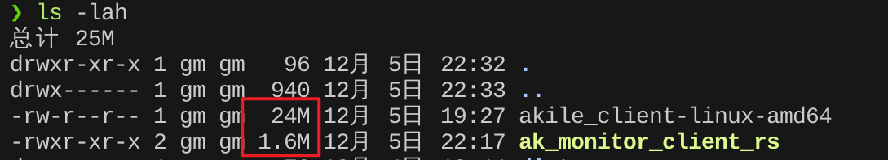

# 第三方 Akile Monitor 监控端使用

本文由 GenshinMinecraft 进行编撰，首发于 [本博客](https://blog.c1oudf1are.eu.org/)

## 前言

又是一日闲来无事，看见了 Akile 出了自家的监控面板，本着 能用[现成项目](https://blog.c1oudf1are.eu.org/p/nezha-agent-rs/)改的东西就一定要写 的原则，写了个第三方 [Akile Monitor 监控端](https://github.com/GenshinMinecraft/ak_monitor_client_rs)

## 与原版比较

既然是重写，那就必须有比原版好的地方

测试环境均为 `Redmi Book Pro 15 锐龙版 + Arch Linux`

### 空间占用



上为原版，下为重写的 Rust 版本

可见 Binary 的占用两者相差约 **15** 倍 ~~(其实我也不太知道原版作为一个监控端是怎么编译出来 24M 的)~~

### 内存占用

- 原版
    

- 重写的 Rust 版本
    

可见，原版占用约为 `18MiB`，重写的 Rust 版本占用约为 `4MiB`

两者相差约 4.5 倍，虽然这点内存对于一个正常的小鸡来说无伤大雅，但能少一点就少一点

PS: Arm64 架构内存更少，约 `1.76MiB`，

### 便于配置

原版的配置十分麻烦 (即使有一键脚本)，需要手动配置 `client.json` 来指定连接的主端

而使用重写的 Rust 版本，则只需要在命令行上设置即可，Demo:

```bash
./ak_monitor_client_rs -s 192.168.111.1:3090 -a GenshinMinecraft
```

### 功能更多

- 美观输出:
    原版仅有最普通的控制台输出，而 Rust 版本则使用了丰富的 `log` 库来优化输出 ~~(虽然也没多少人看)~~
- 虚假倍率:
    你是否想让你的小鸡拥有顶天立地的算力？虚假倍率来助你:
    
    - 总物理内存
    - 总 Swap 内存
    - 已用物理内存
    - 已用 Swap 内存
    - 网络进出总量
    - 网络进出速度
    - Load 1 / 5 / 15
    
    以上的这些都可以随心所欲地自定义倍率，拳打太湖之光，脚踢前沿
- 自定义间隔时间: 这个功能我觉得是没啥用的，但是还是加上了。也就是自定义数据上报的间隔
- 自动获取主机名: 懒得填写主机名？这功能能帮你自动获取主机的 Hostname
- 自动重连: 原版只要连不上主端，就会直接退出，Rust 版即使断连也会在五秒之后自动尝试重连

## 安装

首先，请先来到本项目的 [Action](https://github.com/GenshinMinecraft/ak_monitor_client_rs/actions) 界面: (下载要登录 Github 账户)


进入最新的自动构建，向下翻找:


在这里，请找到你的被控主机的系统与架构，并下载其压缩包

最后，解压并上传至被控主机，并赋予可执行权限即可:

```bash
chmod +x ak_monitor_client_rs
```

## 使用

可以通过 `--help` 参数输出以下的帮助信息:
```help
Akile Monitor Rust Client

Usage: 

Options:
  -n, --name <NAME>                主机名，将展示在面板上，默认为本机 Hostname [default: GenArch]
  -s, --server <SERVER>            主端地址，需要 ip:port (Demo: 192.168.111.1:3000)
  -a, --auth-secret <AUTH_SECRET>  在主端设置的 Auth Secret
  -i, --interval <INTERVAL>        采集间隔，单位为毫秒 (不建议低于 1000ms 与高于 5000ms) [default: 1000]
  -f, --fake-times <FAKE_TIMES>    虚假倍率 (随手改一改，全世界算力都在你手上) [default: 1]
      --debug                      Debug 日志输出
      --tls                        开启 TLS 支持 (未支持)
  -h, --help                       Print help
```

- `--name`： (非必须，建议设置) 主机名，将展示在面板上，默认为本机 Hostname
- `--server`： (必须) 主端地址，需要 ip:port (Demo: 192.168.111.1:3000)
- `--auth-secret`： (必须) 在主端设置的 Auth Secret
- `--interval`： (非必须，不建议设置) 采集间隔，单位为毫秒 (不建议低于 1000ms 与高于 5000ms)
- `--fake-times`： (非必须，不建议设置) 虚假倍率 (随手改一改，全世界算力都在你手上)
- `--debug`： (非必须) Debug 日志输出
- `--tls`： (非必须，未支持) 开启 TLS 支持
- `--help`： 查看帮助


### 最简单的使用方法: 

下列例子均以 `GenshinMinecraft` 为 Auth Secret 连接至 `192.168.111.1:3090` 为例

- 连接，并自动获取主机名:
```bash
./ak_monitor_client_rs -s 192.168.111.1:3090 -a GenshinMinecraft
```

- 连接，并设置主机名为 `GenArch`:
```bash
./ak_monitor_client_rs -s 192.168.111.1:3090 -a GenshinMinecraft -n GenArch
```

- 连接，并设置设置虚假倍率为 `2`:
```bash
./ak_monitor_client_rs -s 192.168.111.1:3090 -a GenshinMinecraft -f 2
```

- 连接，并设置上报间隔时间为 `2400ms`: 
```bash
./ak_monitor_client_rs -s 192.168.111.1:3090 -a GenshinMinecraft -i 2400
```

- 连接，并设置上报间隔时间为 `2400ms`，设置设置虚假倍率为 `2`，设置主机名为 `GenArch`:
```bash
./ak_monitor_client_rs -s 192.168.111.1:3090 -a GenshinMinecraft -n GenArch -f 2 -i 2400
```

## 保活

目前，大部分 Linux 发行版均已经使用 SystemD 作为 Pid 1，所以本文只使用 SystemD

用你喜欢的编辑器打开 `/etc/systemd/system/akile_monitor_client.service`

填入: 
```
Description=Cloudflare Speedtest Slave
After=network.target

[Install]
WantedBy=multi-user.target

[Service]
Type=simple
ExecStart=/path/to/ak_monitor_client_rs -s 192.168.111.1:3090 -a GenshinMinecraft 
Restart=always
```

随后重载并开启本服务即可:
```bash
sudo systemctl daemon-reload
sudo systemctl enable --now akile_monitor_client
```

这样便完成了安装保活

## 结语


感谢你能看到这里，这是对一位开源工作者的最大之境，也希望本项目能帮到你

就这样吧 Thanks