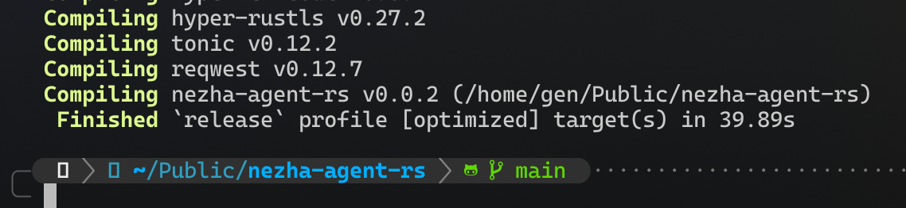

# Unihiker 行空板 M10 测评

本文由 GenshinMinecraft 进行编撰，首发于 [本博客](https://blog.c1oudf1are.eu.org/)

## 前言

> 行空板是一款拥有自主知识产权的国产教学用开源硬件，采用微型计算机架构，集成LCD彩屏、WiFi蓝牙、多种常用传感器和丰富的拓展接口。同时，其自带Linux操作系统和python环境，还预装了常用的python库，让广大师生只需两步就能开始python教学。

官网简介: <https://www.unihiker.com.cn/products/m10>

简而言之，就是国产 Linux 开发板，用于中小学生创客类型比赛，官方售价 399RMB

话不多说上配置:

- CPU: RK3308 Aarch64 4Cores 1.2Ghz
- 内存: 512MB D3
- 硬盘: 16GB EMMC
- WIFI & Bluetooth: RTL8723DS (2.4G & 4.0)
- 用于IO通信的单片机: GD32VF103C8T6 RISC-V 108MHz & 64KB Flash & 32KB SRAM
- 实体按键: x3
- 屏幕: 2.8inch 240x320 可触控 彩屏
- 麦克风: 电容硅
- 光线传感器: PT0603
- 蜂鸣器: 无源
- L灯: 蓝色LED
- 六轴传感器: ICM20689
- USB Type-C: x1 (供电 / 数据)
- USB TYPE-A: x1 (数据 / 外设)
- microSD: x1
- 3Pin I/O: x4
- 4Pin I/O: x1

## 体验

板内直接运行的是 Debian 10 Linux 系统，并集成了 `SIot`、`Jupyter` 等软件，集成了非常多与中小学生科技比赛有关的东西，换句话说就是臃肿 (?)

其图形化部分还是一个完整的 `X Server`，完整运行了一套桌面 Linux 的应用，所以开机内存占用 50%+

屏幕稀烂，但在 2.8inch 的体验下还不足以感受到模糊，触摸经常漂移，即使校准也无济于事

还有其 USB-A 接口为 USB 2，接个键盘鼠标都不错了

## 性能测试

由于 Linux 版本过低，大部分的测试脚本都无法很好的运行，所以我们直接上编译程序来测试:

测试环境: 使用 Rust Stable 1.82.0 Release 编译 [nezha-agent-rs](https://github.com/GenshinMinecraft/nezha-agent-rs)，Target 为平台默认，均已事先下载好所有第三方 crate

### 行空板 M10 表现

- Target: aarch64-unknown-linux-gnu
- Command: cargo build --release
- Gcc Version: 8.3.0 (已经是 Debian 10 中能找到最高的了)

用时 57min，都快一个小时了

### Redmi Book Pro 16 Ryzen 表现

- Target: x86_64-unknown-linux-gnu
- Command: cargo build --release
- Gcc Version: 14.2.1 (AUR 最新)

用时约 40s

### 评价

两者相差约 86 倍，售价相差约 10 倍

行空板能编译成功已经是出乎意料了

## 优点

用下来，板子只有一个显著的优点: **功耗小**

即使是在编译中，功耗也不会超过 1.5W，日常待机仅 0.6W 上下，是我见过的最低功耗的 Linux 板子

还有与中小学生编程相配套的各种环境，比如 Mind+ 等，这点还算不错

## 缺点

缺点很明显: 贵且性能垃圾

很显然，在大批量生产的情况下，这块板子不论从什么方面都是不及 399 的售价的，更多的只是给中小学生打比赛、了解编程使用，不是为了当成一块 Linux 板子

## 总结

我觉得应该也没有人傻到买这个玩意当作 Linux 低功耗小主机来使用，所以在作为 Linux 板子这一方面还是算了

但在中国的创客环境下，这板子已经算是性能顶尖的了，可以直接运行完整 Python (而非 Micropython)，以及图形化支持，比其他如 DFRobot 的 DFRDuino 都是好很多了的

就这样吧

Thanks