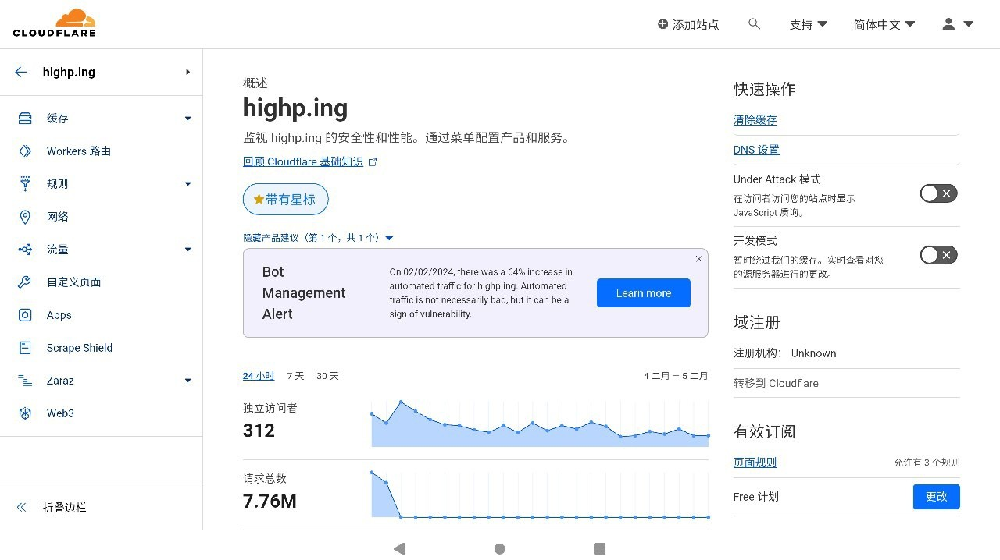
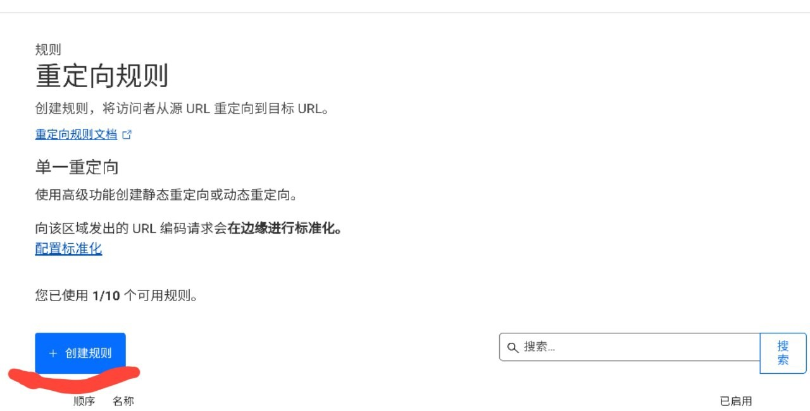
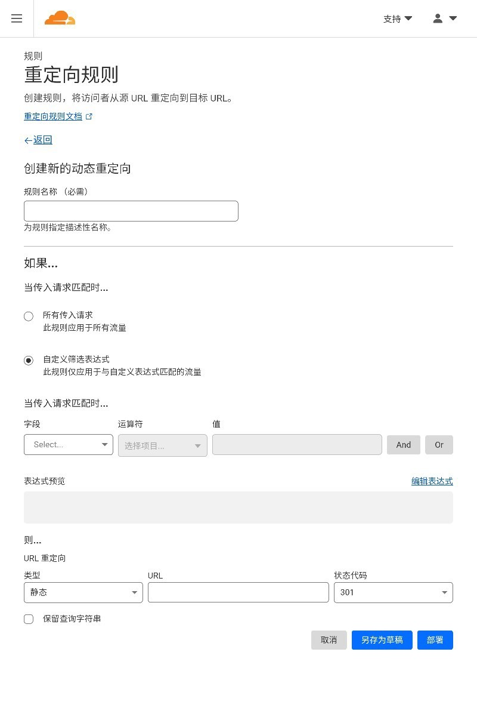

# 仅依靠 CloudFlare 完成带路径参数重定向

本文由 `High Ping Network` 的小伙伴 GenshinMinecraft 进行编撰，首发于 [本博客](https://blog.highp.ing/)

## 前言

本博文会**十分短**，因为比较简单而且也是随手一记。

做到的效果大约是: *中国大陆用户*访问 <https://blog.highp.ing/xxx/xxxx> 时会被 CloudFlare 在边缘重定向到 <https://nomao.blog.highp.ing/xxx/xxxx>

不论 URL 中的 *目录/请求参数* 是什么，都可以一并转发到目标网站

整个过程是为了让*中国大陆*访问者更快访问，且不影响浏览体验，**无感302**

**Powered By CloudFlare**

## 配置

### Step 1

转到 <https://dash.cloudflare.com>

进入侧边栏的 `规则-重定向规则`

### Step 2

点击 `创建规则`

为你的规则起一个名字

### Step 3

其中，`如果...-当传入请求匹配时...` 根据需要写入规则的前提

比如我的就是检测 *中国大陆* 的请求，其表达式为: `(ip.geoip.country eq "CN")`

`则...-URL 重定向` 中，类型选择 `动态`，表达式这样写: 

`concat("https://nomao.blog.highp.ing", http.request.uri.path)`

其中，`https://nomao.blog.highp.ing` 需要替换为你的重定向后的域名

状态代码 `301` 与 `302` 均可，差别只是一个是*永久重定向*一个是*临时重定向*

记得勾选上 `保留查询字符串`

## Enjoy it!

保存并部署上面的重定向规则，测试完成后就差不多了！

[本博客](https://blog.highp.ing) 在 *中国大陆* 地区访问会跳转到 <https://nomao.blog.highp.ing>

欢迎加入 High Ping 大家庭:
- [官网](https://highp.ing)
- [Blog](https://blog.highp.ing)
- [@HighPingNetwork](https://t.me/HighPingNetwork)
- [@HighPingChat](https://t.me/highpingchat)