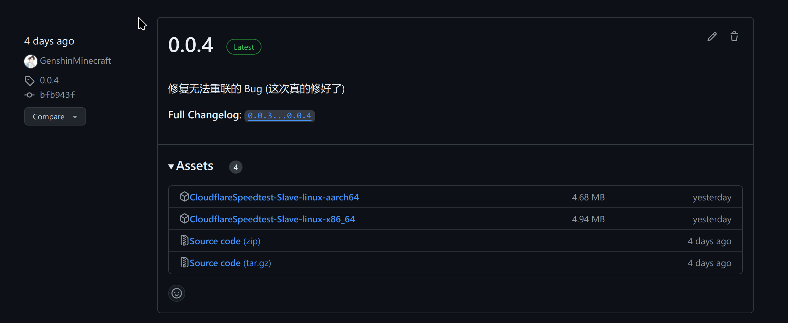

# 搭建 Cloudflare Speedtest 后端

本文由 `High Ping Network` 的小伙伴 GenshinMinecraft 进行编撰，首发于 [本博客](https://blog.highp.ing/)

## 前言

[Cloudflare Speedtest](https://docs.cloudflare.su/) 是一个**分布式的**、**高性能的** Cloudflare IP 优选服务

其实就是最近我们用 Rust 写的一个自动测试 Cloudflare IP 速度的小玩意啦

其原理如下:
1. 后端连接主端
2. 主端定期发送 IP 列表
3. 后端测试 Ping 值与速度之后，选取最快的一个返回给主端

大概就这样吧

其详细的 Doc 请前往 <https://docs.cloudflare.su/> 查阅，这里仅提供最简单的部署方法

同时，欢迎加入我们的内测群组: <https://t.me/+zisOvb8yFCgzNjk1>

在为官方服务器提供后端后，可以在内测群组中获得**优选的域名**

有任何 Bug 与意见可以前往群组 / 项目 Issue 反馈

## Binary 部署

Binary 部署有多简单呢？

### 下载

首先，请下载来自 [Github Release](https://github.com/GenshinMinecraft/CloudflareSpeedtest-Slave/releases) 的最新 Binary，目前最新版本为 0.0.4



在这里选择与你系统和架构相符的下载至你的机器上即可: (下面示例为 Arm64)
```bash
wget https://github.com/GenshinMinecraft/CloudflareSpeedtest-Slave/releases/download/0.0.4/CloudflareSpeedtest-Slave-linux-aarch64
```

然后为其附上可执行权限: 
```bash
chmod +x CloudflareSpeedtest-Slave-*
```

### 运行前操作 (Root)

如果你不想要使用 **Root 权限**执行该程序，请事先使用 **Root 用户**为其附上可以创建原始套接字的权限 (后端使用的 `Fastping-rs` 库需要该权限): 
```bash
sudo setcap cap_net_raw=eip CloudflareSpeedtest-Slave-*
```

还有一点需要注意，你应该要事先将系统默认的**套接字缓存**调整为更大才可以实行高效率的并发 Ping: 
```bash
sudo sysctl -w net.core.wmem_default=4194304 >> /etc/sysctl.conf # 设置为 4MB, 这足够超多 IP 的测试了
```

上面的两条 sudo 命令均会修改系统设置，请小心执行！

### 运行

然后即可执行: 
```bash
./CloudflareSpeedtest-Slave-* -s [主端链接] -t [Bootstrap Token] -m [最大带宽 Mbps]
```

如果你想为官方服务器做出贡献，连 `[主端链接]` 与 `[Bootstrap Token]` 都无需指定，只需要指定你的网络环境带宽即可: (其实也不需要，默认为 500Mbps)
```bash
./CloudflareSpeedtest-Slave-* -m 1000
```

### 设置 Systemd

这一步是为了保活，保证程序的持续运行

该功能仅支持 **基于 Systemd 的系统**，一般所用的 Ubuntu 与 Debian 等均支持

非常简单，在你的运行命令后加上 `--install` 参数即可

如 `./CloudflareSpeedtest-Slave-* -m 1000 --install`

有关 Binary 部署的更多详情，可以在命令行添加 `--help` 参数查看或前往 [Docs](https://docs.cloudflare.su/hou-duan/binary-bu-shu) 查看

## Docker 部署

Docker 部署更简单了

### 安装 Docker

这里不再赘述，一键脚本带过
```bash
curl -fsSL https://gdk.rtc.ovh | bash -s docker --mirror Aliyun
```

这一命令使用了来自 RtxCat 友情提供的 Docker Download 脚本镜像，并指定源为 Aliyun，用于在中国大陆环境下安装

如果你不信任该源，请自行寻找安装方式

### 运行前操作 (Root)

和 Binary 部署一样，你同样应该要事先将系统默认的**套接字缓存**调整为更大才可以实行高效率的并发 Ping: 
```bash
sudo sysctl -w net.core.wmem_default=4194304 >> /etc/sysctl.conf # 设置为 4MB, 这足够超多 IP 的测试了
```

### 运行

运行下面的 Docker Run 命令: 
```bash
docker run -d --restart=always --name CloudflareSpeedtest-Slave \
-e SERVER=${SERVER_URL} \
-e TOKEN=${BOOTSTRAP_TOKEN} \
-e MAX_MBPS=${MAX_MBPS} \
dp.rtc.ovh/genshinminecraft/cloudflarespeedtest-slave:v0.0.4
```

同样地，在连接到官方服务器时，无需填写 `SERVER` 与 `TOKEN`: 
```bash
docker run -d --restart=always --name CloudflareSpeedtest-Slave \
-e MAX_MBPS=1000 \
dp.rtc.ovh/genshinminecraft/cloudflarespeedtest-slave:v0.0.4
```

以上的 Docker Run 命令均使用了来自 RtxCat 友情提供的 Docker Hub 镜像，如你不信任该源，请自行将命令中的 dp.rtc.ovh/ 删去，以使用官方 Docker Hub 源

有关 Docker 部署的更多详情，可以前往 [Docs](https://docs.cloudflare.su/hou-duan/docker-bu-shu) 查看

## 部署后

在部署后，如果你为官方服务器做出了贡献，你可以享用你应得的权力，在[内测群组](https://t.me/+zisOvb8yFCgzNjk1)里获得解析的域名

欢迎加入 High Ping 大家庭:
- [官网](https://highp.ing)
- [Blog](https://blog.highp.ing)
- [@HighPingNetwork](https://t.me/HighPingNetwork)
- [@HighPingChat](https://t.me/highpingchat)
- [项目文档](https://docs.cloudflare.su/)
- [项目内测群组](https://t.me/+zisOvb8yFCgzNjk1)
- [项目主端](https://github.com/moohr/cfst-backend)
- [项目后端](https://github.com/GenshinMinecraft/CloudflareSpeedtest-Slave)