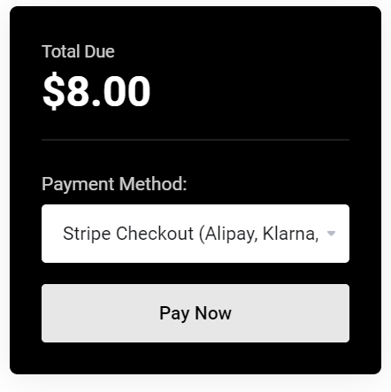
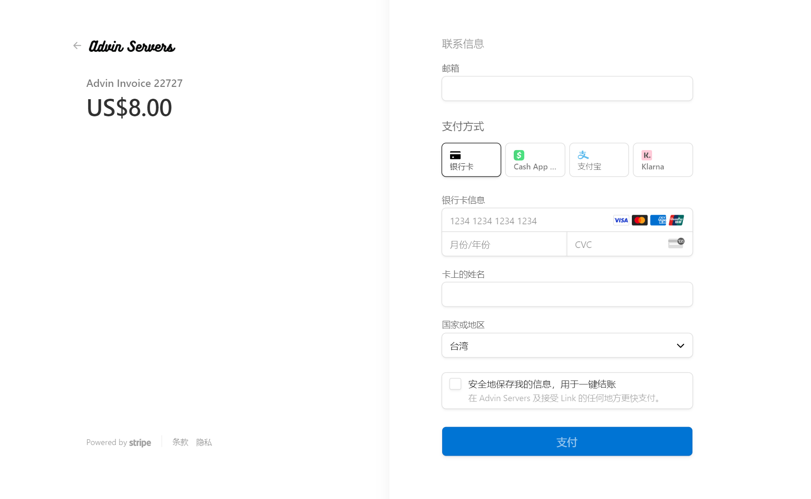
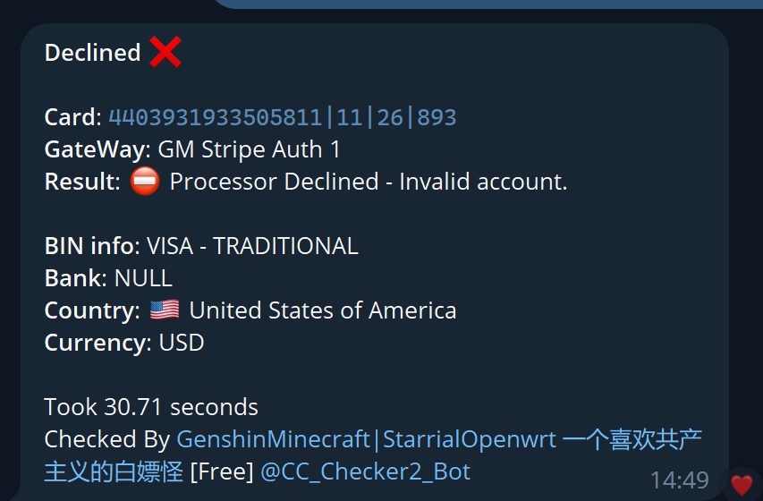
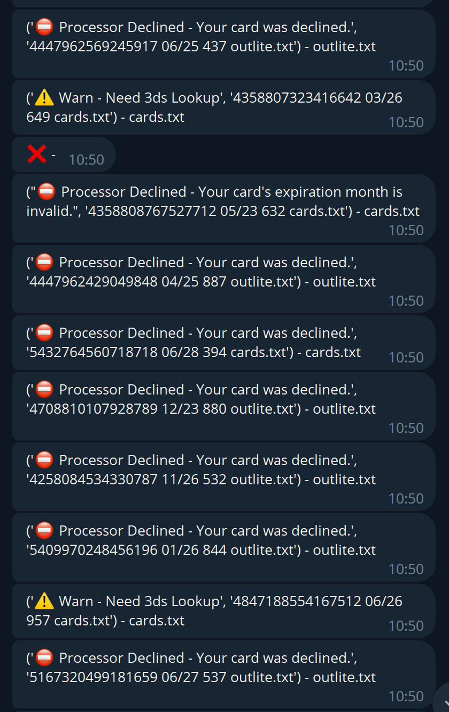

# 如何免费检测料卡是否 已死/3d
## 前言
在刷料付款的时候，我们经常会***被拒绝/3ds***

而且是当料卡数量超多的时候，手动测试每一张卡是不是都是活的十分麻烦。

所以就有了以下介绍的方法

以下的方法***全都免费，无需付款***！

## 方法一：手动挡
第一种方法就是付款。在这里推荐一个平台：***Advinservers的stripe通道***

前往[Advinservers官网](https://clients.advinservers.com/login)

选择等繁杂步骤就不说了

选购好任何一件东西后，付款时选择**Stripe**



接下来就可以跳转到**Stripe**的付款界面，就可以在这里测试卡*是不是被拒绝/3d*啦！



## 方法二：手动挡
第二种方法是使用TelegramBot

这里推荐一个测活Bot，他使用的是**Stripe V1 API**

其余的api需要**付费使用**，不过免费已经够用了

准确度是免费里面*最准确的*

<https://t.me/CC_Checker2_Bot?start=u5965795367>

带有AFF，不喜欢可以去掉

只需要对着机器人发送：
```
/chk 16位卡号|月|年|CVV
```

就可以获取返回结果！

请注意会有20秒的*AntiSpam*，防止滥用！

返回结果类似于：



实际测试也是十分准确的！

## 方法三：自动档
第三种方法也是使用TelegramBot，是跟上面同一个作者开发的

所以各种api功能都一样!

<https://t.me/gmcheckerbot>

只需要对着他发送带有料卡信息的*txt文件*，就可以**自动获取结果**，**不设限制**！




## 小结
三种方法都介绍完了，都很实用，而且***全部免费***！

可以根据自己的料卡数量进行选择。

最好的方法当然是**方法一**，手动输入Stripe正确率很高哦！
