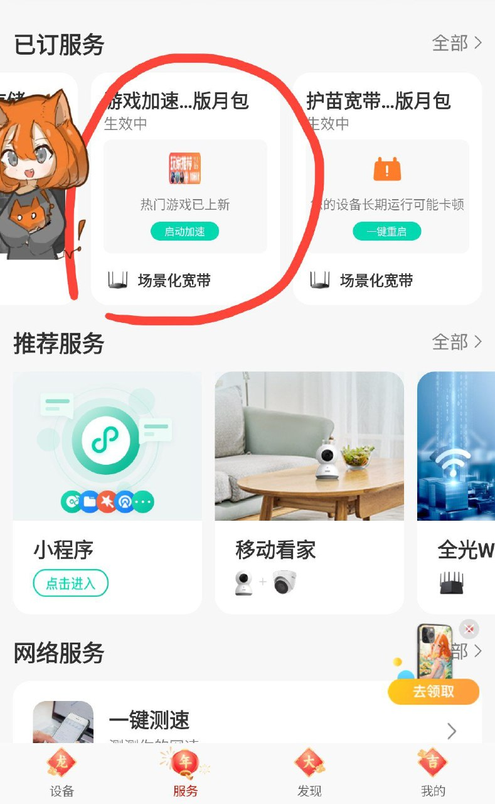
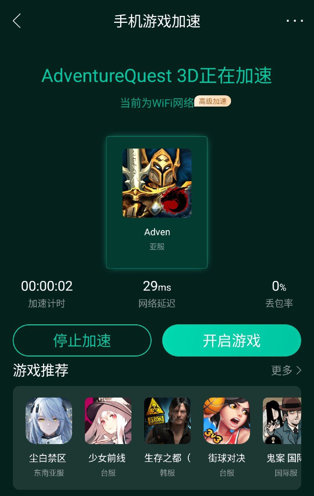
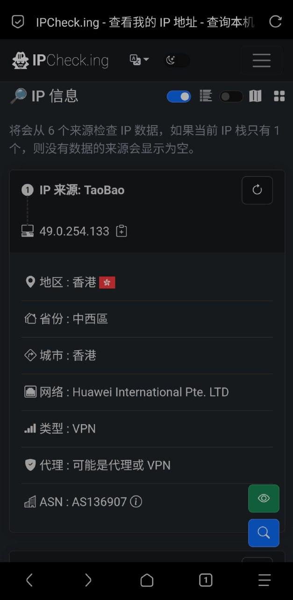
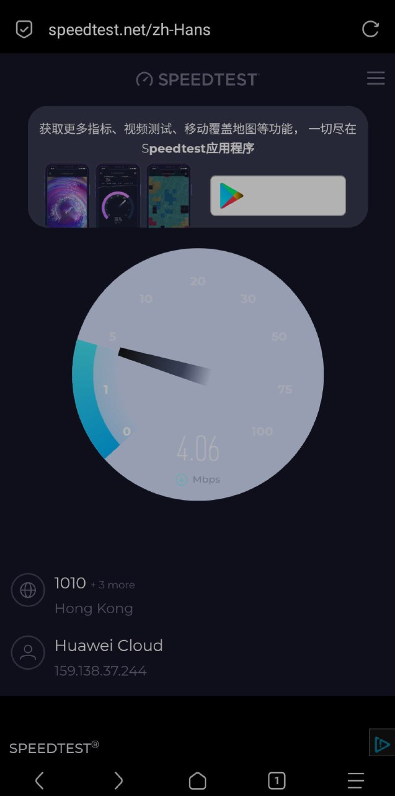

# 利用 中国移动游戏加速器 代理 非游戏软件 实现出国代理服务 (漏洞复现)

本文由 `High Ping Network` 的小伙伴 GenshinMinecraft 进行编撰，首发于 [本博客](https://blog.c1oudf1are.eu.org)

## 免责声明

这是一篇实验博客，**本人已经通过邮件的方式向中国移动提交了该问题，并附带上本博客**，请不要把这篇博客当作**滥用博客**

可以肯定，这样做是**非法的**，我只是记录了复现的过程

## 前言

如果我不说，你一般不会知道中国移动还有 电竞加速服务，它是中国移动场景化宽带下的一部分

如果我不说，你一般不会知道中国移动还有 场景化宽带，它是中国移动宽带的增值服务，主要提供了`电竞加速`、`护苗宽带`、`教育加速`三大服务，分别对应了`游戏加速器`、`家庭网络监控`、`访问国外教育网站`的服务

本文就是利用了 和家亲 客户端的漏洞，进行代理非游戏软件，实现出国代理服务，俗称~~翻墙~~

请注意，该漏洞，大部分手游加速器都有，并非中国移动专属

## 基本思路

到这里就可以介绍一下基本思路了: 更改需代理软件的包名为中国移动电竞加速服务认可的游戏包名，让加速器以为这是游戏，启动代理，就可以用该伪装软件进行出国代理了

比如我就制作了个修改版 Via 浏览器，链接: 

[Via_com.battleon.aq3d.apk](Via_com.battleon.aq3d.apk)

该应用伪装成了《AdventureQuest 3D》这款游戏，无意冒犯

## 复现方法

你需要准备一台安卓手机，还有一个已经开通了[电竞加速服务](https://www.ha.10086.cn/shop/scenarioKd/index?type=1)的移动手机号

首先，下载和家亲，下载链接不贴了，谷歌一下，你就知道

打开并登录，转到下方 Nav  `服务-已定服务－游戏加速...`

进去之后，长这样

安装了上面提供的修改版 Via 后，在该节界面应该会有对应的游戏软件，启动加速即可

## 复现效果

很简单对吧，打开刚才安装的修改版 Via 浏览器，理论上你就可以访问境外网站了

甚至，亚洲出口还是华为云的 IP，属实是遥遥领先了

不过应该也做了一些限速处理，不知道为什么总感觉不止这一点速度

## 修复建议

修复非常简单，在客户端进行游戏应用检测即可，只检测个包名还是炸裂了

或者，在客户端/服务端双双配置好游戏需要访问的域名 / IP，限制访问

欢迎加入 High Ping 大家庭:
- [官网](https://highp.ing)
- [Blog](https://blog.c1oudf1are.eu.org)
- [@HighPingNetwork](https://t.me/HighPingNetwork)
- [@HighPingChat](https://t.me/highpingchat)