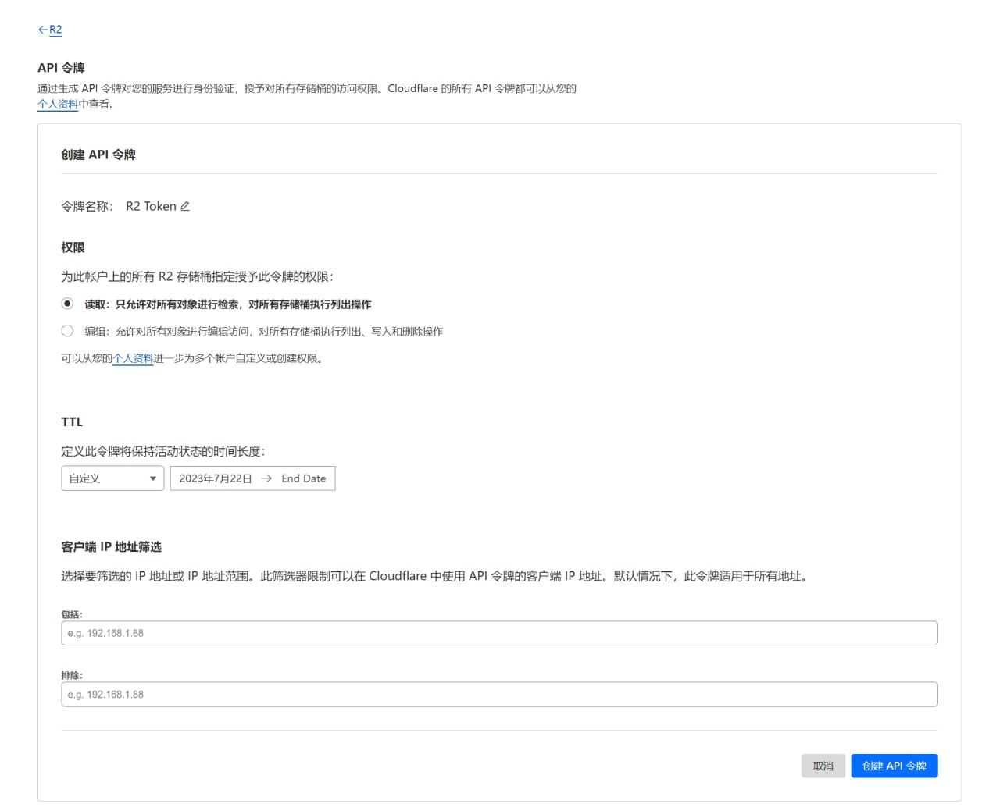

# CloudFlare R2 获取/使用方法

本文由 `High Ping Network` 的小伙伴 GenshinMinecraft 进行编撰，首发于 [本博客](https://blog.highp.ing)

## 前言
众所周知，***CloudFlare***有一个自家的**对象存储**服务：**R2**。并且兼容与亚马逊的S3，可以做出许多玩法。

而CloudFlare出了名的好心，为我们提供了一个免费的额度：
- 每月 ***1,000,000 次 A 类操作*** + 每增加 1,000,000 次操收取 US$4.50
- 每月 ***10,000,000 次 B 类操作*** + 每增加 1,000,000 次操收取 US$0.36
- 每月 ***10 GB 存储*** + 每增加 1 GB 存储/月收取 US$0.015

而我们仅需要以下的东西就可以得到这***10GB对象存储***：
- 脑子和手
- 一个CloudFlare账号（最好带有一个用于连接至R2储存桶的域名）
- 一张银行卡（0刀验证，可以是料）

## 申请
在[此处](https://dash.cloudflare.com)登入***CloudFlare***账户，并在左侧导航栏找到`R2`。

点击中间的`激活R2`：

点击`进入付款详细信息`：

输入付款信息，请注意这里并不会有*3d验证*，只会扣除银行卡里面的0刀用于验证：

一路下一步完成验卡。

## 创建储存桶
完成申请并验卡部分后，回到R2界面。
点击`创建储存桶`：

填写好储存桶的名称，地区建议选择***亚太（APAC）***：

## 储存桶使用
创建完成后，可以在`R2界面`中找到自己刚才创建的储存桶，可以在这里上传/查看/删除文件。

### 绑定域名
进入储存桶后，点击 `设置-公开访问-自定义域-连接域` 来连接自己的域名：

一路下一步即可完成绑定域名。

### 创建R2 API 令牌
**API令牌**是亚马逊S3储存中的鉴权部分，需要手动创建**API令牌**。

在`R2界面`右侧点击 `管理R2 API 令牌-创建API 令牌`：

按照自己的需求填写好，`客户端 IP 地址筛选`可不写

点击`创建API令牌`即可完成创建*访问密钥 ID*与*机密访问密钥*。

***注：访问密钥 ID与机密访问密钥只会显示一次，创建后需注意保存***

### 案例：挂载至Alist
挂载内容如图下填写：

其中，`储存桶`是在创建时填写的名称；\
`Endpoint`是在`R2管理界面`名称下的链接（记得去掉后面的储存桶名称）；\
`访问密钥 ID`与`安全访问密钥`是上面创建的*R2 API 令牌*；\
`地区`是在创建时填写的区域**后面括号内的字母**（如亚太为APAC）。

这样设置过后，就可以在Alist内使用CloudFlare的R2服务了！

## 小结
CloudFlare大家可能都在折腾他的**CDN**或者**ZT tunnel**，没有多少人折腾**R2**服务。其实用免费的R2对接到一些自建的服务上还是很好用的，详细玩法还是可以查看[CloudFlareDoc](https://developers.cloudflare.com/r2/)！

## Example：
下面这首歌是储存在CloudFlareR2中的。可以用来做网站图床、音视频调用，自带全球CDN，还不占用机器资源。

<https://Vooid.link/YouBrokeMeFirst.mp3>

***我的大爹，永远都是我的大爹！***

欢迎加入 High Ping 大家庭:
- [官网](https://highp.ing)
- [Blog](https://blog.highp.ing)
- [@HighPingNetwork](https://t.me/HighPingNetwork)
- [@HighPingChat](https://t.me/highpingchat)