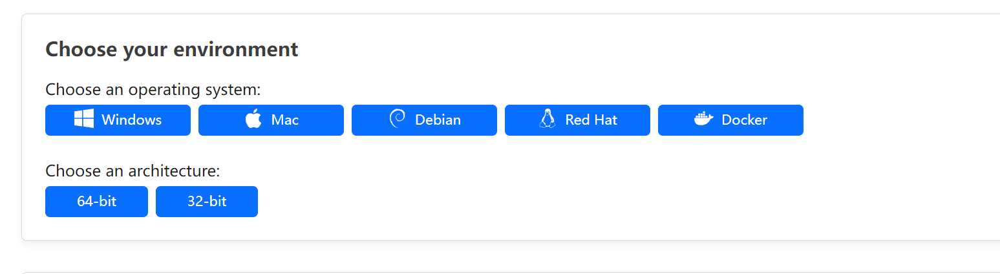

# CloudFlare Tunnel(内网穿透) 获取/使用方法

本文由 `High Ping Network` 的小伙伴 GenshinMinecraft 进行编撰，首发于 [本博客](https://blog.c1oudf1are.eu.org)

## 前言
在生活中，我们经常会遇到需要*访问家里设备*（NAS、Router等）的情况，这个时候如果没有公网IP，将会是十分头疼的一件事情。

而国内的免费FRP服务有诸多限制，比如**带宽小、需实名**，还不是很稳定。

这个时候我们可以选择CloudFlare家的Tunnel服务，既能拥有***CloudFlare的全球防护CDN***，还可以获得**更加安全的体验**！

仅需要以下几样东西即可获取CloudFlare Tunnel的全部功能：
1. 脑子和手
2. 一个CloudFlare账户
3. 一张银行卡/Paypal（料卡也可）
4. 一台用于穿透的设备（如Router）

## 创建Tunnel隧道
### 创建域名前缀
进入[CloudFlare管理面板](https://dash.cloudflare.com)，在左侧栏找到` Zero Trust `

在此输入你的*前缀*（喜欢即可，后面可以绑定域名）。

### 选择计划并验卡

在这里选择最左侧的*0刀计划*并继续，随后一路下一步输入自己的卡号信息，即可完成验卡创建。

### 创建第一个隧道
回到[**Zero Trust**的主界面](https://one.dash.cloudflare.com/)


点击左侧的`Access-Tunnels`


创建Tunnel，点击`Create a tunnel`

填写名称

按需下载内网穿透的软件


下一步，填写想*连接的域名*以及tunnel穿透的*协议*与*目标地址*，目标地址可以是本机/内网/公网~~（所以你甚至可以把tunnel当作中转使用）~~


最后**完成创建**即可！

## 连接到Tunnel隧道
下载好上面所需要的内网穿透软件后，找一个地方放置，并打开终端

输入在`隧道名-Configure`下的命令（Linux注意**添加可执行权限**，以及**去掉默认为windows的exe后缀**）


Linux:
```
cloudflared service install xxx(一大串Token字符)
```

Windows:
```
cloudflared.exe service install xxx(一大串Token字符)
```

然后CloudFlared就会**以服务运行**，这样就算***连接好了Tunnel隧道***。

当隧道名右边的`Status`变成绿色时，就算连接成功。可以通过上面填写的域名访问来进行验证。

## 小结
CloudFlare Tunnel的搭建十分简单，而且可以获得CloudFlare CDN的全球防护，还是免费的。

可以说是非常良心了，但是还是有一定的缺点，如国内直连访问速度得不到保障等CloudFlare的通病。

但是也比国内FRP提供商直接给你强制限速10Mbps好！

并且可以使用与网站优选ip相同的方法，优选Tunnel的ip，可以说是自定义功能十分强大！

***我的大爹，永远都是我的大爹！***

欢迎加入 High Ping 大家庭:
- [官网](https://highp.ing)
- [Blog](https://blog.c1oudf1are.eu.org)
- [@HighPingNetwork](https://t.me/HighPingNetwork)
- [@HighPingChat](https://t.me/highpingchat)