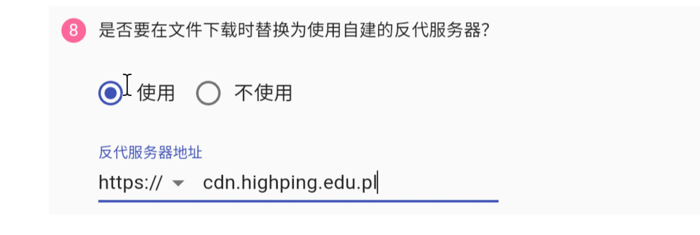
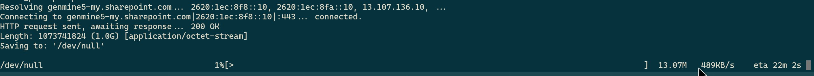
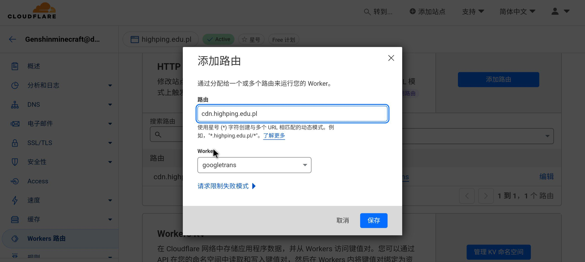
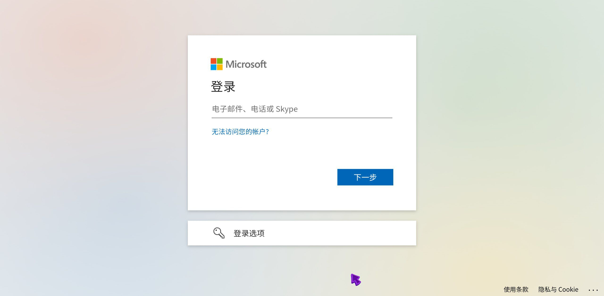
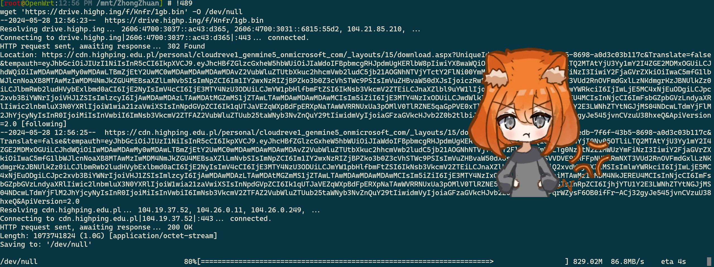

# 使用 Cloudreve + E5 + Workers 搭建免费高速云盘 | 跑满带宽
本文由 `High Ping Network` 的小伙伴 GenshinMinecraft 进行编撰，首发于 [本博客](https://blog.highp.ing)

## 前言

Cloudreve 也不是什么新玩意了，就不过多介绍了

本文主要讲述的是有关于 **Cloudflare Workers 代理 E5 下载链接**的部分，其他应该会一笔带过，除非有特别需要注意的地方

你只需要:
- 用于搭建 Cloudreve 的机器
- 一个域名
- 一个用于优选的 Cname 域名
- 一个 Cloudflare 帐号
- 一个用作网盘的 Microsoft 365 E5 帐号 (当然有 Onedrive 权限的任意账号也可以)

请注意: 用于 Workers 的优选 IP 不能为反代 IP，只能为 Cloudflare 官方 IP 列表中的 IP

## 搭建 Cloudreve 并连接网盘

这一步跟着[官方教程](https://docs.cloudreve.org/getting-started/install)来就行了，无需多言

相信能阅读到本篇文章的朋友也不至于不会搭建

记住这里，留意下，这里填写的就是等会使用的 Workers 的域名



目前可以先不管

## 中转 E5 下载地址

我们默认的 E5 下载地址直连还是比较慢的，中国移动 1000M 宽带速度高达 500kb/s



### 获取 E5 下载地址

一般地，E5 的通用下载地址域名为 `xxxx-my.sharepoint.com`

其中 `xxxx` 为 E5 的组织名字，也就是 `xxxx.onmicrosoft.com` 的二级，替换即可

比如我的域名为 `genmine5.onmicrosoft.com`，对应的下载域名为 `genmine5-my.sharepoint.com`

将其记住并保存下来

### 反代 E5 下载地址

来到 Cloudflare Dashboard，`Workers And Pages`，新建一个 Workers

将代码改为:

```js
export default {
	async fetch(request, env, ctx) {
		let url = new URL(request.url);
		if(url.pathname.startsWith('/')){
			url.hostname="genmine5-my.sharepoint.com"; // 修改成自己的域名
			let new_request = new Request(url, request)
			return await fetch(new_request)
		}
		return await env.ASSETS.fetch(request);
	},
};
```

记得修改其中的反代域名，保存部署即可

### 连接域名

回到 Cloudflare Dashboard 主界面，点进一个域名，找到 `Workers 路由`，新增一个类似于下图的路由:



PS: *不建议使用顶级域名，建议二级，顶级域名有 Cname 拉平*

还有一个注意的点，后面的 `/*` 千万不要忘记

### 解析域名

回到 DNS 解析，将刚才设置的域名 Cname 到一个 `Cloudflare 官方 IP 优选地址`上

注意一定要 **官方 IP**，反代 IP 没用的！

解析就不多说了，简单得很

### 测试访问

现在，访问你的反代地址，当跳转到 Onedrive 登陆界面即为完成: 




## 编辑反代 IP


还记得这里吗，将其改为反代的地址即可，以后所有的下载请求都会走反代了

PS: 上传不走，也不太可能走，Cloudflare 上传最大 100MB


## 测试



前后提升巨大，优选前下载速度 500KB/s，优选后下载速度 80MB/s+

也算是把 E5 优化到极致了

## 小结

差不多整个过程就是这样，最重要的步骤只是在 Workers 配置反代

还有，Workers 免费版每天只有 10w 次访问，但是个人使用完全是足够的，即使放在商用大网盘也完全没有问题

CLOUDFLARE YES!

欢迎加入 High Ping 大家庭:
- [官网](https://highp.ing)
- [Blog](https://blog.highp.ing)
- [@HighPingNetwork](https://t.me/HighPingNetwork)
- [@HighPingChat](https://t.me/highpingchat)
