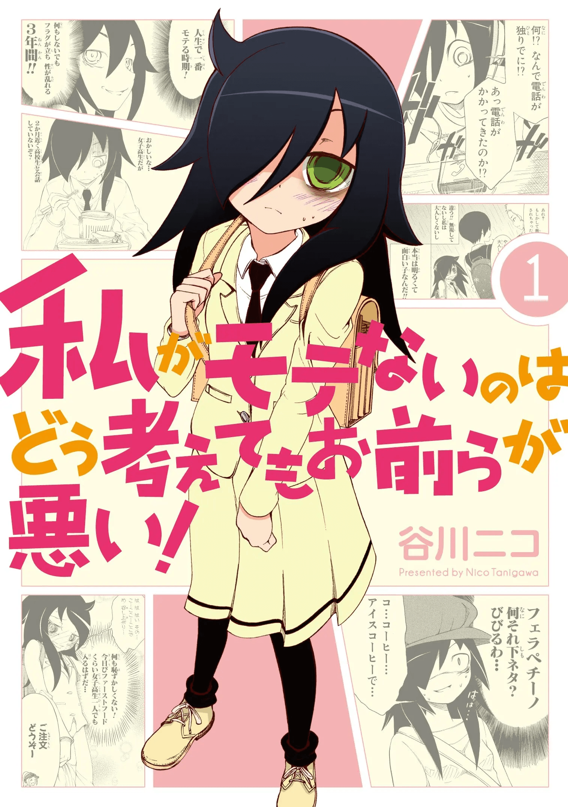

# 个人向番剧大评价 (长期更新)

[<-前往本博客获取更好阅读体验->](https://c1oudf1are.eu.org/p/comic/)

## 前言

最近有同学找我推荐番剧 / 我找别人推荐番剧，或是给番剧排名什么的，遂写这篇文章

本评价**非常主观**，所以别上来就开骂，想骂 / 交流请找 Telegram: [@C1oudF1are](https://t.me/C1oudf1are)

本人常年混迹于*日常系*、*空气系*、*搞笑系*，并且看番就看**全系列**，所以评价的是一整部作品，并非单一一季

甲就不叠了，有关评价规定请看下文

格式为:
```
等级 + 番剧名称 + 番剧图(可能是二创) + 评价(几行)
重点会有 OP / ED / 插曲的评价
若有任何有关链接，优先放萌娘百科 moewiki
```

共分为四个等级，分别为:
- **神**: 有且*只有八部*，重温至少一两次，如果有更神的会替换
- **优**: 值得*推荐*的，可以收获良好观看体验
- **还行**: 不会直接推荐给他人，但是如果找人聊起来也能聊
- **差**: *遇到了得喷口痰*

## 神

### 幸运星

[萌娘百科](https://zh.moegirl.org.cn/%E5%B9%B8%E8%BF%90%E6%98%9F#.E5.8A.A8.E7.94.BB.E7.89.88)


**当之无愧的第一**，伟大无需多言

美水镜于 2004 年创作的老物，比我还大六岁

> 娶妻当如樱庭葵，生女当如泉此方

甚至其中的[`脑残舞`](https://zh.moegirl.org.cn/%E6%8B%BF%E5%8E%BB%E5%90%A7%EF%BC%81%E6%B0%B4%E6%89%8B%E6%9C%8D#%E8%84%91%E6%AE%8B%E8%88%9E)我都会跳，可见其经典程度

还有，在观赏时请务必选择第三方字幕组而非流媒体平台，在一些 neta 或者 2000 年代流行的梗都会在字幕里面标识出来，体验拉满了！


### 非人哉

[萌娘百科](https://zh.moegirl.org.cn/%E9%9D%9E%E4%BA%BA%E5%93%89)


也是我的国漫**入门**番，印象中很小的时候就开始看了

> 遥远混沌之际是怎样天地，先人留下故事要怎样继续？

其实我很少看国漫，特别是短漫，几乎只有`「非人哉」`一部，所以其拿个第二没问题

同样地，其[同名 OP](https://zh.moegirl.org.cn/%E9%9D%9E%E4%BA%BA%E5%93%89(%E6%AD%8C%E6%9B%B2)#) 更是由洛天依演唱并早已获得**传说曲**称号 (V 家你崛起吧)


### 魔女之旅

[萌娘百科](https://zh.moegirl.org.cn/%E9%AD%94%E5%A5%B3%E4%B9%8B%E6%97%85#.E5.8A.A8.E7.94.BB.E7.89.88)


本来我对这种东西从来不感兴趣，但因为某人，看了之后直接给这玩意排到第三了

> 没错，那就是我 (非常符合现在语境)

剧情也是每集一到两个小故事，整体关联性不强 (而且总感觉在隐喻什么东西)

其中有一些黑暗致郁类故事，比如花海 (s01e02 应该是)，不只是一个`萌系美少女轻松旅行番`哦

同样地，其 OP [旅途的华章](https://zh.moegirl.org.cn/Literature)也还算可以，符合本作的水平


### 日常

[萌娘百科](https://zh.moegirl.org.cn/%E6%97%A5%E5%B8%B8)


当之无愧的**日常搞笑**番，从名字也不难看出，但是剧情非常不日常就是了

> 我们所经历的每个平凡的日常，也许就是连续发生的奇迹。

这一句是我最喜欢的动漫名言，简称 `日常即是奇迹`

同样采用了一集分成多个小故事的编排，中间以角色的互动或者只是一个乱动的日常标识分割:


BTW，我们学校教室的 Wallpaper 还是阪本先生呢！


### 轻音少女 K-on

[萌娘百科](https://zh.moegirl.org.cn/%E8%BD%BB%E9%9F%B3%E5%B0%91%E5%A5%B3)


~~好了，终于到卖歌番了~~

> 但是呢，遇见了！那美丽的天使

位列于乐队番四大名著榜首，剧情奠定了今后乐队番的走向基础

既然是~~卖歌番~~，那就得来看看卖的歌咋样:
- [`「相遇天使」`](https://zh.moegirl.org.cn/%E7%9B%B8%E9%81%87%E5%A4%A9%E4%BD%BF): 全番最好听的，是前辈们送给阿梓喵的歌曲，虽然番剧中只出现一次
- [`「Don't say "lazy"」`](https://zh.moegirl.org.cn/Don%27t_say_%22lazy%22): s01 的 ED，传唱度也挺高的，(印象中 BanG Dream 也翻唱了，不过我不看啦)
- [`「轻飘飘时间」`](https://zh.moegirl.org.cn/%E8%BD%BB%E9%A3%98%E9%A3%98%E7%9A%84%E6%97%B6%E9%97%B4): 著名的滑滑蛋，传唱度全番最高，几乎每一话都可以见到其身影

歌就这三首好听了，剧情日常系也很不错


### 白箱 ShiroBako

[萌娘百科][https://zh.moegirl.org.cn/%E7%99%BD%E7%AE%B1]


顶级飙车番，好久没吃过这么好的了

角色塑造非常非常成功，通过制作进行的工作视角代入到动漫制作中简直神了
虽然角色过多，不重复看几次真的是人名都记不清

作画没问题，角色塑造没问题，剧情牛逼
感动点和笑点都有而且结合非常不错
要知道这是来自 2014 的番剧，满打满算也十二年前了

感谢字幕组，非常多的业内术语、隐喻、Neta 等全都注明了，0 门槛理解

其实我真的挺喜欢这种讲述某一行业、某一圈子内的细节的番剧
比如我个人评价还是不差的 「16bit 的感动」，讲述 GalGame 业界的
如果范围宽一点，讲露营的 「摇曳露营△」可能也算
但是和「ShiroBako」比起来啥都不是
我很想拿来对比一下，为什么，因为它没跑题
「16bit 的感动」基本上可以看作是和原作没啥大关系的了，后面改动漫突发奇想整个脑回路清奇的人类大战 AI 结局
而「ShiroBako」紧扣动漫制作，不跑题就行了

OVA 的 Exodus 和 三女 也是一点毛病没有
唯一的缺点就是音乐，全片下来没有一首歌是比较能听的，音乐这一块确实可能还比不上「16bit 的感动」(说实话这玩意我评价有一半来自音乐)

24+2OVA，分成两季来看，可惜我战线拉太长了，这部番剧我至少看了一个月才看完


### 摇曳百合

[萌娘百科](https://zh.moegirl.org.cn/%E6%91%87%E6%9B%B3%E7%99%BE%E5%90%88#.E5.8A.A8.E7.94.BB.E7.89.88)


~~欸你这封面中间怎么是空白的啊？~~

剧中的主角(?)[阿卡林](https://zh.moegirl.org.cn/%E8%B5%A4%E5%BA%A7%E7%81%AF%E9%87%8C)曾被当作 Bilibili 默认初始头像，对就是那个一堆虚线举着手那个:


剧情同样也非常日常、轻松(译名本来就是)、搞笑

轻百合(这个叫轻?)经典作品之一，全剧男性角色出镜不超过三次

[s01 的 OP](https://zh.moegirl.org.cn/%E3%82%86%E3%82%8A%E3%82%86%E3%82%89%E3%82%89%E3%82%89%E3%82%89%E3%82%86%E3%82%8B%E3%82%86%E3%82%8A%E5%A4%A7%E4%BA%8B%E4%BB%B6) 十分洗脑，在十周年 OVA `「Mini Yuri」`中玩了这个 OP 梗: *大 ~ 事 ~ 件 ~*

比起 OP，还是阿卡林每话的开头报幕更洗脑，只有 s01e01 报幕成功，其余均被恶搞（

> 玉汝于日，哈姬马入唷！

外传[大室家](https://zh.moegirl.org.cn/%E5%A4%A7%E5%AE%A4%E5%AE%B6)讲的大室三姐妹的日常，所以姐姐的女朋友到底是谁？


### CITY

[萌娘百科](https://zh.moegirl.org.cn/CITY)


很牛逼的京阿尼回来了，最新力作延续其一贯传统，被看作是「日常」的续作

炫技特别明显，比如 s01e05 的八宫格，观看体验及其难受，但是观感非常好 (这俩不是一个东西吗，这集有人骂死有人吹四)

歌曲特特特特好听，给你们展示一下:


牛逼在哪呢，就是很日常，非常日常

具体角色非常非常多，我相信没有几个人能记住所有的角色。与「日常上河图」相似，「CITY」中也有全家福，位于 OP 尾部


## 优

优就挺多了

### 干物妹！小埋

[萌娘百科](https://zh.moegirl.org.cn/%E5%B9%B2%E7%89%A9%E5%A6%B9%EF%BC%81%E5%B0%8F%E5%9F%8B)


我的日漫启蒙者，第一部完整看完的日漫

> 有没有 Wi-fi，有没有 Wi-fi，有而且耐用五毛的！

上面的空耳来自于 s01 的 OP [`「革新性的小埋变身」`](https://zh.moegirl.org.cn/%E9%9D%A9%E6%96%B0%E6%80%A7%E7%9A%84%E5%B0%8F%E5%9F%8B%E5%8F%98%E8%BA%AB)，传唱度也很高

如果说 `生女当如泉此方`，那么 **`有妹必定干物妹`**

其以家门为界，跨入自动缩小，迈出自动放大，简称 `随地大小变`

剧情相当的日常以及搞笑，~~反差萌最喜欢了~~！

非常不好意思让你做优守门，因为「白箱」实在太好看了


### 摇曳露营△

[萌娘百科](https://zh.moegirl.org.cn/%E6%91%87%E6%9B%B3%E9%9C%B2%E8%90%A5)


如果说`「悠哉日常大王」`是乡村生活宣传番，那`「摇曳露营」`就是日本旅游宣传番了

剧中所有露营地均为有现实原型的，很想知道有多少人去圣地巡礼了

OP / ED 也属于一流级别，比如[`「So Precious」`](https://zh.moegirl.org.cn/So_Precious)、[`「SHINY DAYS」`](https://zh.moegirl.org.cn/SHINY_DAYS)、[`「Seize The Day」`](https://zh.moegirl.org.cn/Seize_The_Day)之类

前 `神` 的守门员，因 CITY 还可以退下了


### 悠哉日常大王

[萌娘百科](https://zh.moegirl.org.cn/%E6%82%A0%E5%93%89%E6%97%A5%E5%B8%B8%E5%A4%A7%E7%8E%8B)


如果说`「摇曳露营」`是日本旅游宣传番，那`「悠哉日常大王」`就是乡村生活宣传番了 (似曾相识)

看完发现最喜欢的角色竟然是[加贺山枫](https://zh.moegirl.org.cn/%E5%8A%A0%E8%B4%BA%E5%B1%B1%E6%9E%AB)~~卖零食的不良~~

有许多经典的 BGM 出自这里，比如听到就会想到米小圈的[`「いいのかな？」`](https://music.163.com/#/song?id=28160994)等等

So, 短笛大魔王是单纯还是富有心机呢？


### 缘之空

[萌娘百科](https://mzh.moegirl.org.cn/%E7%BC%98%E4%B9%8B%E7%A9%BA)


和`「成神之日」`一样，都是一个晚上看完的番剧

也是我看过的除了「野良与皇女与流浪猫之心」之外的第二部 Gal 改 动漫

我没玩过它的 GalGame，但是动漫整体节奏过于快了 (毕竟把几十个小时的 Gal 压到 五个小时以内肯定删了一堆)

还有音乐依旧称神，随便哪一首都是顶尖的存在

就是我觉得每一个人第一次看第一集是绝对看不懂的，相当于一个共通线，奠定了悲伤的感情基调，但是后面的小剧场让人摸不着头脑 (看多几集就知道了)

看完也对感情的边界有了一定的认识


### 这个医师超麻烦 

[萌娘百科](https://zh.moegirl.org.cn/%E8%BF%99%E4%B8%AA%E5%8C%BB%E5%B8%88%E8%B6%85%E9%BA%BB%E7%83%A6)


附图为 S01E08 15:10 处

顶尖的搞笑番，新奇并且有趣的设定非常多:

- 主角是吐槽位 (应该也有其他番剧是这种设定，但是这个最明显也最好笑)
- 完全混乱的译名: `这个 [僧侣|治疗|医师] [有|超] [麻烦|够烦|点烦]` 均为其译名
- 几百个字的标题:
    - > 在充斥着魔物和怪物的世界里，踏上冒险者之旅的阿鲁维（主人公/铠甲剑士）在与熊战斗的危急时刻，走运地遇到了治愈术暗精灵女孩卡拉（女主角/暗精灵），但是卡拉性格过于恶劣，和阿鲁维发生了口角，让熊也很迷惑，后来又被带到熊的家里，这样的原作漫画里没有的展开，原作漫画粉丝可能会有“诶？”的想法，但是，这是在杂志连载前网络发表的内容为“这是什么故事？”的以相同世界观为基础的内容，所以还请谅解，作为工作人员和原作方的意向，请让我们在这里说明一下，然后因为这个长标题没有换行或速览这样的装置，所以这一点也很不好意思的这样的第一话
    - > 和医师卡拉一同踏上旅程的阿鲁维，为了原本的目的前去收集解毒草，却在途中与幽灵在墓地里展开战斗，正当以意想不到的方法解除危机时，又不小心中了哥布林的陷阱，先是前半剧情就累个半死，但诅咒尚未解除所以不能跟卡拉分开，再次认识到今后的日子会更加辛苦，而这么长的标题其实包含下集预告共用，很好奇有多少人会读到最后的这样的第二话
    - ...
  
我可以说是从头笑到尾

由于漫画的剧情写进一季里太紧凑，写两季又太松散，导致到后面三集节奏过快且完全没有介绍五人组到底怎么组建起来的... 仅有的缺点吧

> 别的番剧女主出抱枕，这个番剧女主得出解压沙袋


### 龙与虎

[萌娘百科](https://zh.moegirl.org.cn/%E9%BE%99%E4%B8%8E%E8%99%8E)


非常不错，人生以来第一次因为一首歌看完了整部番剧，就是 ED1 的 [香草与盐](https://music.163.com/#/song?id=22749247)
唯一一部真正意义上没跳过过 OP / ED 的番
OP1 与 ED1 都挺顶级的，不过后面换 OP / ED 2 就略显一般了

这部番有友情、爱情、亲情
令人深思的不是友情，打动人的不是爱情，是亲情
印象最深刻两个场景: 泰子为了龙儿奔劳、游泳池边大河骑在龙儿腹上哭泣

网上评价对这部番有点两极分化
情有可原，剧情设计上给其他女主带来太大伤害，实乃梨还能正面接受，亚美到最后都没开口 (其实我以为 OVA 是亚美剧情来着)

小结一下: 前半恋爱搞笑番，后半亲友打架番，迟到了 20 年也要看


### 末日后酒店

[萌娘百科](https://zh.moegirl.org.cn/%E6%9C%AB%E6%97%A5%E5%90%8E%E9%85%92%E5%BA%97)


首先 op 非常不错，很少听离调的歌

每集标题为酒店十二规律，可以（就是第一条和最后一条换了下）

朋友强力推荐看的，确实有这个水准

特别是 11 集的，八千代被迫放假出去走走，单人视觉无对白叙事可以比肩一下「缘之空」的叙事了

长篇看下来没什么可以吐槽的地方，最想吐槽的应该就是：
人类都能造这样机器人了，怎么解决不了破病毒

ed 水准明显不在线，所以这应该是我看过（短篇泡面番除外）ed 时长最短的番剧

还有我最想看的爱情线怎么没了，不支持的

感谢字幕组，翻译特牛逼，好多骈句都翻译到了，还有很多 neta，不科普根本不了解


### 中二病也要谈恋爱！

[萌娘百科](https://zh.moegirl.org.cn/%E4%B8%AD%E4%BA%8C%E7%97%85%E4%B9%9F%E8%A6%81%E8%B0%88%E6%81%8B%E7%88%B1%EF%BC%81)


> 爆裂吧现实！粉碎吧精神！放逐这个世界！

纯爱中的经典，虽然我不经常看纯爱

看完发现自己已经能背出上面这句话了，太~~爆裂~~了


### NewGame

[萌娘百科](https://zh.moegirl.org.cn/zh-hans/NEW_GAME!#.E7.94.B5.E8.A7.86.E5.8A.A8.E7.94.BB)


~~总之，想画 R18 直说~~

总体上，剧情有点快，发现更喜欢女孩纸贴贴了

人物上都成对出现，这点比其他百合好多了，~~(四个人在一起都不知道推哪对，说的就是你芳文社，欸这个好像也是芳文社)~~

推荐百合高端玩家食用


### 请问您今天要来点兔子吗？

[萌娘百科](https://zh.moegirl.org.cn/%E8%AF%B7%E9%97%AE%E6%82%A8%E4%BB%8A%E5%A4%A9%E8%A6%81%E6%9D%A5%E7%82%B9%E5%85%94%E5%AD%90%E5%90%97%EF%BC%9F)


点兔太经典了，治愈番代表，入门必刷之一

全员傲娇说是，(其实前面人物形象挺鲜明的，但是后面全员傲娇了，不过我喜欢)


### 总之就是非常可爱

[萌娘百科](https://zh.moegirl.org.cn/%E6%80%BB%E4%B9%8B%E5%B0%B1%E6%98%AF%E9%9D%9E%E5%B8%B8%E5%8F%AF%E7%88%B1#.E5.8A.A8.E7.94.BB.E7.89.88)


也是入坑作的级别，恋爱经典

S01 OP [「恋のうた」](https://www.bilibili.com/video/BV1Xi4y1j7gQ) 直接封神

我被酸死了，不说了，我柠檬呢


### 小林家的龙女仆

[萌娘百科](https://zh.moegirl.org.cn/%E5%B0%8F%E6%9E%97%E5%AE%B6%E7%9A%84%E9%BE%99%E5%A5%B3%E4%BB%86)


日常搞笑，但又有点战斗

看得出来，作者是巨乳控，众多龙系角色没有一个不是的

s01 OP [`「青空狂想曲」`](https://zh.moegirl.org.cn/%E9%9D%92%E7%A9%BA%E7%8B%82%E6%83%B3%E6%9B%B2)同样属于歌单级

所以，操你妈的傻逼京都纵火案，老子的 s03 呢？


### 侵略!乌贼娘

[萌娘百科](https://zh.moegirl.org.cn/%E4%BE%B5%E7%95%A5%EF%BC%81%E4%B9%8C%E8%B4%BC%E5%A8%98)


一部番剧集齐了所有日常要素*的说*

欸我怎么打字也带*的说*了*的说*

虽然老，但是我问了一圈竟然没有人听说过这玩意*的说*

很冷门吗？还可以的日常番*的说*

每一话的标题很有辨识度，都是以 `不...吗？` 为格式*的说*


### 明天，美食广场见。

[萌娘百科](https://zh.moegirl.org.cn/%E7%BE%8E%E9%A3%9F%E5%B9%BF%E5%9C%BA%E9%87%8C%E7%9A%84%E5%A5%B3%E9%AB%98%E4%B8%AD%E7%94%9F%E4%BB%AC%E5%9C%A8%E8%AF%B4%E5%95%A5%E3%80%82)


很可爱啊，图为喷出 CloudFlare 的场景

这部番最吸引人的点就是唠嗑，唠嗑唠 6 集，真的超吸引我

和相声最大的区别是什么，是捧哏逗哏的位置反了过来而已 (吐槽位在左)

每个剧情都好有意思，依旧有点傲娇成分在

我真的很想要和田的 TG Sticker Pack，有没有人制作或者发我下（

还有 [ED](https://music.163.com/song?id=2726952879) 好听，有趣的是 ED 说 `在这大流媒体时代没人能忍受十秒以上没唱歌吧？`，而 [OP](https://music.163.com/song?id=2707225849) 就是在 10 秒开始唱的


### 爱杀宝贝

[萌娘百科](https://zh.moegirl.org.cn/%E7%88%B1%E6%9D%80%E5%AE%9D%E8%B4%9D)


经典的 `没头脑与不高兴` 风格作品，漫才极致

[OP](https://music.163.com/#/song?id=1317156416) 异常洗脑，当年称霸舞蹈区

这个翻译真的很绝，`Kill Me Baby` 翻译成 `啾咪宝贝` 和 `爱杀宝贝`，见过最有创意的译名之一

还有剧情虽然说是杀手与忍者，但是其实一点相关的也没有，反而特好笑

还有一位特别 阿卡林 的存在 (红毛)


### 岁月流逝 饭菜依旧美味

[萌娘百科](https://zh.moegirl.org.cn/%E5%B2%81%E6%9C%88%E6%B5%81%E9%80%9D%E9%A5%AD%E8%8F%9C%E4%BE%9D%E6%97%A7%E7%BE%8E%E5%91%B3)


「悠哉日常大王」原班人马，原创番剧

依旧~~吃起来很好看~~看起来很好吃，甜甜的友谊 + 美味的食物怎么看都看不腻

人物塑造也还可以，变脸王说是


### 前辈是伪娘

[萌娘百科](https://zh.moegirl.org.cn/%E5%89%8D%E8%BE%88%E6%98%AF%E4%BC%AA%E5%A8%98)


看似只有俩？不不不，实则有仨

仨人相爱有什么好处？好处就是任意两个情感破裂时第三者能及时修复

看过最好的一部有关 `LGBTQ+` 题材的作品，剧中没有过多强调伪娘而开一些低级的黄色玩笑

本剧中有铝铜 / 南通，引用一句来自范式的话: 

> 不是我喜欢男生 是因为我喜欢的人刚好是男生而已

情感线可谓十分丰富，每集拍的都像最后一集，中间的剧集情感超超超丰富

说句实话，如果你对这类特殊群体没有什么感觉，可以看看这部番剧

还有 [ED](https://music.163.com/#/song?id=2605273789) 也是一绝，收藏级别


### 樱 Trick

[萌娘百科](https://zh.moegirl.org.cn/%E6%A8%B1Trick)


六个人，有三对，特别硬核，非百合爱好者请退场

值得吹的地方有很多，比如每集两个 Trick ~~(其实应该是 Track)~~、劲爆的 [OP](https://music.163.com/song?id=28462246&uct2=U2FsdGVkX1/9hDGlC8TFX/1yXJCDzdqfR9mkNZ10Kr8=)、还有春香与美月会长的感情线、还有每个人物比喻成一个物品的同时也有小剧场

每集至少一个 Kiss 还是太劲了


### 为美好的世界献上祝福！

[萌娘百科](https://zh.moegirl.org.cn/%E4%B8%BA%E7%BE%8E%E5%A5%BD%E7%9A%84%E4%B8%96%E7%95%8C%E7%8C%AE%E4%B8%8A%E7%A5%9D%E7%A6%8F%EF%BC%81)


这算什么？抖M、中二病、废柴男主、脑残女神的日常吗？

> Konosuba!

每次想到这玩意都想被大运吓死转生到异世界了

素晴的音乐非常有美国风格，比如[`「ちいさな冒険者」`](https://music.163.com/#/song?id=41645488)，同样属于可以加入歌单级别

外传有[`「为美好的世界献上爆焰！」`](https://zh.moegirl.org.cn/%E4%B8%BA%E7%BE%8E%E5%A5%BD%E7%9A%84%E4%B8%96%E7%95%8C%E7%8C%AE%E4%B8%8A%E7%88%86%E7%84%B0%EF%BC%81)，讲的是中二病魔法使遇见其他队员前的经历

不是你这动漫里有一个正常人吗，偷内裤的偷内裤，只放一次魔法的放一次魔法、抖M的抖M、还有个脑残 (Neta 自「缝纫机乐队」)


### 天使降临到我身边

[萌娘百科](https://zh.moegirl.org.cn/%E5%A4%A9%E4%BD%BF%E9%99%8D%E4%B8%B4%E5%88%B0%E4%BA%86%E6%88%91%E8%BA%AB%E8%BE%B9%EF%BC%81)


纯狱风，萝莉控最爱，已经准备好 110 了

其 OP [`「自由自在的天使们」`](https://zh.moegirl.org.cn/%E8%87%AA%E7%94%B1%E8%87%AA%E5%9C%A8%E7%9A%84%E5%A4%A9%E4%BD%BF%E4%BB%AC)可以算是萝莉控结算 BGM，同样属于歌单级别

说起来学校有一个老师的五菱宏光 Mini 还是白咲花 ~~童~~ 痛车


### Blend·S

[萌娘百科](https://zh.moegirl.org.cn/Blend%C2%B7S)


常被称为「抖S咖啡厅」/「属性咖啡厅」，著名的`S属性大爆发`就源自这里

其实还是挺经典的，~~挖去还有小南娘~~

特洗脑这 OP，可以听听

很久之前看的，剧情快忘完了

轻松搞笑必看之一，上就完了


### 不要欺负我，长瀞同学

[萌娘百科](https://zh.moegirl.org.cn/zh-hans/%E4%B8%8D%E8%A6%81%E6%AC%BA%E8%B4%9F%E6%88%91%EF%BC%8C%E9%95%BF%E7%80%9E%E5%90%8C%E5%AD%A6)


挖去还有艾斯爱慕

真的很少看纯爱，真的

剧情说实话还可以，该有的都有了，艾斯爱慕题材怎么还有攻防转换（

OP / ED 忘了，下一个


### 邻家索菲

[萌娘百科](https://zh.moegirl.org.cn/%E9%9A%94%E5%A3%81%E7%9A%84%E5%90%B8%E8%A1%80%E9%AC%BC%E7%BE%8E%E7%9C%89)


不知道为什么，几个月之前看的但是一直忘了写

很治愈很可爱，也是朋友推荐，爱看

没有什么沉重情节，算是比较优雅闲适的治愈番

不像部分治愈番先治愈 8 集，最后 4 集来点刀啥的

有时候来点这样的也不错哈


### 我不受欢迎，怎么想都是你们的错

[萌娘百科](https://zh.moegirl.org.cn/%E6%88%91%E4%B8%8D%E5%8F%97%E6%AC%A2%E8%BF%8E%EF%BC%8C%E6%80%8E%E4%B9%88%E6%83%B3%E9%83%BD%E6%98%AF%E4%BD%A0%E4%BB%AC%E7%9A%84%E9%94%99%EF%BC%81#.E5.8A.A8.E7.94.BB.E7.89.88)



丧女也很经典啦，不过据说到后期了之后成为万雌王了，但不在动画内

动画纯纯就是黑暗时刻，半夜能当鬼片看的级别

阿嘿颜的代表作，很符合我现在的精神状态


### 妻子变成小学生

[萌娘百科](https://zh.moegirl.org.cn/%E5%A6%BB%E5%AD%90%E5%8F%98%E6%88%90%E5%B0%8F%E5%AD%A6%E7%94%9F%E3%80%82)


漫画、真人剧都获得了非常高的评价，但是动漫有点一言难尽，节奏过快

很不错的一点是泪点很多，继承了漫画的优点

缺点就是剧情高开了 11 集，最后假结婚我受不了真的

剧情走向和「成神之日」有点异曲同工之妙，但是比它好太多了

爱看催泪治愈番的可以上


### 粗点心战争

[萌娘百科](https://zh.moegirl.org.cn/%E7%B2%97%E7%82%B9%E5%BF%83%E6%88%98%E4%BA%89)

我去好看啊，十年前的东西，好有乐子

第一季每集24min，第二季缩水一半12min，怎么还有倒着整的

第二季真有意思吧，好看好吃

我对黄毛 青梅竹马 不良少女 dagashi 这几个tag合并起来一点抵抗力没有


### 因为太怕痛就全点防御力了

[萌娘百科](https://zh.moegirl.org.cn/%E6%80%95%E7%97%9B%E7%9A%84%E6%88%91%EF%BC%8C%E6%8A%8A%E9%98%B2%E5%BE%A1%E5%8A%9B%E7%82%B9%E6%BB%A1%E5%B0%B1%E5%AF%B9%E4%BA%86)


盾娘嘛，萌就好了

其实盾娘是和天使、龙女仆一起看的，可以被萌死

OP / ED 已经忘得差不多了，不做评价


### 街角魔族

[萌娘百科](https://zh.moegirl.org.cn/%E8%A1%97%E8%A7%92%E9%AD%94%E6%97%8F)


公式化但是公式化满分

笑点密集，歌曲中规中矩，而且感情不错

依旧笑十集，然后有点点沉重剧情收尾

公式化没问题，符合预期，不像 某麻神的动画大战俄罗斯黑客

#### S02

差点忘了这有个 s02 的

后面剧情太赶了，火急火燎的

看完有点舍不得啊，剧情人设都还是不错的，就是音乐依旧不行


### 关于我转生变成史莱姆这档事

[萌娘百科](https://zh.moegirl.org.cn/%E5%85%B3%E4%BA%8E%E6%88%91%E8%BD%AC%E7%94%9F%E5%8F%98%E6%88%90%E5%8F%B2%E8%8E%B1%E5%A7%86%E8%BF%99%E6%A1%A3%E4%BA%8B#.E5.8A.A8.E7.94.BB.E7.89.88.E3.80.8A.E5.85.B3.E4.BA.8E.E6.88.91.E8.BD.AC.E7.94.9F.E5.8F.98.E6.88.90.E5.8F.B2.E8.8E.B1.E5.A7.86.E8.BF.99.E6.A1.A3.E4.BA.8B.E3.80.8B)


我愿称之为`开大会大王`，到了后期，打一次架开一次会，巅峰时刻一集里面开三个会

音乐除了 S01 的 [`「Nameless Story」`](https://zh.moegirl.org.cn/Nameless_Story(%E5%85%B3%E4%BA%8E%E6%88%91%E8%BD%AC%E7%94%9F%E5%8F%98%E6%88%90%E5%8F%B2%E8%8E%B1%E5%A7%86%E8%BF%99%E6%A1%A3%E4%BA%8B))都不咋样


### 别当欧尼酱了！

[萌娘百科](https://zh.moegirl.org.cn/%E5%88%AB%E5%BD%93%E6%AC%A7%E5%B0%BC%E9%85%B1%E4%BA%86%EF%BC%81)


刻板印象+++，终于知道为什么一个个群友变成小南娘了，如果有这种药水请给我来十瓶

其 OP [`「アイデン貞貞メルトダウン」`](https://music.163.com/#/song?id=2008994667)已经成为 xyn 等群体的专属小曲儿，收藏的人这辈子也是有了


### 我怎么可能成为你的恋人，不行不行！（※不是不可能！？）

[萌娘百科](https://zh.moegirl.org.cn/%E6%88%91%E6%80%8E%E4%B9%88%E5%8F%AF%E8%83%BD%E6%88%90%E4%B8%BA%E4%BD%A0%E7%9A%84%E6%81%8B%E4%BA%BA%EF%BC%8C%E4%B8%8D%E8%A1%8C%E4%B8%8D%E8%A1%8C%EF%BC%81%EF%BC%88%E2%80%BB%E4%B8%8D%E6%98%AF%E4%B8%8D%E5%8F%AF%E8%83%BD%EF%BC%81%EF%BC%9F%EF%BC%89#.E5.87.BA.E7.89.88.E4.BF.A1.E6.81.AF)


女孩纸贴贴，~~片~~番剧情不错，值得一看

主线是探讨**挚友**和**恋人**之间的关系，主角依旧魅魔附身，百合恋爱喜剧当「男女之间存在纯友情吗」的百合版看，还有三个后宫，不过后面琴纱月没出过场

但是人物全他妈傲娇，现在一部番剧脱离了傲娇这个属性真能画下去吗，角色形象太刻板了 ~~(虽然有人说我的傲娇标准不对)~~

主角团五个人那么请问香穗戏份去哪了 (据说还是路人电灯泡)

[ED](https://music.163.com/song?id=2725549814) 比 [OP](https://music.163.com/song?id=2723338530) 好听，特别是有几集后面进 ED 纯享受，有一个好文明就是 OP 前和 ED 后没有内容，你们自动挡可以不用开了

NextShine 补充: 结局可以预料，皆大欢喜呼呼


### 仙王的日常生活

[萌娘百科](https://zh.moegirl.org.cn/%E4%BB%99%E7%8E%8B%E7%9A%84%E6%97%A5%E5%B8%B8%E7%94%9F%E6%B4%BB)


唯一一部算是能看的长国漫，虽然有我不怎么喜欢的战斗环节

值得点评的是其音乐，每一季的 OP / ED 都是放入歌单级别，配乐也非常好

同时也是我唯一一部期待的长国漫

#### S05

大概率是寒假的最后一部，总体来说能看

热度太低了，去年年底开播的，我作为一个从 s01 开始看的人，完结了才知道出了 s05，弹幕明显比前面少很多很多，而且弹幕质量都很低

音乐中规中矩，ed 别听了，op 只能说中等
其实他自己也知道他的音乐没以前那么牛逼，后面剧情 bgm 全是以前的 oped，s05 自己的 op 只在 e12 出现了一次，ed 见都见不到

其实一直没看懂仙王的时长设定，每集只有 18.5 分钟，片头 0.5 分钟，oped3 分钟，实际剧情最多 15 分钟，一个季度只有三个小时不到

就那样吧，都看了四季了，第五季别漏了就行


### 公主大人的“拷问”时间

[萌娘百科](https://zh.moegirl.org.cn/%E5%85%AC%E4%B8%BB%E5%A4%A7%E4%BA%BA%E7%9A%84%E2%80%9C%E6%8B%B7%E9%97%AE%E2%80%9D%E6%97%B6%E9%97%B4)


吃起来很可爱，不是，看起来很好吃

看的时候请自备食物，~~不然你也会变成公主那样的脑瘫的~~

基本剧情发展: `不投降-自我思考-左脑攻击右脑-吐槽辅助-招了`

最后没有刀，很不符合这种番剧的定位啊

~~所以招了这么多真的好吗？~~

#### S02

没有尿点 没有可以吐槽的啊
歌曲依旧不错，剧情依旧不错
2026 看的第一部新番搞这么好
后面怎么看

真的没有什么令人吐槽的点，玩命冲就行了
看了笑笑也不亏
各方面非常均衡，而且都在我的水平线往上


### 超时空辉夜姬！

[萌娘百科](https://zh.moegirl.org.cn/%E8%B6%85%E6%97%B6%E7%A9%BA%E8%BE%89%E5%A4%9C%E5%A7%AC%EF%BC%81)


第一感受是看 2D 动漫看多了（特别是上古 2D），一下子真不适应 NF 大制作这种高帧率

剧情写好一点，写长一点就好了，但是作为电影 2.5H+ 确实得做些取舍，做成正常的 12 集番剧貌似会更好（？）

本来是奔着日 V 大手子负责音乐去看的，印象最深刻是 Sekai 一响我鸡皮疙瘩都起来了（虽然对于我听中 V 的人来说，很多曲目都不是很熟）

剧情很明显的三个阶段，有点割裂感


### 快把我哥带走

[萌娘百科](https://zh.moegirl.org.cn/%E5%BF%AB%E6%8A%8A%E6%88%91%E5%93%A5%E5%B8%A6%E8%B5%B0)


又是一部国漫啊，我曾在一个晚上给他 s01-s05 全看完了

也同样是一部短漫，适合吃饭的时候看，搞笑成分还是可以的


### 邪神与厨二病少女

[萌娘百科](https://zh.moegirl.org.cn/%E9%82%AA%E7%A5%9E%E4%B8%8E%E5%8E%A8%E4%BA%8C%E7%97%85%E5%B0%91%E5%A5%B3)


小邪神好渣啊

非常非常多 Neta，制作组和作者疑似都有点脑子不正常（？）

同样一个没有字幕组标注就完全看不了一点的番

歌曲没有啥好听的（还有为什么有一个10min的「神保町哀歌」）（补充: 剧中插曲还不错）

由于夹心酱太过于人渣了，导致有的时候笑点和道德打架


### 正相反的你与我 

[萌娘百科](https://zh.moegirl.org.cn/%E6%AD%A3%E7%9B%B8%E5%8F%8D%E7%9A%84%E4%BD%A0%E4%B8%8E%E6%88%91)


无功无过，很喜欢这种画风

很神奇的是它一年出两季

节奏慢但是看起来很快

第二季没完结，等完结再说

就是几对笨蛋情侣，值得一看

btw 它的ed给我一种「小城日常」的 ed 的感觉，而且我超超超爱这种画风


### 关于养猫我一直是新手

[萌娘百科](https://zh.moegirl.org.cn/%E4%B8%8E%E7%8C%AB%E5%85%B1%E5%BA%A6%E7%9A%84%E5%A4%9C%E6%99%9A)


也叫`「与猫共度的夜晚」`

治愈番，二维码猫真的超可爱的有没有

这个眼睛画的太传神了 (?)


### 宇崎酱想要玩耍！

[萌娘百科](https://zh.moegirl.org.cn/%E5%AE%87%E5%B4%8E%E9%85%B1%E6%83%B3%E8%A6%81%E7%8E%A9%E8%80%8D%EF%BC%81)


很大，嗯很大

这图太好笑了，有点过于卖肉说是

为数不多的纯爱作品，放这也还行

节奏把握还是差点火候，和「不要欺负我，长瀞同学」有点差距

甚至和长瀞同学有不少相似之处，看的时候以为进错番剧了

值得一试就对了


### 在魔王城说晚安

[萌娘百科](https://zh.moegirl.org.cn/zh-hans/%E5%9C%A8%E9%AD%94%E7%8E%8B%E5%9F%8E%E8%AF%B4%E6%99%9A%E5%AE%89)


个人感觉和「公主大人的“拷问”时间」差不多，但是比这玩意早多了

还有，这就是我上课的真实写照，特好睡觉


### 猪肝倒是热热再吃啊

[萌娘百科](https://zh.moegirl.org.cn/%E7%8C%AA%E8%82%9D%E5%80%92%E6%98%AF%E7%83%AD%E7%83%AD%E5%86%8D%E5%90%83%E5%95%8A)


「猪肝倒是热热再吃啊」 #anime

说实话这部番剧有点出乎意料，看到的是豆瓣这种平台评分 5.0，当成消磨时间的来看的

我觉得评分的人有很大一部分没有从头看到结尾，让我有种低开高走的感觉

前六集写的都是卖肉剧情，看的时候差点想弃坑了，谁他妈这么压抑写得出来

令我很震惊的是他的伏笔太多了，但是竟然全都收的回来

战斗戏可以直接跳过，没有一点看的必要

音乐也是中规中矩，ed 可以收藏下

如果我打分，6.5+ 吧


总结就是，以变成猪和美少女贴贴来吸引人，但是内核感情线甚至不错，败絮其外银玉其中 (算不算金)


### 孤独摇滚！

[萌娘百科](https://zh.moegirl.org.cn/%E5%AD%A4%E7%8B%AC%E6%91%87%E6%BB%9A%EF%BC%81)


比起「孤独摇滚！」，我还是喜欢 K-on

很经典，但我不喜欢就对了

好看肯定是好看的，不喷

作为一部卖歌番，但是没有我喜欢的歌曲


### 品酒要在成为夫妻后

[萌娘百科](https://zh.moegirl.org.cn/%E5%93%81%E9%85%92%E8%A6%81%E5%9C%A8%E6%88%90%E4%B8%BA%E5%A4%AB%E5%A6%BB%E5%90%8E)


挺有趣的一个短漫，算是最近看过的精品

讲的就是个高冷女强人与酒后傲娇妻子的反差，泡面时间即可刷完

还有大车哦


### 魔法少女小圆

[萌娘百科](https://zh.moegirl.org.cn/%E9%AD%94%E6%B3%95%E5%B0%91%E5%A5%B3%E5%B0%8F%E5%9C%86)


不要被这图骗了，这是纯致郁番

个人不是很喜欢马猴烧酒，所以排在这，除了原作，之后的剧场版什么的也没看

其 [OP](https://zh.moegirl.org.cn/Connect(ClariS%E6%AD%8C%E6%9B%B2)#) 也还可以，但是是纯纯大骗子，和 QB 一样


### 电器少女

[萌娘百科](https://zh.moegirl.org.cn/%E7%94%B5%E5%99%A8%E5%B0%91%E5%A5%B3)


原创漫画，于 2023 播出

同样的治愈系、搞笑短漫，当然也同样的冷门

配音全是大佬，hanser / 叮当 / 藤新等一众大佬云集

类似的动漫最喜欢在倒数几集来个刀子，最后 happy ending，习以为常了

OP / ED 也非常鲜活，属于可以加入歌单级别


### mono

[萌娘百科](https://zh.moegirl.org.cn/Mono)


「摇曳露营△」作者的最新力作，我愿称之为「摇曳露营△」S04，非常多 Neta 来自「摇曳露营△」

不可否认的是依旧是一个还算可以的日常美食风景番剧，但明显超越不了「摇曳露营△」

作为主视觉图最显眼的全景相机在剧情中并没有发挥太大作用，而且后面怎么成恐怖片了

当时那帮摄影佬推荐我这部番以为是什么类似于「New Game」这种介绍行业之作，后面还是有点失望的


### 漫画家与助手们

[萌娘百科](https://zh.moegirl.org.cn/%E6%BC%AB%E7%94%BB%E5%AE%B6%E4%B8%8E%E5%8A%A9%E6%89%8B)


考试前一天看了下「漫画家与助手们」，非常不错的一个休闲泡面番

我的心情在
这俩人为什么还没凑成一对 / 这俩人为什么凑的成一对
徘徊一万次

简单来说就是一个 M 男主，一个 S，一个温柔大姐姐，一个萝莉 S，一个青梅竹马

没有什么沉重剧情，看就完了


### 宅饮

[萌娘百科](https://zh.moegirl.org.cn/%E5%AE%85%E9%A5%AE%E3%80%82)


心目中最正常最理所当然的 介绍一种事物的 番剧

介绍了喝酒与酒的品类

作画没崩 剧情没崩 音乐普普通通

美食 + 酒，也是不能不吃泡面了

其实我期待的「摇曳露营」和「mono」也应该是类似的番剧，但是明显后者不是


### 珈百璃的堕落

[萌娘百科](https://zh.moegirl.org.cn/%E7%8F%88%E7%99%BE%E7%92%83%E7%9A%84%E5%A0%95%E8%90%BD)


额，1031 +小埋 既视感 （2017盛产这类番剧啊）

确实挺糖水但是我觉得还好，很正常走向的一个番剧

OP / ED 听一遍够了，没啥意思

我才发现好多表情包出现在这里

主角珈百璃没啥特点啊，黄毛长发有好多


### 贫乏神来了

[萌娘百科](https://zh.moegirl.org.cn/%E8%B4%AB%E4%B9%8F%E7%A5%9E%E6%9D%A5%E4%BA%86)


歌曲 OK，人设 OK，剧情能看，画风看久了习惯了，唯一缺点就是节奏

节奏非常疑惑，e10 还是 e09 一次性引入了三个用了就抛弃的角色，一点下文也没有，完全为了火速推情节，我是没看懂

还有就是在前期完全没有处理好所谓 “笑点和道德在打架” 的感觉，有的时候真的是太腹黑了导致中途转着到笑点的时候，我没反应过来

设定啥的都是比较好的，就是纯粹败笔在节奏

所以评价不太高


### 我决定和班上最讨厌的女生结婚了

[萌娘百科](https://mzh.moegirl.org.cn/%E6%88%91%E5%86%B3%E5%AE%9A%E5%92%8C%E7%8F%AD%E4%B8%8A%E6%9C%80%E8%AE%A8%E5%8E%8C%E7%9A%84%E5%A5%B3%E7%94%9F%E7%BB%93%E5%A9%9A%E4%BA%86)


高开低走典型案例之一，但是除了最后两集都还好

如果最后两集剧情走向能正常一点就好了

最后面两个女主为了争夺男主 Battle 完了还要相亲相爱，剧情我不好评价

先婚后爱题材也不是没看过哈，放倒数第二还是挺悬的


### 16bit 的感动

[萌娘百科](https://zh.moegirl.org.cn/16bit%E7%9A%84%E6%84%9F%E5%8A%A8)


与原著相差较大

讲的是现代原画师穿越回 1990 年代制作 Galgame 的故事

除了剧情发展和「成神之日」的最后四话来点刀，都还可以

由于我不怎么玩 Gal，所以对其中 Neta 不怎么了解

放在这里当作优的守门员，主要是由于它的音乐，[`「65535」`](https://zh.moegirl.org.cn/65535)与[`「リンク～past and future～」`](https://zh.moegirl.org.cn/%E3%83%AA%E3%83%B3%E3%82%AF%EF%BD%9Epast_and_future%EF%BD%9E)，超好听的，属于红心级别

如果身边有玩 Gal 的朋友，可以尝试推荐一下

## 还行

放在这里的不会详细介绍，只是当一个列表，且**排名不分前后**。保存看过但是不怎么感兴趣的动漫:

- [`「万圣街」`](https://zh.moegirl.org.cn/%E4%B8%87%E5%9C%A3%E8%A1%97): 常与「非人哉」相提并论，但明显不如它，后劲不足，歌挺好听
- [`「关于前辈很烦人的事」`](https://zh.moegirl.org.cn/%E5%89%8D%E8%BE%88%E6%9C%89%E5%A4%9F%E7%83%A6): 这真的不是幼女吗？我已经准备好 110 了。身边人全是巨乳，只有五十岚自己娇小~~(可爱)~~
- [`「打了300年的史莱姆，不知不觉就练到了满级」`](https://zh.moegirl.org.cn/zh-hans/%E6%89%93%E4%BA%86300%E5%B9%B4%E7%9A%84%E5%8F%B2%E8%8E%B1%E5%A7%86%EF%BC%8C%E4%B8%8D%E7%9F%A5%E4%B8%8D%E8%A7%89%E5%B0%B1%E7%BB%83%E5%88%B0%E4%BA%86%E6%BB%A1%E7%BA%A7): 一集一个新角色吗，有点意思哈。s02 补充: 就爱看这种，多来点
- [`「魔王的女儿太温柔了!!」`](https://zh.moegirl.org.cn/%E9%AD%94%E7%8E%8B%E7%9A%84%E5%A5%B3%E5%84%BF%E5%A4%AA%E6%B8%A9%E6%9F%94%E4%BA%86!!): 太过于幼态审美了，实在是有点接受不了。虽然说剧情上确实没有什么比较 sexy 的恶趣味。女主不错，整体中规中矩，总之一言不合就唱歌。能看吧，消遣用，非常扣题目，也没有什么沉重剧情
- [`「少女型兵器想要成为家人」`](https://zh.moegirl.org.cn/%E5%B0%91%E5%A5%B3%E5%9E%8B%E5%85%B5%E5%99%A8%E6%83%B3%E8%A6%81%E6%88%90%E4%B8%BA%E5%AE%B6%E4%BA%BA): 无功无过，中规中矩，不太那么值得看。OP 前奏很好听，正歌废物。剧情非常普通，也没有什么沉重剧情，后面也正常发展
- [`「与汪汪喵喵同居的开心日常」`](https://baike.baidu.com/item/%E4%B8%8E%E6%B1%AA%E6%B1%AA%E5%96%B5%E5%96%B5%E5%90%8C%E5%B1%85%E7%9A%84%E5%BC%80%E5%BF%83%E6%97%A5%E5%B8%B8/24621850): 治愈番，乐天狗与冷脸猫
- [`「鹿乃子乃子虎视眈眈」`](https://zh.moegirl.org.cn/%E9%B9%BF%E4%B9%83%E5%AD%90%E4%B9%83%E5%AD%90%E8%99%8E%E8%A7%86%E7%9C%88%E7%9C%88): 以魔性洗脑的 OP 而闻名的搞笑番剧，但是笑点并不非常密集，印象最深刻的是[该图](https://img.moegirl.org.cn/common/d/da/Shikanoko_SV4.jpg) Neta 了`「摇曳百合」`
- [`「魔法少女什么的已经够了啦」`](https://zh.moegirl.org.cn/%E9%AD%94%E6%B3%95%E5%B0%91%E5%A5%B3%E4%BB%80%E4%B9%88%E7%9A%84%E5%B7%B2%E7%BB%8F%E5%A4%9F%E4%BA%86%E5%95%A6%E3%80%82): 我什么时候看过这玩意？忘了......印象不深，只记得有一个一天工作 25h 的爸爸
- [`「搞姬日常」`](https://zh.moegirl.org.cn/%E6%90%9E%E5%A7%AC%E6%97%A5%E5%B8%B8): 什么奇怪玩意？一部 2014 年的短漫，全剧没有一个性别是正常的
- [`「喂，看见耳朵啦！」`](https://zh.moegirl.org.cn/%E5%96%82%EF%BC%8C%E7%9C%8B%E8%A7%81%E8%80%B3%E6%9C%B5%E5%95%A6%EF%BC%81): ~~人寿~~ 漫画家与耳朵族的故事，短漫，适合泡面
- [`「外星人沐沐」`](https://en.wikipedia.org/wiki/Me_and_the_Alien_MuMu): 萌娘百科依旧没有收录，WikiPedia 无中文界面。很奇怪的一部番剧，我看不懂的是他的受众，介绍电器像是给三岁小孩的子供向动画片，但是剧情又不是，有点垃圾
- [`「幼女社长」`](https://zh.moegirl.org.cn/%E5%B9%BC%E5%A5%B3%E7%A4%BE%E9%95%BF): 实际上剧情与`幼女`根本无关，就是一个搞笑番
- [`「社畜小姐想被幽灵幼女治愈」`](https://zh.moegirl.org.cn/%E7%A4%BE%E7%95%9C%E5%B0%8F%E5%A7%90%E6%83%B3%E8%A2%AB%E5%B9%BD%E7%81%B5%E5%B9%BC%E5%A5%B3%E6%B2%BB%E6%84%88%E3%80%82): 「牢狱之灾降临到我身边」最新力作，萝莉控这把完全胜利
- [`「猫咪日常」`](https://zh.moegirl.org.cn/%E7%8C%AB%E5%92%AA%E6%97%A5%E5%B8%B8): 短漫，泡面番，产出了很多表情包。幼女猫娘来一个谢谢miao
- [`「姐姐来了」`](https://zh.moegirl.org.cn/%E5%A7%90%E5%A7%90%E6%9D%A5%E4%BA%86): 弟控这一块，姐姐给我来一个。无厘头快节奏搞笑短漫，人物不多
- `「恐龙日和」`: 对，甚至连萌娘百科都没有收录，这很不对劲。每集 1 分 30 秒的短漫，吃个泡面把 26 集看完了。所以灭绝了吗？
- [`「香蕉喵」`](https://zh.moegirl.org.cn/%E9%A6%99%E8%95%89%E5%96%B5): 以旁白为主要叙述的可爱故事，泡面番 (说实话有点无聊)
- [`「野良与皇女与流浪猫之心」`](https://zh.moegirl.org.cn/%E9%87%8E%E8%89%AF%E4%B8%8E%E7%9A%87%E5%A5%B3%E4%B8%8E%E6%B5%81%E6%B5%AA%E7%8C%AB%E4%B9%8B%E5%BF%83#.E5.8A.A8.E7.94.BB.E7.89.88): 游戏改，疑似删除了一堆圣光，无厘头
- [`「去唱卡拉OK吧！」`](https://zh.moegirl.org.cn/%E5%8E%BB%E5%94%B1%E5%8D%A1%E6%8B%89OK%E5%90%A7%EF%BC%81): 第一次看 BL 番剧，剧情非常不错，画风双开门不太能接受，非常不错
- [`「任性High Spec」`](https://zh.moegirl.org.cn/%E4%BB%BB%E6%80%A7High_Spec): 挺有趣的一个泡面番，游戏改，不过我没玩过游戏啦
- ... 还有很多，差不多忘了

## 差

能列在这里的，一个比一个炸裂

### 我喜歡的妹妹不是妹妹

[萌娘百科](https://zh.moegirl.org.cn/%E6%88%91%E5%96%9C%E6%AC%A2%E7%9A%84%E5%A6%B9%E5%A6%B9%E4%B8%8D%E6%98%AF%E5%A6%B9%E5%A6%B9)


那啥，男主吊有毒，依旧无缘无故爱上我

当片看得了，作画废物，人设废物，歌曲一般，剧情就是tmd吊有毒

很少有东西可以给我看力竭，但是这真没意思吧

据说原版是神作来的，但是动漫化后和其剧情所述，玩烂了

InFact，我甚至都不知道我看的是修正版还是不是修正版，反正不管怎样作画都纯属一个闹麻了评价

### 成神之日

[萌娘百科](https://zh.moegirl.org.cn/%E6%88%90%E7%A5%9E%E4%B9%8B%E6%97%A5)


不是 nm，你不是麻神吗？

从头到尾，主线剧情仅为最后面四集，前面看成日常番了，后面才发现是催泪番，但是毫无泪点

额螺丝带嗨客剧情也是硬套，纯逆天

引用一句来自豆瓣的评价:

>我是越来越不懂你们二次元的事情了，这片子的编剧要不是大名鼎鼎的麻枝准，你们给得出5.2分这么离谱的分数？并且麻枝准这种按照他以往用烂了的套路，我都能猜到后面的走向，明明是快节奏可以讲完的事情，偏要先来几集无聊的日常，然后最后几集强行加速，为了反转而反转，你们就大呼过瘾，当代二次元小将们是多没见识，才会一次次吃这种套路。


### 北海道辣妹贼拉可爱

[萌娘百科](https://zh.moegirl.org.cn/%E5%8C%97%E6%B5%B7%E9%81%93%E8%BE%A3%E5%A6%B9%E8%B4%BC%E6%8B%89%E5%8F%AF%E7%88%B1)


高开低走的典型表现，剧情老套，而且这玩意还是 2024 年的

豆瓣评分 6.1 还是高了，再度引用豆瓣老哥: 

>果然期望越大失望越大，最后果然低走了。好不容易有个男女主离别的机会，各种渲染气氛，搞的跟三五年的阵仗一样，结果你跟我说只有两周？？我真想给这个臭编剧一巴掌，还有这个不争气的男主一巴掌，到这部剧结尾，“喜欢你”三个字也没说出口。


### 不时轻声地以俄语遮羞的邻座艾莉同学

[萌娘百科](https://zh.moegirl.org.cn/%E4%B8%8D%E6%97%B6%E8%BD%BB%E5%A3%B0%E5%9C%B0%E4%BB%A5%E4%BF%84%E8%AF%AD%E9%81%AE%E7%BE%9E%E7%9A%84%E9%82%BB%E5%BA%A7%E8%89%BE%E8%8E%89%E5%90%8C%E5%AD%A6#.E5.8A.A8.E7.94.BB.E7.89.88)


掌声欢迎，这一看完下来不知道在干啥的番剧

你说竞选吧，竞选了一季还没有任何结果

你说后宫吧，内斗也看不懂

再说好看吧，确实好看，画里番去吧

再度再度引用豆瓣:

>如果全程按一二两集搞福利剧情，那我没意见。但本来剧情写得就不咋地，非要扬短避长，大写特写你那破剧情。第三集实在是太典了，纯是对伪恋、春物、辉夜等等的拙劣模仿。典中典之傲娇大小姐爱上我、先天魅魔圣体男主、换个名字就不认识的青梅竹马……


### 男女之间存在纯友情吗？（不，不存在！）

[萌娘百科](https://zh.moegirl.org.cn/%E7%94%B7%E5%A5%B3%E4%B9%8B%E9%97%B4%E5%AD%98%E5%9C%A8%E7%BA%AF%E5%8F%8B%E6%83%85%E5%90%97%EF%BC%9F%EF%BC%88%E4%B8%8D%EF%BC%8C%E4%B8%8D%E5%AD%98%E5%9C%A8%EF%BC%81%EF%BC%89#.E5.8A.A8.E7.94.BB.E7.89.88)


恭喜差评榜再添一位！

豆瓣 5.9 分，男主疑似魅魔附体。在这里你会看到包括但不限于:
- 男 / 女桐
- 骨科
- 脑子不正常的蓝发角色 (某女神: ???)
- 疑似毛妹的宫斗
- 疑似资本操控的剧情

总之低开低走也是见识到了

说真的作为剧情线索的 饰品 在剧中也是什么用处也没有，纯发癫，去除掉也能看真的

引用 B 友评论:

> 阿库娅还带点大智若愚呢，这玩意...我不好说

(未完待续)

## 更新日志

- 2025.03.30: 开始编写
- 2025.04.02: 新增「侵略!乌贼娘」*的说*
- 2025.04.25: 新增「打了300年的史莱姆，不知不觉就练到了满级」
- 2025.05.02: 新增「公主大人的“拷问”时间」与「NewGame」
- 2025.05.27: 新增「社畜小姐想被幽灵幼女治愈」、「恐龙日和」、「在魔王城说晚安」
- 2025.06.22: 新增「不要欺负我，长瀞同学」、「前辈是伪娘」
- 2025.07.09: 「男女之间存在纯友情吗？（不，不存在！）」、「猫咪日常」、「姐姐来了」、「香蕉喵」、「野良与皇女与流浪猫之心」、「品酒要在成为夫妻后」、「我决定和班上最讨厌的女生结婚了」
- 2025.08.16: 新增「妻子变成小学生」、「打了300年的史莱姆，不知不觉就练到了满级」(S02)、「总之就是非常可爱」、「我不受欢迎，怎么想都是你们的错」
- 2025.08.29: 更改大部分排名，优化排版
- 2025.09.07: 新增「万圣街」
- 2025.10.01: 新增「CITY」、「MONO」
- 2025.10.05: 新增「明天，美食广场见。」、「我怎么可能成为你的恋人，不行不行！（※不是不可能！？）」
- 2025.11.15: 新增「爱杀宝贝」、「樱Trick」、「外星人沐沐」
- 2025.11.23: 新增「缘之空」、「岁月流逝 饭菜依旧美味」
- 2025.12.22: 新增「这个医师超麻烦」
- 2026.01.23: 新增「去唱卡拉OK吧！」、「任性High Spec」、「我怎么可能成为你的恋人，不行不行！（※不是不可能！？）～Next Shine!～」
- 2026.02.09: 新增「超时空辉耀姬」、「漫画家与助手们」、「龙与虎」、「龙与虎」、「末日后酒店」
- 2026.05.27: 新增「宅饮」、「猪肝倒是热热再吃啊」、「仙王的日常生活 S05」、「邻家索菲」、「白箱」、「公主大人的“拷问”时间 S02」、「贫乏神来了」、「街角魔族」
- 2026.08.12: 新增「少女型兵器想要成为家人」、「珈百璃的堕落」、「邪神与厨二病少女」、「正相反的你与我 S01」、「我喜歡的妹妹不是妹妹」、「粗点心战争」、「魔王的女儿太温柔了!!」