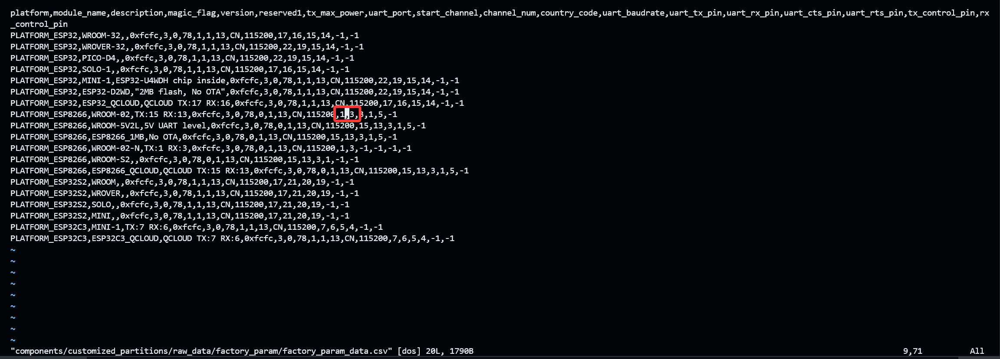

# ESP8266 AT 固件 - 将 AT 端口绑定到 UART0 - 实现使用 USB AT

[<-前往本博客获取更好阅读体验->](https://genmin.icu)

## 前言

又是一日闲来无事，想给 ESP8266 刷个官方的 ESP-AT 固件

但发现官方 AT 固件的 AT 命令端口并不是 UART0，就很不爽

也就是说正常开发板的 UART0 是连接到 USB 转串口芯片的，而官方固件 AT 输入输出不在 UART0

所以不能轻易使用 UART0 输入输出 AT 命令，还需要用软串口 UART1

遂有本文

## 一步到位

如果你不想看下去，看到这里就够了

在这里下载我已经编译好的最新固件:

<https://genmin.icu/p/esp8266-espat/esp8266-nodemcu-v2300-atuart0.bin>

然后用任何工具 (esptool 也好，官方刷写工具也好) 在 0x0000 位置直接刷入即可

刷入完成后 使用 115200 波特率连接即可

## 折腾过程

在官方文档发现了如下内容:

<https://docs.espressif.com/projects/esp-at/zh-cn/release-v2.3.0.0_esp8266/Compile_and_Develop/How_to_set_AT_port_pin.html>

很简单，重新编译即可

为了不污染我的电脑环境，我在 Github Action 进行操作

至于 7788 的环境配置我就不说了，官方文档写的很好的，主要是修改一个地方就可以

`customized_partitions/raw_data/factory_param/factory_param_data.csv`

在这里，更改成 1,3 即可，作为 UART0 端口

最后使用 `./build.py build` 编译即可

成功后固件会输出在 `./build/factory/factory_WROOM-02.bin`，下载刷入即可

最终效果如下:

## 下载链接

<https://genmin.icu/p/esp8266-espat/esp8266-nodemcu-v2300-atuart0.bin>

本人保证该固件基于 [ESP-AT](https://github.com/espressif/esp-at/) 项目 [v2.3.0.0_esp8266](https://github.com/espressif/esp-at/commits/release/v2.3.0.0_esp8266/) 分支的最新 Commit [795c42d8f3ddb90544ade142433cec788711270c](https://github.com/espressif/esp-at/commit/795c42d8f3ddb90544ade142433cec788711270c) 编译而成