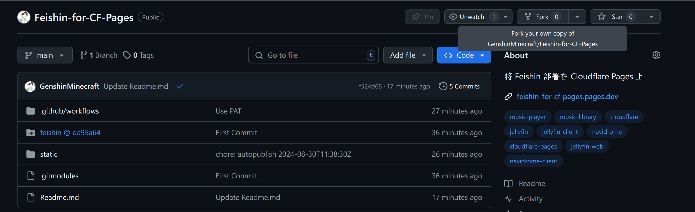
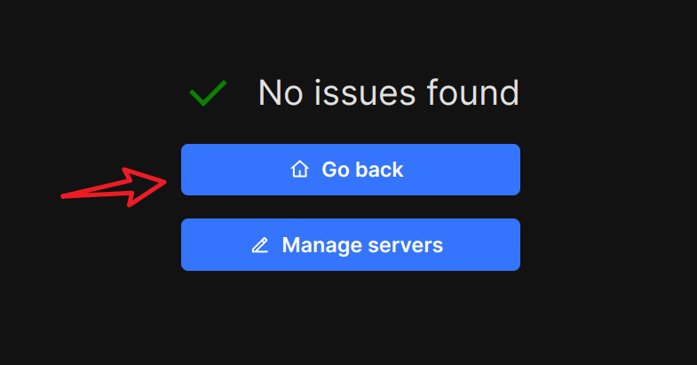
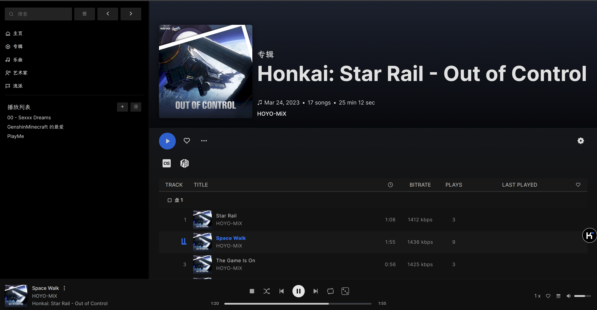

# 使用 Cloudflare Pages 部署 Feishin 用于连接音乐库来播放音乐

本文由 `High Ping Network` 的小伙伴 GenshinMinecraft 进行编撰，首发于 [本博客](https://blog.c1oudf1are.eu.org)

## 介绍

[Feishin](https://github.com/jeffvli/feishin) 是一个 **自托管的**、**开源的**、**多平台的** 第三方音乐播放器

它源自同作者的之前的一个项目 [Sonixd](https://github.com/jeffvli/sonixd)，如果你曾经自建过类似于 [Jellyfin](https://jellyfin.org/) / [Navidrome](https://www.navidrome.org/) 等项目的音乐库，你应该有所耳闻

Feishin 目前可以连接 [Jellyfin]([https://jellyfin.org/](https://jellyfin.org/)) / [Navidrome](https://www.navidrome.org/) 的音源，并提供了 网页版 与 本地客户端 的两种选择，这次我们就使用 Cloudflare Pages 来搭建网页版客户端

## 部署

部署非常简单，仅需要动动手指

### 克隆仓库

首先来到我的仓库: <https://github.com/GenshinMinecraft/Feishin-for-CF-Pages>

在这里 Fork 一个我的仓库，步骤不详细说明了

### 初始化 Pages

来到 [Cloudflare Dash](https://dash.cloudflare.com)，登陆后左侧栏目中选择 `Workers 和 Pages - 概述 - 新建`

选择 Pages 下的 `连接到 Git`

登陆自己的 Github 账号后，选择刚才 Fork 的仓库，随后开始设置

在这里，你只需要更改你的 `项目名称` 和 `构建目录` 即可

随后保存并部署，不出多少时间，就可以部署完成

### 自定义域名

如果你需要在国内正常访问，也许需要自定义一个 自己的域名 来躲开针对于 `pages.dev` 的 DNS 污染

不再赘述

## 使用 Feishin

这里会展示一些 Feishin 的基本用法

### 连接到 Jellyfin / Navidrome

进入到你所部署的 Feishin 网页客户端

点击 `Open menu - Manage servers` 以添加服务器

按照规则填写所需信息，此处演示为 Jellyfin，Navidrome 选项卡大同小异

添加后选择 `Go Back` 即可开始使用

请注意: 服务器连接信息以 Cookies 方式保存于本地浏览器，更换浏览器则需重新添加

### 切换语言

在左侧的菜单中选择 `Settings - Language` 即可更换为简体中文

### 播放音乐

至此，Feishin 就被我们设置~~调教~~得十分好用了，如有特殊需求还可以去设置中进行微调

如图，正在播放 HOYO-MIX Out of Control 中的 Space Walk

部分截图: 

## 小结

总的来说，Feishin 经过这么多次的迭代，已经是开源中比较好用的音乐播放器了

就这样吧

欢迎加入 High Ping 大家庭:                                                                                                                                                                    

- [官网](https://highp.ing)                                                                                                                                                                   

- [Blog](https://blog.c1oudf1are.eu.org)                                                                                                                                                              

- [@HighPingNetwork](https://t.me/HighPingNetwork)                                                                                                                                            

- [@HighPingChat](https://t.me/highpingchat)
