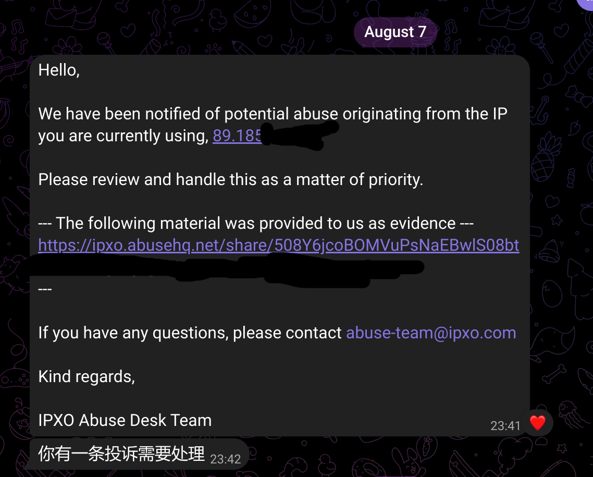
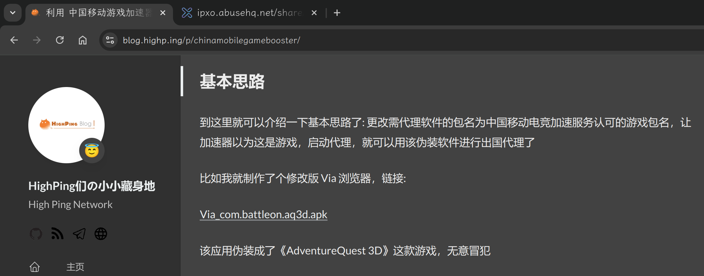
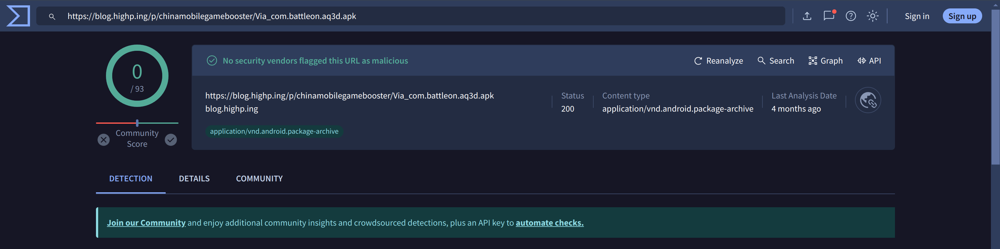
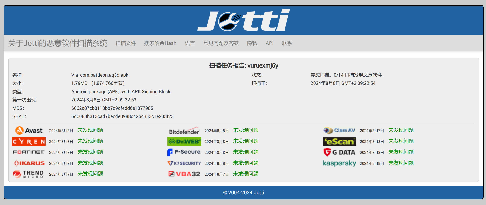
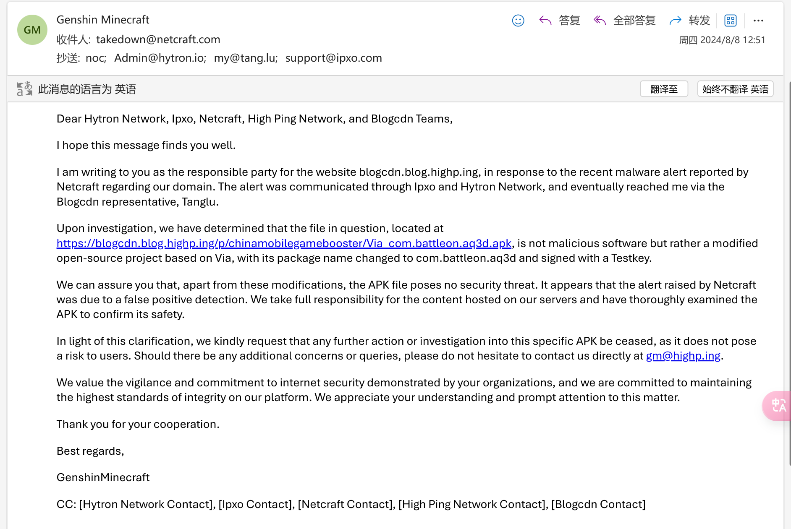

# 关于 High Ping Blog 的第一个 Abuse

本文由 `High Ping Network` 的小伙伴 GenshinMinecraft 进行编撰，首发于 [本博客](https://blog.highp.ing)

# 

2024 年 8 月 7 日北京时间下午 23:41，我收到了来自 BlogCDN Tanglu 的 Telegram 私信:

当时正半夜，我躺在床上重温《轻音少女》，所以我先回应他明天看看

第二天早上起来看了一下，是有关 [利用 中国移动游戏加速器 代理 非游戏软件 实现出国代理服务 (漏洞复现)](https://blog.highp.ing/p/chinamobilegamebooster/) 这一文章的问题

问题来源于该文章中的 `基本思路` 这一节中的一个修改版 Via 浏览器 APK 文件:

.png)

.png)

Netcraft 公司通过扫描检测到了位于 <https://blogcdn.blog.highp.ing/p/chinamobilegamebooster/Via_com.battleon.aq3d.apk> 的文件为恶意软件

并向 Hytron 的 IP 89.185.x.x 发送了 Abuse (该 IP 为 BlogCDN 所有)

该“恶意文件”只是一个 修改版的 Via 浏览器，仅仅将其修改完包名后使用 Testkey 重新签名，可以保证他完全的安全无毒 (Via 内置的除外):

Via 浏览器原包名为 `mark.via`，只是将其更改为 `com.battleon.aq3d`，就被检测出病毒

我们深知 Netcraft 等一众网络安全公司对于这优美和谐的互联网环境作出的努力，所以对于这检测失误，也是情有可原的

随后我向 Hytron、Ipxo、Netcraft、BlogCDN 发送了解释邮件:

目前该事件并未收到正式的回应，我们希望 Netcraft 公司可以重新鉴定该文件，并撤下 Abuse

欢迎加入 High Ping 大家庭:

- [官网](https://highp.ing)
- [Blog](https://blog.highp.ing)
- [@HighPingNetwork](https://t.me/HighPingNetwork)
- [@HighPingChat](https://t.me/highpingchat)

