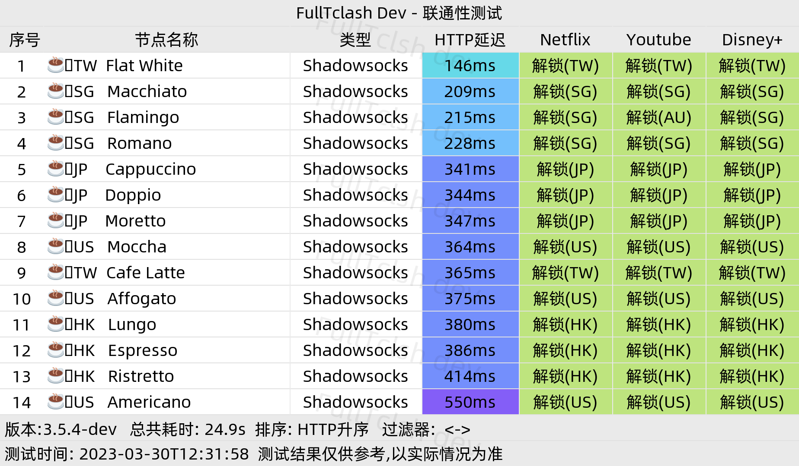
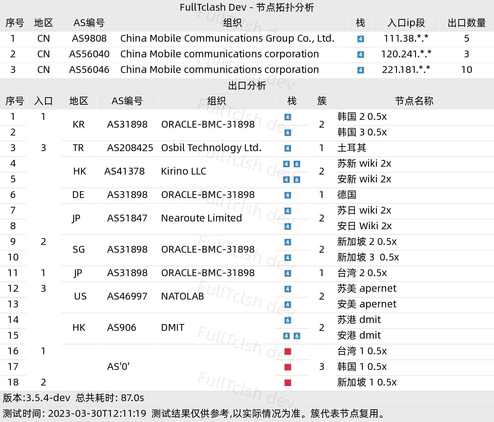

# FullTclash 搭建/使用方法

本文由 `High Ping Network` 的小伙伴 GenshinMinecraft 进行编撰，首发于 [本博客](https://blog.highp.ing)

## 前言 
[**FullTclash**](https://github.com/AirportR/FullTclash.git)是一个 *基于clash 核心运作的、进行全量订阅测试的telegram机器人*（官方原话）

也就是我们平常常说的**测速Bot**

其现在已经比较完善，拥有诸多功能，还可以**自定义添加新功能**！

因为其开源的特性，任何人均可搭建，无需收取**任何费用**！

官方效果图：



想要搭建**FullTclash**机器人，你只需要以下的几样东西：
- 脑子与手
- 一个用于搭建的机器（这一机器的*地理位置、网络环境带宽、性能配置*等决定了测速bot的**结果准确性与是否需要连接代理服务器以访问Telegram服务器**），推荐使用国内家宽的长期运行设备（软路由等）
- 一个Socks5代理，用于国内服务器连接Telegram，本机/内网/公网均可（如为国外服务器可忽略此项）
- 一对Telegram api_id与api_hash，可以在[这里](https://my.telegram.org/apps)获取
- 一个Telegram Bot Token，可以在Telegram的@BotFather处获取，用于连接机器人

服务器环境要求：
- 系统选择**Win/Linux/MacOS**均可，如架构非x86_64(amd64)可能需要*手动编译*对应Clash测速内核
- Python3.9+（Ubuntu22.04+具有Py3.9+，Debian12+具有Py3.9+，Win/Mac手动选择Py3.9+，其他Linux请自行确认Py3.9+）
- Pip环境支持（Linux下包名为`python3-pip`，Win/Mac须在安装时勾选）
- Git环境支持（Linux下包名为`git`，Win/Mac自行解决）

## 安装（以Debian系列Linux为例，Win/MacOS用户可以尝试按照以下方法进行部署，但个别步骤不一样）
### 安装环境（Win/MacOS自行解决
安装所需要的软件包：
```
apt install python3 python3-pip wget curl git -y
```

### 拉取项目
本项目有`master`、`dev`、`old`三个分支。

`old`分支较为老旧，不建议使用；`master`分支为正式版，日常使用可以选择；`dev`分支为开发版，具有最新的功能和最好的技术支持，建议选择！

这篇文章选用`dev`分支作为演示

```
git clone -b dev https://github.com/AirportR/FullTclash.git
```

如果因为*众所周知*的网络问题在国内**无法直接拉取**，可以使用下面二选一代理：
```
git clone -b dev https://kgithub.com/AirportR/FullTclash.git
git clone -b dev https://ghproxy.com/https://github.com/AirportR/FullTclash.git
```

### 安装pip依赖
进入项目
```
cd FullTclash
```

安装依赖：
```
pip3 install -r requirements.txt
```

如果因为*众所周知*的网络问题在国内**无法直接安装pip依赖**，可以使用下面的源：
```
pip3 install -r requirements.txt -i https://pypi.tuna.tsinghua.edu.cn/simple
```

稍等片刻（5min）即可完成安装依赖

### 修改配置文件
***这一步相当的重要！！！！！！！修改配置文件错误可能会导致无法启动！！！！！！！***

首先在项目文件夹内复制`config.yaml.example`为`config.yaml`

```
cp resources/config.yaml.example resources/config.yaml
```

随后用你喜欢的编辑器打开`resources/config.yaml`，按照注释修改配置文件

理论上最简的配置文件为：
```
admin:
- 12345678 #管理员，此处写你的账户id或用户名，必须配置该项，否则程序会自动退出
bot:
 api_id: 123456 # Telegram的api_id
 api_hash: ABCDEFG # Telegram的api_hash
 bot_token: 123456:ABCDEFG #bot的token
 proxy: xx.xx.xx.xx:xxxx # 用于连接Telegram服务器的Socks5代理，如网络环境支持可不填写
clash:
 path: './bin/fulltclash-linux-amd64' # bin内核的路径，下面会讲到（每个系统默认不同，Linux Amd64可使用默认）
```

建议先使用上面的模板进行运行成功后，再按照[config.yaml.example](https://github.com/AirportR/FullTclash/blob/dev/resources/config.yaml.example)进行修改/添加！

### 添加可执行权限
*Win用户可以跳过这一步，除非架构不同*
首先查看你电脑的系统与架构
如为`Macos Amd64/Windows Amd64/Linux Amd64`则可以不用自行编译

添加可执行文件权限：
```
chmod +x ./bin/fulltclash-linux-amd64 #如为自编译请检查文件名
```

### 编译内核（可选）

如系统/架构**非上面的默认**，可以自行编译

详情可以看这一**FullTclash附属项目**：<https://github.com/AirportR/FullTCore>

***不论你是否自行编译，是否为默认，都应该进行下面的一步！！***

将编译后的内核复制到项目的`bin/`目录下，并添加可执行权限（详见上述）

然后更改配置文件`resources/config.yaml`中：
```
clash:
 path: '内核路径，以项目路径写起'
```

## FullTclash，启动！

进行完上述步骤后，就可以开始启动**FullTclash**了

请在开始执行前注意以下几点：
- Python版本必须为3.9+
- 请确保机器可以连接到Telegram，国内机器可以选择Socks5代理
- 确保配置文件已存在
- 确保pip依赖已安装完成

回到项目目录，开始运行：
```
python3 main.py
```

看到以下的输出即为完成启动：
```
2023-08-12 13:49:24.722 | INFO     | utils.cleaner:add_user:1037 - 添加成功
2023-08-12 13:49:25.858 | INFO     | utils.cleaner:getBotconfig:804 - 从配置中获取到了api_id
2023-08-12 13:49:25.860 | INFO     | utils.cleaner:getBotconfig:806 - 从配置中获取到了api_hash
2023-08-12 13:49:25.861 | INFO     | utils.cleaner:getBotconfig:808 - 从配置中获取到了bot_token
2023-08-12 13:49:25.861 | INFO     | botmodule.init_bot:<module>:143 - 管理员名单加载:[tgid]
2023-08-12 13:49:25.862 | INFO     | botmodule.init_bot:<module>:160 - 当前代理设置为: x.x.x.x:xxxx
2023-08-12 13:49:25.863 | INFO     | botmodule.init_bot:<module>:193 - 配置已加载, Telegram bot程序开始运行...
开始启动clash core
接收到的端口数量: 16
已开始在 127.0.0.1:11219 进行socket监听

--- More ---
Mixed(http+socks) proxy listening at: 127.0.0.1:11230
--- More ---

# --------------------------- [ Start bot AsyncIOScheduler Successful ] ---------------------------- # 
2023-08-12 13:49:26.323 | INFO     | utils.cleaner:init_addons:221 - 模块即将动态加载: [*xxx*]
2023-08-12 13:49:26.324 | INFO     | utils.cleaner:init_addons:222 - 正在尝试获取 'SCRIPT' 属性组件

--- More ---
2023-08-12 13:49:26.326 | INFO     | utils.cleaner:init_addons:253 - 已成功加载测试脚本：xxx
--- More ---

2023-08-12 13:49:26.822 | INFO     | utils.cleaner:init_addons:256 - 外接测试脚本成功导入数量: 60
2023-08-12 13:49:26.829 | INFO     | utils.cleaner:init_callback:294 - 权限回调脚本导入数量: 0
2023-08-12 13:49:26.831 | INFO     | utils.cleaner:getBotconfig:804 - 从配置中获取到了api_id
2023-08-12 13:49:26.832 | INFO     | utils.cleaner:getBotconfig:806 - 从配置中获取到了api_hash
2023-08-12 13:49:26.832 | INFO     | utils.cleaner:getBotconfig:808 - 从配置中获取到了bot_token

2023-08-12 13:49:29.222 | INFO     | glovar:bot_info:50 - >> Bot Started
2023-08-12 13:49:29.224 | INFO     | glovar:bot_info:51 - >> Bot ID: botid Username: @xxx
# ---------------------------- [ Start the bot ] ---------------------------- #   
# ---------------------------- [ Check Bot Successful ] ---------------------------- #   

```

***恭喜你，你的Telegram FullTclash Bot已经成功启动，可以去对Bot发送`/help`以测试功能！***

## 保活
**Windows**的保活可以将cmd/powershell放置在后台，不用关闭即可

**Macos**保活也可以同Windows一样，将Terminal放置后台

而对于**Linux**，则有多种保活方法，这里介绍两种较为通用的方法：

### Screen 方法保活

对于更详细的使用方法，可以查看这一篇站内文章：<https://c1oudf1are.link/p/screen/>

其优点是**简单并且容易配置**，缺点是无法使用**开机自启**

简单的命令如下：

```
screen -S fulltclash

# 在screen环境内输入
python3 main.py
# 然后直接关闭Ssh/Terminal即可

# 进入screen环境
screen -d -r fulltclash
# 退出也是直接关闭窗口
```

### Systemd 方法保活

***注：此方法需要Linux系统使用Systemd作为进程管理服务，普遍的Ubuntu/Debian/Centos已支持，但个别Linux系统（如Openwrt）不支持Systemd）***

首先使用文本编辑器将以下的内容输入至`/etc/systemd/system/fulltclash.service`中，记得**需要更改下方文本中个别字段**

```
[Unit]
Description=FullTclash Daemon
After=network.target

[Install]
WantedBy=multi-user.target

[Service]
Type=simple
WorkingDirectory=[FullTclash项目的绝对路径]
ExecStart=[启动时的命令，命令必须为绝对路径，一般为 /usr/bin/python3 main.py]
Restart=always
StandardOutput=null
StandardError=null
```

然后可以使用以下的命令*启动/停止/重启/查看状态/设置开机自启*：

```
systemctl start fulltclash # 启动
systemctl stop fulltclash # 停止
systemctl restart fulltclash # 重启
systemctl status fulltclash # 查看运行状态
systemctl enable fulltclash # 设置开机自启
systemctl disable fulltclash # 关闭开机自启
```

## 小结

总的来说，**FullTclash**的配置难度还是十分简单的，没有什么比较困难的部分

之后还会编写FullTclash的使用方法 ~~摆烂中~~

有什么不懂得可以来以下的地方提问哦！
- Telegram FullTclash Group: <https://t.me/+gzjSyp_e5ZA3ZjAx>
- Github Project Issues: <https://github.com/AirportR/FullTclash/issues>

总会有大佬给你解决的啦！