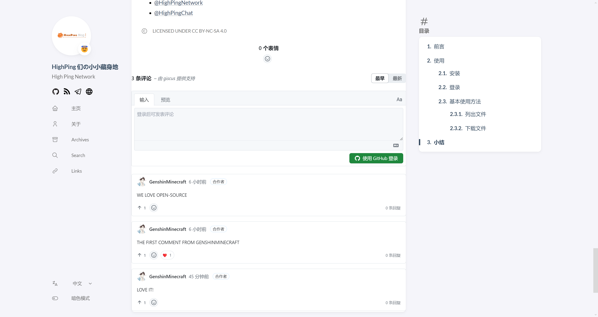
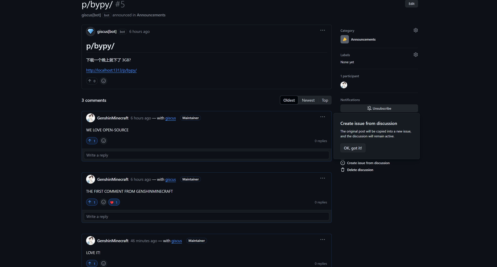
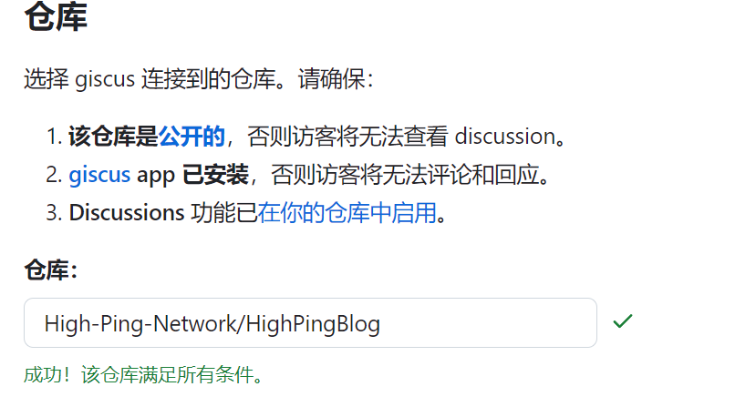
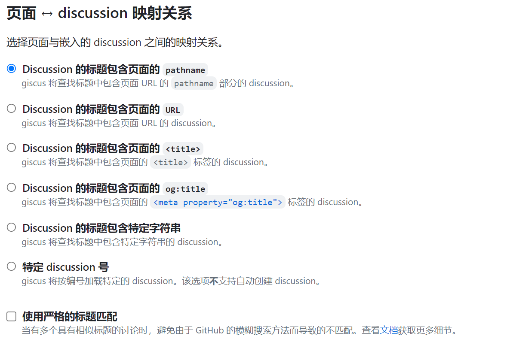
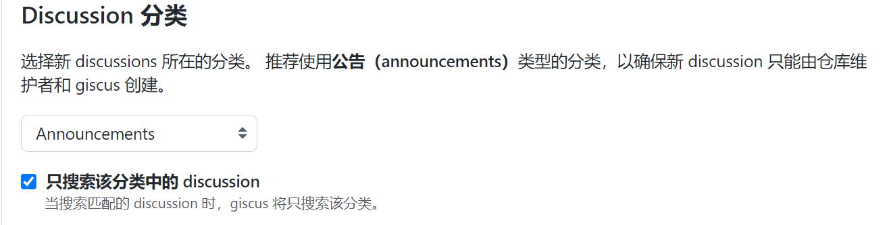
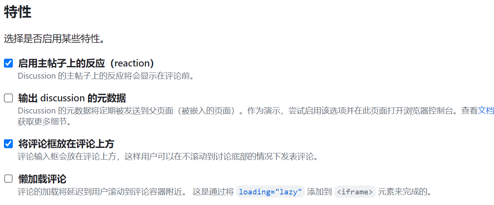
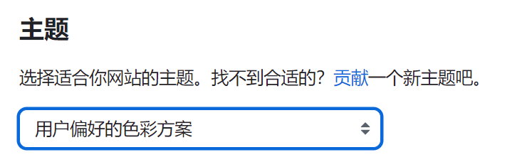
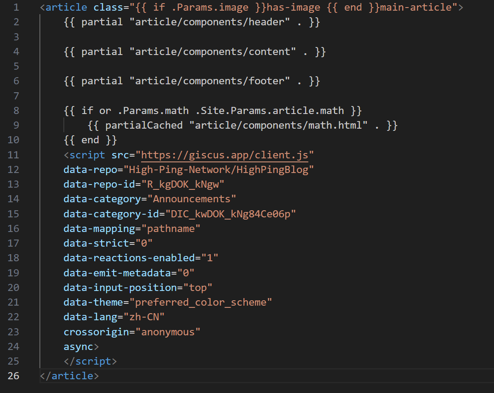

# Giscus -- 为你的博客添加一个基于 Github 的评论区

本文由 `High Ping Network` 的小伙伴 GenshinMinecraft 进行编撰，首发于 [本博客](https://blog.highp.ing)

## 前言

Giscus 是一个**开源的**、**免费的**、**易于使用的**基于 Github Discussions 实现的评论系统

理论上说，只要是支持嵌入 Html 的地方，都可以当成评论区

他的优点很多:
- 开源且免费
- 支持自己部署 (一般情况下用官方给的 Api 就行了)
- 兼容性广泛
- 嵌入简单，仅需引用一个 Js

Giscus 一般用于 Hexo / Hugo / Vuepress / Vitepress 等基于纯 Html 的博客程序，如果是 Wordpress / Typecho 等动态博客程序，则可以使用相关的插件或原本就支持

需要注意的一点是，Giscus 既然基于 Github，所以评论也是需要事先登录 Github 账号的，如国内网络环境不佳则可能体验有点炸裂

这是本博客添加 Giscus 后的样子: 



在 Github Discussions 会显示:



## 实践

### 仓库设置

首先，找到一个 Github 仓库，不一定是新的，当然也可以使用你的博客仓库，本文就拿 [High-Ping-Network/HighPingBlog](https://github.com/High-Ping-Network/HighPingBlog) 作为示例

前往 `仓库 - Settings - General - Features`，找到 Discussions 并打开即可


随后安装 Giscus: <https://github.com/apps/giscus>

点击绿色的 Install，安装到所需仓库即可

### 生成配置

前往 [Giscus](https://giscus.app/zh-CN) 进行配置

#### 仓库

此处填写仓库信息: 



#### 页面 ↔️ discussion 映射关系

下面的是对于 Discussions 名称的设定，也就是这个的命名: 


个人推荐使用 `pathname`，也就是网站 URL 的路径部分，对于日常调试环境非常友好



#### Discussion 分类

Discussion 分类 按照推荐就行了



#### 特性

这个因人而异吧，我只开了个评论框在评论上方



#### 主题

如何选择一个合适的主题呢？很简单，当你在这一界面选择主题后，将会更改当前界面的主题，找到一个适合自己博客的就好啦



#### 保存配置

按照上面配好之后，下面就会出现我们所需要的 Html 代码啦！

比如本博客的 Html 代码为: 

```
<script src="https://giscus.app/client.js"
        data-repo="High-Ping-Network/HighPingBlog"
        data-repo-id="R_kgDOK_kNgw"
        data-category="Announcements"
        data-category-id="DIC_kwDOK_kNg84Ce06p"
        data-mapping="pathname"
        data-strict="0"
        data-reactions-enabled="1"
        data-emit-metadata="0"
        data-input-position="top"
        data-theme="preferred_color_scheme"
        data-lang="zh-CN"
        crossorigin="anonymous"
        async>
</script>
```

### 嵌入到界面

怎么嵌入呢？好问题，根据你所使用的博客程序、主题等来看

比如本博客的嵌入方式，就是在主题的 Layout 模板中嵌入即可

路径在 `./themes/hugo-theme-stack/layouts/partials/article/article.html`，找个位置放好就行



## 小结

很简单对吧，真的很简单。如果你是从 High Ping Blog 阅读本文章的话，那应该会在下方见到一个评论区，登录以在下方发表你的意见吧！

欢迎加入 High Ping 大家庭:
- [官网](https://highp.ing)
- [Blog](https://blog.highp.ing)
- [@HighPingNetwork](https://t.me/HighPingNetwork)
- [@HighPingChat](https://t.me/highpingchat)