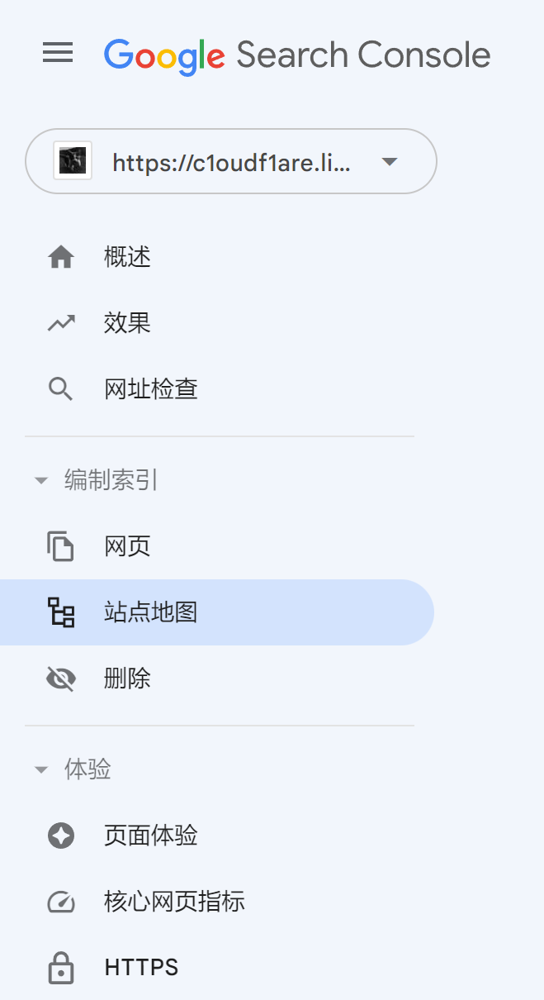
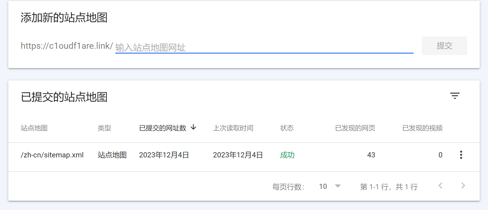
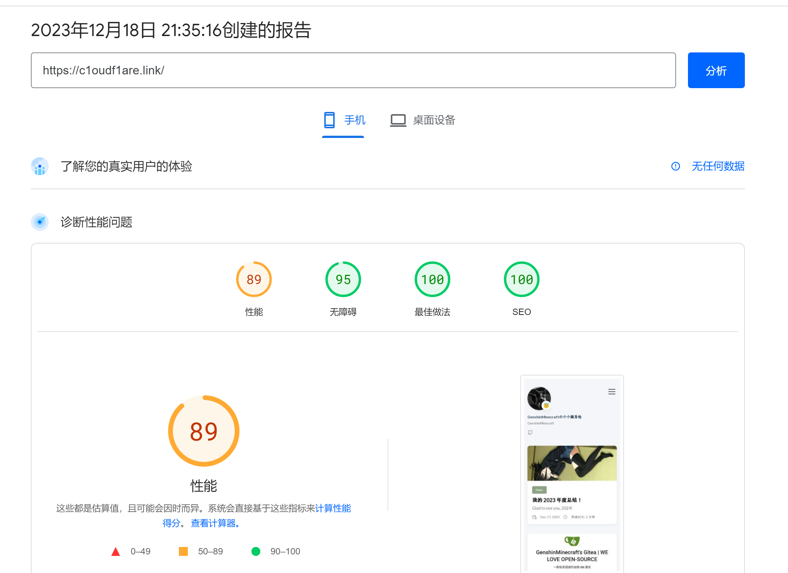
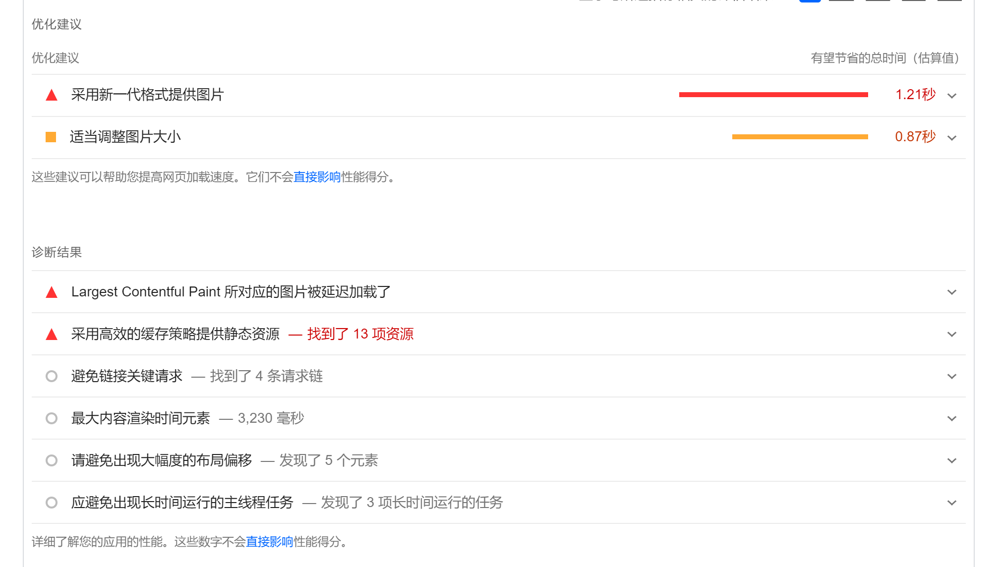
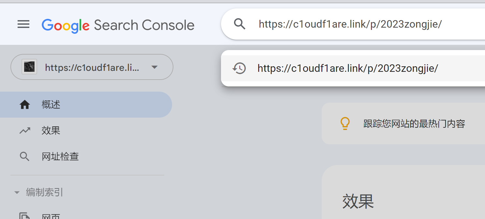
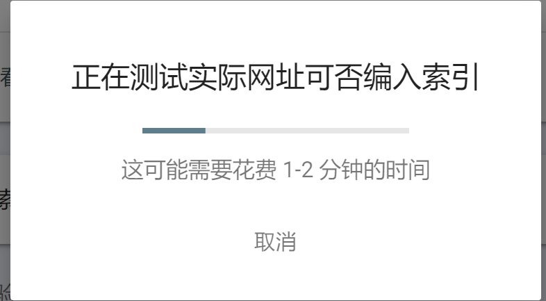

# 如何让 Google 快速收录你的网站 / 提升在 Google 的排名

本文由 `High Ping Network` 的小伙伴 GenshinMinecraft 进行编撰，首发于 [本博客](https://blog.c1oudf1are.eu.org)

## 前言
针对于小型站点（博客）站长来说，让自己的内容更多人看见是主要的工作之一

所以本文会教你如何快速提升在 Google 中**你的网站的排名**

本文会以[**本博客**](https://c1oudf1are.link)为例子

## 1.申请收录
这一 Part 相信大部分站长都完成了，如果你还未完成的话

可以找到 [Google Search Console](https://search.google.com/search-console) 来完成谷歌收录设置

## 2.Sitemap
### 什么是 Sitemap
Sitemap 是收集了一个站点中所有 URL 的文本文件

比如我的站点的 Sitemap 链接就是 <https://c1oudf1are.link/zh-cn/sitemap.xml>

### 一般情况下生成 Sitemap
一般的，如果你使用**博客生成工具**(Hugo/Hexo等) 或 **WordPress** 等由 PHP 编写的博客程序，都会自动化地生成本站对应的 Sitemap

你可以在有关于**博客站点主题**，**各种 Readme** 中找到你的站点的 Sitemap

Sitemap 可以让 Google 更好地爬取你的网站

**此方法非常方便，博客程序一般会定期生成你的 Sitemap**

### 使用各种工具生成 Sitemap
当你的博客程序没有提供 Sitemap 生成服务时，可以使用该方法

你可以在 [Google](https://www.google.com.hk/search?q=sitemap+generator) 搜索到各种在线生成 Sitemap 的工具

生成完之后，请将导出的 Sitemap 放置到**你博客的任何一个目录下**

要求就是，可以用你的**博客域名**访问的范围，比如上文中提到的 <https://c1oudf1are.link/zh-cn/sitemap.xml>

**请注意，如果你的博客发生了变动（比如新增文章），需要重新生成**

### 向 Google 提交 Sitemap
在`侧边栏-编制索引-站点地图`中

输入站点地图 URL 后即可完成提交

## 3.访问速度以及优化
### PageSpeed Insights
Google 会参考**用户的体验**来进行排序，因此一个好的界面以及访问速度至关重要！

> Google 的核心排名系统旨在奖励那些提供良好网页体验的内容。Search Console 针对您可能希望考虑的两个方面提供相关报告：Core Web Vitals 和 HTTPS。不过，网页体验并不只是涉及这两个方面。 

你可以通过 [Google 官方工具 PageSpeed Insights](https://pagespeed.web.dev/) 来检测你的网站的得分

一般来说，得分 95+ 的网站优化已经顶破天了，无需继续优化

得分 85+ 的网站可能需要一些小小的优化，但是并没有很大必要

在测评下方有对于你网站的**优化建议**

可以参考 Google 给出的建议，进一步加速你的网站

### 需要注意优化的地方
#### 服务器本身延迟
从客户端至服务器本身的延迟如果很高，那么得分不可能好到哪里去

如果你是`纯 HTML`站长，可以考虑使用 `CloudFlare Pages` 或 `Github Pages`，既无需服务器，延迟也还不错

如果你是`拥有自己服务器并搭建站点`的站长，肯定需要一台线路、配置等各方面足够好的机器

如果你是`CDN`用户，请注意配置合适的缓存规则，避免源站负载过大以及不必要的请求。

#### 图片
**图片是博客等项目的重头**

如果你的机器带宽过小（1M-50M），则应配置**站外图床**

这里推荐一个稳定且免费的图床：<https://png.cm>

优点就是上传时**自动转换成 Webp 格式**（PageSpeed Insights 中提醒的使用新一代图片文件格式就是 Webp）

而且，一个页面内如果有过多图片，也会降低用户体验，降低测试分数

#### PHP
如今，大部分博客已经都是 **PHP 应用**了

PHP 博客有其优点，当然也有少许缺点

PHP 有一个至今绕不开的难题

- 占用过高
- **请求界面时需要运算**
- 无法真正做到全缓存

这几点使 PHP 博客需要一台至少 4c4g 的站机才算足够

所以，如果**你有一定技术能力**，可以像我一样，部署一个**纯 HTML** 博客

我个人使用的是 Hugo，当然也有其他类似的选择

#### HTTPS
HTTPS 也是 Google 所看重的内容之一，相信开启 HTTPS 对于各位站长来说还是不难的，不赘述了

#### 小结
大概就这些重头戏，其他优化可以不管，这几个优化完了保证分数上85

## 其他需要注意的地方
### 刚提交给 Google 时
注意：第一次提交给 Google 时并不会马上就收录，大约要等待 2-3 天左右

当收录了你的站点时，请手动将博客文章地址输入到 Search Console 中的搜索框内

这样会让 Google 查询你输入的网址**是否已经收录**，一般是没有的

然后点击`请求编入索引`

这样就可以手动让 Google 收录网址了

刚开始，需要一篇篇博客手动收录！

### 等稳定后提交
等你的博客稳定，并定期**有内容产出的时候**

Google 就会定期从 Sitemap 中查找还没添加的 Url，进行编入索引

这样就可以不用理会 Google Search Console 了！

### 稳定你的博客
稳定博客一般需要半年左右的时间，每个月发点文章

而且不要频繁更换页面主体（比如换主题），长期稳定后就可以等候排名慢慢提升

虽然本文的标题是`快速提升在 Google 的排名`，但是莫要心急，没有好内容产出是没有用的！

## 总结
本文阐述了我自己所用的方法，相信各位站长能快速提升自己 Google 排名

也欢迎各位站长来和我交换友链！

发送邮件至 genshinminecraft#duck.com 或 Telegram:@C1oudF1are 来交换友链吧！

欢迎加入 High Ping 大家庭:
- [官网](https://highp.ing)
- [Blog](https://blog.c1oudf1are.eu.org)
- [@HighPingNetwork](https://t.me/HighPingNetwork)
- [@HighPingChat](https://t.me/highpingchat)