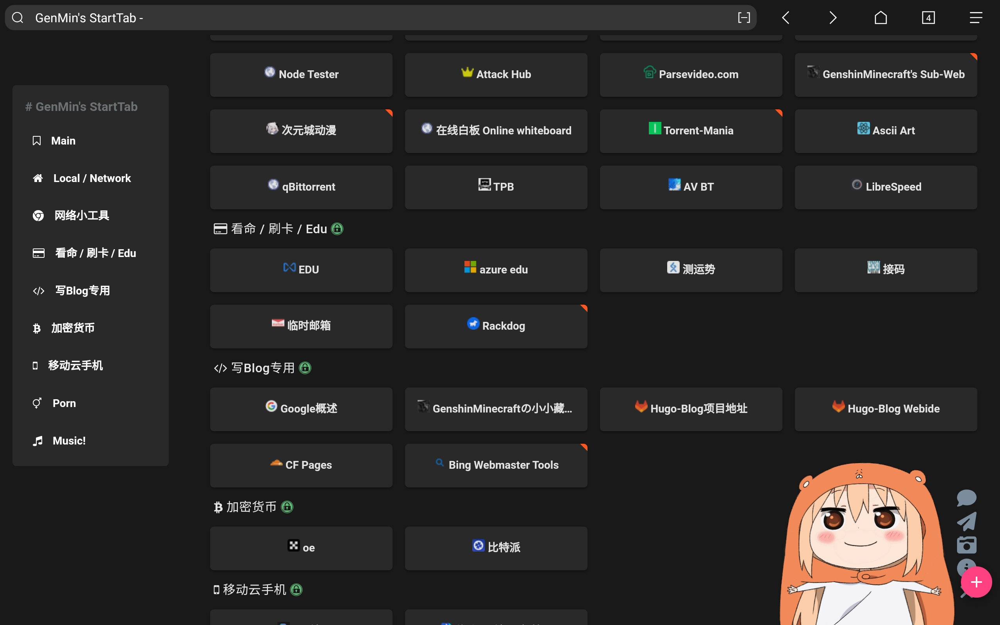

# HomeCloud 家庭云 折腾心得
## 前言
作为一个 **新时代网络人**，在家里放几台小机器，运行一下内网服务，还是非常 INTERESTING 的～～

所以本文会介绍，有***哪些服务值得在内网运行***，以及***家用低功耗服务器的选择***，具有一定的参考价值，也包含一些个人的主观评价！

## My Servers & Network Devices
首先来列个表
- Redmi AX6s
- Friendly ELEC Nano Pi R4s
- J3455 小主机
来一个个介绍

### Redmi AX6s
这是我家里的**主要网关设备**，在我没有 R4s 之前当作我的 路由+路由代理 设备

现在主要当作 **无线AP** 和 **主要路由设备**，但并不进行拨号（shanbing运营商不给光猫超密）

拨号由**运营商光猫**进行，对外网可以跑到 970Mbps 的速度，千兆宽带这样可以了

安装了 Openwrt 系统，仅用于 **DHCP** 与 **DNS** 和 **NAT转发**

~~（还有个 Alist 以及内网所有 FRP~~

就是很普通的 Router 一个！

### Friendly ELEC Nano Pi R4s
这是我家里的**主要服务器设备**，用于各种7788的服务

运行了一个 Clash 内核作为网络代理（非路由代理，非强制）

其余的等会在介绍
~~（别问为什么要写这么长的名字，为了装逼，其实 R4s 就行~~

基础配置：**Arm64 6c4g** & **64G SDCard** & **32G USB Disk** & **64G USB Disk**

系统：Ubuntu 20.04

### J3455 小主机
这个。。。 不好说是什么设备，应该与 R4s 差不多，都是服务器

运行了需要**大储存大硬盘**的服务，~~很爽~~

基础配置：**Inter J3455 4c4g** & **120G SSD** & **320G HDD x2**

系统：Ubuntu 22.04

## Redmi AX6s 服务

### Frpc
很好理解吧？[Frp](https://github.com/fatedier/frp) 是一个简易的**内网穿透**服务，可以轻易地将**内网端口穿透至公网**

目前，我使用的公共 Frp 服务为 [OpenFrp](https://www.openfrp.net/#home) 

对于这 OpenFrp，也来讲一下：它是免费的，公共的 Frps 服务器，提供了全球各地的 Frps 服务器，每一位注册用户可以使用**每日签到**来获取流量，共计可开**4条通道**。（需实名）

并且，其还有**自行制作**的 Frpc 客户端，可以使用 **API令牌**(Token) 更方便连接至其服务器！

请注意，Frp 服务区分 `Frpc` 以及 `Frps`，前者为*客户端*，后者为*服务端*

一般来说，仅需要使用 Frpc 即可

### Alist
[Alist](https://alist.nn.ci/zh/) 是一个适合部署于自己服务器上的**网盘聚合文件列表**应用，其将数十个服务商的网盘服务**整合**起来，提供*网页访问*或 *Webdav 服务*，一般用于存储影视等**流媒体资源**，还是挺不错的

关于在本博客上关于 [Alist](https://c1oudf1are.link/categories/alist/) 的文章，请点击前字查看！

搭建过程很简单，就不教程了


对于 Alist 的使用上，我一般配合 [Rclone](https://rclone.org/) 进行使用，对于 Rclone 的各文章，请参阅[本博客的 Rclone Tag 食用](https://c1oudf1are.link/categories/rclone/)

对于网盘选择，[这篇文章](https://c1oudf1are.link/p/alist/)已经介绍的很清楚了！

但不妨我再说一次：Onedrive + 夸克！

Onedrive 用于储存一些**备份内容**，夸克因为其可以**转存 BT 磁力**的特性，很适合用来当影视盘！

但是还是要根据自身的经济情况等来选择！

## R4s 服务
说到 R4s，运行的服务就多了，不急，慢慢来

### FullTclash
[**FullTclash**](https://github.com/AirportR/FullTclash.git) 是一个 *基于clash 核心*运作的、进行全量订阅测试的telegram机器人（官方原话）

听不懂？简单来说就是**测速 Telegram 机器人**

其作用，有的人很需要，有的人其实没什么需要

对于其搭建方法，[本博客就有](https://c1oudf1are.link/p/fulltclash/)

其实现在的 FullTclash 已经**十分先进**了，由于本博客的教程有点久远(23.08)

所以现在来贴上最新版本测试的结果：


**碉堡了！** （雷总音

挺好玩的，就是上手配置**难度稍高**，不适合小白**进行搭建**，有需要可联系[我的 Telegram](https://t.me/c1oudf1are)无偿教程！

### Cloudflare Tunnel
Cloudflare Tunnel 是 CF 家的**内网穿透**服务，但是其并不是 Frp，是 **Cloudflare Warp** 与 **Zero Trust** 的一部分

Cloudflare Tunnel 有如下的优点：
- 无限隧道：对于目前互联网上公共的 Frp 服务来说，CF 给的还是很厉害的
- 无限流量：这个就厉害了，很牛逼
- 配置简单：官方给你一键命令，连**进程守护**都可以根据系统**自动配置**
- 与 Cloudflare 深度绑定：与 Cloudflare 其他服务**深度绑定**，比如域名等直接**一键配置**

本博客也有关于 Cloudflare Tunnel 的教程：[There](https://c1oudf1are.link/p/cloudflare-tunnel/)

总结还是那句话：***Cloudflare 大爹永远是你大爹！***

但是其也有缺点：
- 在国内直连访问 Cloudflare 服务，稍微有些卡
- 仅支持 HTTPS(TCP,WSS) 隧道出口到公网，其他协议(Belike SSH,RDP)等需要在客户端配置客户端才可正常使用！

### 1Panel
[1Panel](https://1panel.cn/) 是新一代的 Linux 服务器运维管理面板（官方原话）

之所以选择 1Panel 而不选择 其他类似于 宝塔 等面板，主要还是因为其使用 **Docker** 进行服务部署

不管是 HTTP(Nginx/OpenResty)，还是 PHP，又或是其他的 **Docker 服务** 都一同集成在一个面板上！

而宝塔等面板，一般直接是安装在主系统上

由于内网，所以服务稍微有点多，而且不想让环境太乱

所以全部使用 Docker 进行管理才是最有效的方法！


也有非常多的基于 **Docker** 的应用


而其他，对于服务器的管理，还是非常有帮助的

R4s 中所有的网站均由其**管理&反代**

### Gitea
也就是本文章的头图 ~~（真的是想不到拿什么玩意当topic了~~
[Gitea](https://about.gitea.com/) 是一个**开源**的 Git 服务，提供类似于 [GitHub](https://github.com) 的体验，但是其更私有化。且由 **Go** 语言进行开发，这确保了其**快速**的根本！


可以看到，与 GitHub 十分相似，他也提供了大部分**等同于 GitHub 的体验**，比如：
- 兼容 GitHub 的 Workflow Runner(GitHub 叫 Action)
- CI/CD 支持
- SSH 验证服务
- HTTP API 令牌验证服务
- ......

还有更多的功能，等待你去使用！

### Music163bot
闲的无聊整了个 [Music163bot-Go](https://github.com/XiaoMengXinX/Music163bot-Go)

用处就是在 Telegram 上创建一个可以获取**网易云音乐**的 Bot

官方 Bot 为：[@Music163bot](https://t.me/Music163bot)

我自建 Bot 为：[@gxwzbot](https://t.me/gxwzbot)

说实话没啥用，获取高音质音乐还需要**网易云音乐会员**，但是确实挺好玩~~（不是吗


*PS: 图中音乐为尼康战歌 《Welcome Home》*

### Miaospeed
[Miaospeed](https://github.com/miaokobot/miaospeed) 是一个基于 **Clash** 用于测试**网络代理服务商**的后端，前端即为大家所熟知的 **Miaoko**

可以说，**Miaoko** 与上边提到的 **FullTclash** 为同一种东西，但是其不开源

我在 R4s 搭建俩测速平台也是为了对接不同的测速 Bot
这玩意没啥好说的，就只是列出来而已（

### YesPlayMusic
[YesPlayMusic](https://github.com/qier222/YesPlayMusic) 是一个**高颜值的第三方网易云播放器**（官方原话）

为了体现他的高颜值，先来几张图：


其支持的平台有:
- Windows
- Linux
- MacOS
- Web

其与近期发布了 `v2.0.0 alpha` 版本，大更新了一次，可以在 [Release](https://github.com/qier222/YesPlayMusic/releases/tag/v2.0.0-alpha-2) 找到

`v2.0.0` 版本与上面的截图大不相同，请自行安装看看效果！

*PS: `v2.0.0` 版本暂无 Web 版*


### OneNav
[OneNav](https://www.onenav.top/) 是一个**开源免费**的书签管理工具，采用了 **PHP+SQLite3**，并且支持 **Chrome 浏览器插件**，与浏览器原生兼容。

我采用的 PHP 环境为：由 **1Panel** 安装的 **OpenResty**+**PHP8**



我所采用的 OneNav 主题：[Dark](https://gitlab.com/mooe/dark)

我用其作为我的浏览器启动页，提供了资源索引的服务，美中不足的就是 **没有搜索栏**

### 小结
你可以看到，我用 **R4s** 所运行的服务这么这么多

但是以上所有的服务火力全开，占用也很低


这是以上的服务全部都在运行的情况（甚至还有一些没有写在这里的项目）

可以看到
**CPU 占用仅 1%**

**内存仅用了 800M 不到**

**Uptime 大约 1.00**

所以，作为一个 **6c4g**(6 线程 4g 内存) 的***低功耗***服务器，性能还是非常强劲的

点评：家里没有家里云的(副歌除外)无脑入，R4s/R2s 都行

R4s 能耗比太牛逼了，跑上面那堆玩意功耗不过8w

注意：R4s 当主路由(Openwrt)实在是有点浪费，建议起步就 Ubuntu 好了！

还有，R4s的 1G 版本真心不建议买，性价比不好，跑几个服务就满了

4G 刚刚好差不多，1G 实在是有点。。。不好评价

## J3455 小主机 服务
其实，不论按照什么资格来说，J3455 这机器都是不应该拿来做 HomeCloud 的

因为单纯从 J3455 这个 CPU 的 *TDP 10W* 看起来，都不是啥省电的料

但是，我只不过是在家里云缺少一台 **x86 架构**的机器而已（

（虽然现在基本啥软件预编译都有 Linux-Arm64 了，但是还是对于 x86 有点执着，不用就不安心

（冷知识：这是我家唯一一台 x86 设备wwwwwwwwwwwwwwwww

### 1Panel
额，这玩意好像在上面的 R4s 中介绍过了，但是并不妨碍我直接复制过来（

真就复制过来了，不介绍了，懒！

每台服务器都要部署一次，有点麻烦呢（

#### 我绝对不会告诉你这是复制的

[1Panel](https://1panel.cn/) 是新一代的 Linux 服务器运维管理面板（官方原话）

之所以选择 1Panel 而不选择 其他类似于 宝塔 等面板，主要还是因为其使用 **Docker** 进行服务部署

不管是 HTTP(Nginx/OpenResty)，还是 PHP，又或是其他的 **Docker 服务** 都一同集成在一个面板上！

而宝塔等面板，一般直接是安装在主系统上

由于内网，所以服务稍微有点多，而且不想让环境太乱

所以全部使用 Docker 进行管理才是最有效的方法！


也有非常多的基于 **Docker** 的应用


而其他，对于服务器的管理，还是非常有帮助的

J3455 中所有的网站均由其**管理&反代**

### Navidrome
这就是我在 J3455 小主机上部署的的重头之一，占用了我的至少**300G**空间 ~~（硬盘：I am NOT FREE~~

[Navidrome](https://github.com/navidrome/navidrome) 是一个**自托管式的，开源的，免费的**自建流媒体音乐服务（定语是不是有点多了


它**兼容与 Subsonic API**，也就意味着用于 Subsonic 的客户端都可以使用！

话不多说，先来看看他 Web 的表现（客户端的在下面）


额，说实话，他的 Web 端表现的真的不是很惊艳，甚至感觉**很丑**

不过好在他兼容 Subsonic，可以自由地配置客户端

下面是安卓客户端 Symfonium：


**Navidrome** 的部署方法也在本博客中，详情请点击[这里](https://c1oudf1are.link/p/navidrome)

~~你知道吗：在家部署一个歌曲**音质超好**的音乐云，真的很爽~~


### qbittorrent
都说了是 HomeCloud，所以 **BT Download** 能缺席吗？

[qbittorrent](https://www.qbittorrent.org/) 是一款**开源的**网络资源下载工具，可支持的类型包括 HTTP、BT 等

我在本机上使用的 **qbittorrent** 版本为 **qbittorrent-nox**

因为其安装**非常简单**，保活也**非常简单**，并且**使用 Web 界面**作为访问面板，很符合这种没有 Display 的机器

安装有多简单呢？一条命令搞定！（Debian系列）
```bash
apt install qbittorrent-nox
```

保活有多简单呢？也是一条命令搞定！
```bash
qbittorrent-nox -d
```

随后，就可以在 `http://IP:8080` 访问了！

`Tips: 请不要在上面的 URL 后加上 '/'，否则会提示 Unauthorized（奇怪的 Bugs 增加了`

默认的帐号密码均为 `admin`，请根据需要修改

用户界面比较简单，仔细研究五分钟就能使用（其实和客户端版 qbittorrent 有啥区别啊


### 小结
其实有关于 J3455 的介绍没多少，主要运行的都是需要**大存储**的服务

可以看成一个**小型的轻量NAS**，考虑在后期增加更多硬盘

## 总结
好了，一个个都介绍完了，得益于 R4s&J3455 的存在，使我家里的各种服务都发挥出了很好的作用

也在这里点一下对于 HomeCloud 的**平民版**选购指南：
- Arm 架构首选**友善的 Nano Pi 系列**，全系列的价格都很**亲民**，而且**性能较好**（也可以考虑二手）
- x86 架构首选 N100 这类**小型主机**，TDP 越小越好
- 存储方面，如非 BT/流媒体 等方面需求，普通 HomeCloud 1T 完全足够
- 接上一条，硬盘无需太高的级别，普通 500G/1T SATA HDD 已经顶天了
