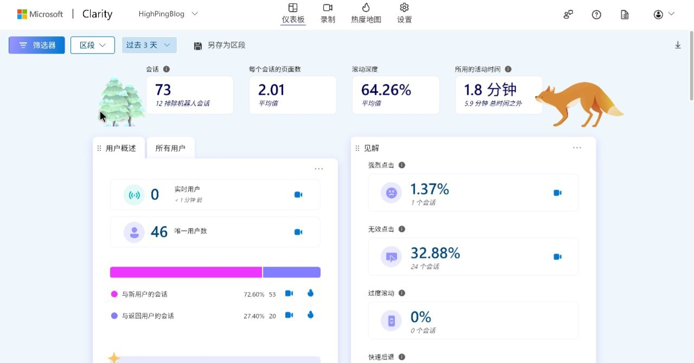

# 通过 Clarity 监视用户在网站的一举一动

本文由 `High Ping Network` 的小伙伴 GenshinMinecraft 进行编撰，首发于 [本博客](https://blog.c1oudf1are.eu.org)

## 前言

> Clarity 是一款免费的用户行为分析工具，可帮助您通过会话重播和热图了解用户如何与您的网站进行交互。(官方原话)

让我来总结一下，Clarity 是 Microsoft 推出的一款 **免费**、**开源**、**方便** 的用户行为分析工具

什么意思呢？就是可以通过回放查看用户在你的网站做的*每一次点击，每一次滑动，每一次输入*

具体效果: 




非常具体，我最常用的是查看哪一方面的博文查看最多

虽然其他工具 (比如 Google 家的 Search Console) 也可以做到此功能，但是远不及 Microsoft 家的 Clarity 来的直观与底层

举个例子，Search Console 是搜索引擎层面的，并非所有流量都来自搜索引擎，而在自己网站内就可以完整记录所有流量

Clarity 的特点有: 
- 免费、开源
- 有智能的隐私识别，自动打码
- 配置简单，仅需一段 JS 脚本
- 直观的仪表盘，某个姓 Goo 的仪表盘我不好说

这玩意配置简单，简单到直接把 JS 插进你的每一个 Web 界面中的 HTML 就行，部分 CMS 程序直接就自带了这种功能

## 配置

在 [官网](https://clarity.microsoft.com/) 整一个账号，这应该不难


添加新项目，名称随便写，网站 URL 写你网站的域名，如 `blog.highp.ing`


转到这个界面，如果你的 CMS 比较热门，建议使用 `在第三方平台上安装` ，里面提供了详细的配置教程

但如果你的 CMS 并未列在上面 `在第三方平台上安装` 的列表中，你就要选择 `手动安装`

这里以 `手动安装` 为例子

点击 `获取跟踪代码` ，会获得一段 HTML 代码，将其插入每一个界面的 HTML 中

比如我的代码是: 

```html
<script type="text/javascript">
    (function(c,l,a,r,i,t,y){
        c[a]=c[a]||function(){(c[a].q=c[a].q||[]).push(arguments)};
        t=l.createElement(r);t.async=1;t.src="https://www.clarity.ms/tag/"+i;
        y=l.getElementsByTagName(r)[0];y.parentNode.insertBefore(t,y);
    })(window, document, "clarity", "script", "l1q4t2a4bl");
</script>
```

部分的 CMS 程序会在后台有将 HTML 代码插入到每一个界面的功能，WordPress、Typecho 这种是肯定有的


而我用的 Hugo + Stack 主题可以这样配置主题文件 `themes/hugo-theme-stack/layouts/_default/baseof.html`

```
<!DOCTYPE html>
<html lang="{{ .Site.LanguageCode }}" dir="{{ default `ltr` .Language.LanguageDirection }}">
    <head>
        {{- partial "head/head.html" . -}}
        {{- block "head" . -}}{{ end }}
		[此处贴上你的 HTML 代码]
    </head>
    <body class="{{ block `body-class` . }}{{ end }}">
    ......
    </body>
</html>
```

随后重新生成界面即可

总之，只要在每一个界面加上这段 HTML 代码即可，甚至你可以随便放在 HTML 中的任何一个位置

*请注意: 只把 HTML 代码加到一个界面是没有效果的，只能监控单一界面，所以一定要加到所有的 HTML 文件*

## 效果

生效挺快的，直接就可以在后台看到访问的信息，功能就自行研究了，最好用当属浏览录像，每一次点击、滑动、输入都是被记录的，这个自行斟酌

本博客也开了 Clarity，虽然没啥用，但是随时随地看看访客数据，统计下流量，还是可以的

欢迎加入 High Ping 大家庭:
- [官网](https://highp.ing)
- [Blog](https://blog.c1oudf1are.eu.org)
- [@HighPingNetwork](https://t.me/HighPingNetwork)
- [@HighPingChat](https://t.me/highpingchat)