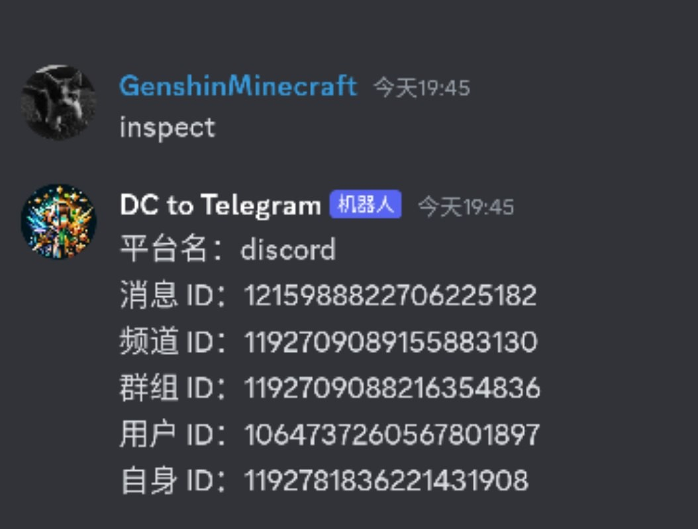
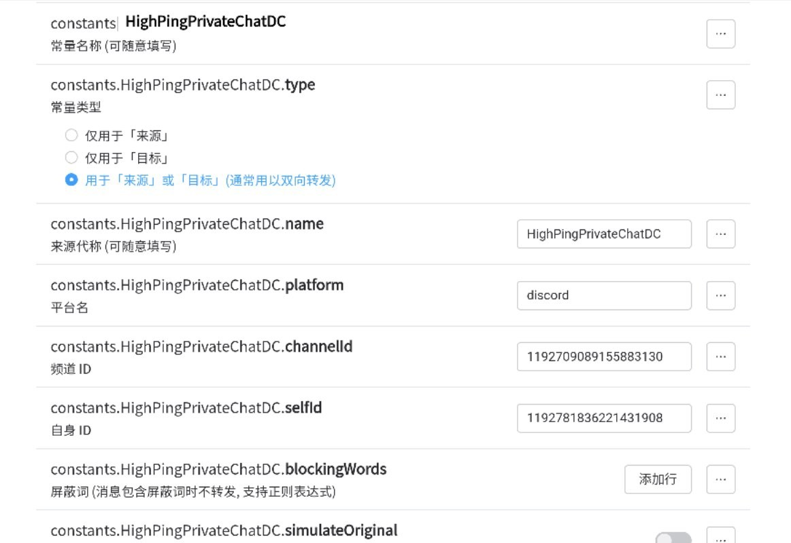

---
title: 全能机器人框架 -- Koishi
description: Telegram 与 Discord 群组互通
date: 2024-03-09
slug: koishi
image: 5b7595e429e43.jpg
categories:
    - Main
---

# 全能机器人框架 -- Koishi

本文由 `High Ping Network` 的小伙伴 GenshinMinecraft 进行编撰，首发于 [本博客](https://blog.highp.ing)

## 前言
  
> Koishi 是一个跨平台、可扩展、高性能的聊天机器人框架。

用人话来说，Koishi 就是一个**开源的**，**可以同时接入多个平台的**，**拥有丰富插件的**，**高性能的**机器人框架

它的优点非常之多:
- 部署多平台支持: 提供了 Windows / Linux / Docker 等平台支持，甚至还可以跑在 Android 上面
- 支持通信平台多: 包括但不限于 QQ / 微信 / Telegram / Discord / Kook / 钉钉 / Minecraft / 邮件
- 配置简单: Docker 一行命令完成部署，提供高级 Web 面板以进行配置
- 功能多: 很多，几千个插件，基本涵盖了通讯/娱乐/查询/图片等等功能的需求

当然，不可能有完美的产品:
- 占用大: 如果你的小鸡是 1c512m 这种，而且跑分特别炸裂的，还是别玩了。Nodejs 通病内存大
- 配置难: 可能和上面的优点是有点冲突的，但是功能多的同时不可避免的就是配置繁琐

本文会以一个 Telegram 与 Discord 互通 Bot 为例子，为你展示他的安装 & 配置过程

## 安装 Koishi

本文采用的是最通用也是最简单的安装方式 -- Docker

```
docker run \
	-itd \
	-v /some/place:/koishi \
	--name koishi \
	-e TZ=Asia/Shanghai \
	-p 5140:5140 \
	koishijs/koishi
```

解析一下: 
- `docker` -- Docker 主命令
- `run` -- 运行 Docker 
- `-itd` -- 在后台运行
- `-v /some/place:koishi` 文件的持久化目录，请将 `/some/place` 改成你要保存配置文件/数据库的路径
- `--name koishi` -- 为容器命名
- `-e TZ=Asia/Shanghai` -- 时区设置
- `-p 5140:5140` -- 端口映射，将容器内 `5140` 映射到主机的 `5140`

更改必要信息后，运行即可

跑完命令后，打开 `http://IP:5140` 就应该可以看见 Koishi 控制台


很好，你已经完成了 Koishi 的安装

## 设置登录帐号密码

Koishi 默认公开到公网上，且无帐密，任何拥有你的 Koishi 访问链接的人都可以随意查看/更改你的设置，所以要设置帐号密码以保证安全

Web 管理面板左侧第二个设置图标，找到 `auth`，编辑好自己的帐号密码


随后，点击右上角第一个按钮启用插件即可

刷新一下 Web 界面，在主页的左下角登录自己账号即可


## 绑定机器人账号

相对于国内平台来说，Telegram 和 Discord 的机器人申请是一点门槛没有，关于申请 API Token 我就不说了，谷歌一下你就知道

### Telegram

还是 Web 管理面板左侧第二个设置图标，找到 `adapter-telegram`，填入你的 Bot Token，协议类型选择 Polling 即可


然后右上角点击最左侧图标，开启插件

### Discord

同界面下找到 `adapter-discord`，填写自己的 Discord API


也是点击右上角最左侧图标开启插件

### Inspect

同界面找到 `inspect`，开启这个插件，其作用后面会说


## 配置 Telegram & Discord 互通

将在 Telegram 与 Discord 的 Bot 拉到需要转发的群组，不详细说了

### 下载 forward 插件

左侧工具栏找到第三个按钮 `插件市场`，搜索 `forward`

请注意，我们需要的是 `@myrtus/forward`，不是 `forward`


点击 `添加`-`安装` 即可完成安装完成，这也是 Koishi 插件的基本安装方法

### 获取群组信息

在群组内，发送一条消息，消息内容为 `inspect`




如果配置正常，应该会收到机器人回复的群组基本信息，保存备用

## 配置 forward 插件

左侧工具栏第二个设置图标，找到 `@myrtus/forward`

### 过滤器设置

在过滤器设置中，最好设置一个 `用户ID - 不等于 - [在 Discord 中获取的 自身ID]`


这样做是因为由于 Discord 特性，机器人可以收到机器人发送的信息，导致无限回环

而因为 Telegram 的机器人无法看见机器人消息，所以无需配置

### 配置群组信息

基本的信息就这样写




通过点击 `constants` 右侧的 `添加项目` 来配置，不知道如何填写的信息可以不填写，仅需要按照图中的信息配置即可

需要注意的是，需要创建两个信息，一个是 Telegram，一个是 Discord，所有信息均可在 `inspect` 获取到的信息中找到

### 设置群组的传输路径

如果要达到群组互通的效果，那基本思想就是这样

```
Telegram -> Discord
Discord -> Telegram
```


按照途中方式配置:
- 一个 来源为 `Telegram`，转发至 `Discord`
- 一个 来源为 `Discord`，转发至 `Telegram`

这样就完成配置了！

右上角按钮，保存并启用插件即可

## 测试


可以看到，完美地工作

这个插件，不只可以传输信息，还可以传输图片/文件，甚至还可以准确地回复在另一平台的消息


## 总结

Koishi 的功能远远不止这一点，可以去细细地了解所有的插件和功能

我的 Bot 连上了 20+ 个 Telegram 与 Discord 群组，日常交流完全没有感觉到卡顿 (也有可能是我的机器比较好)

总的来说，只要你按照上面的方法体验了一次 Koishi 后，你就已经基本会使用 Koishi 了，去发现并研究你的新天地吧！