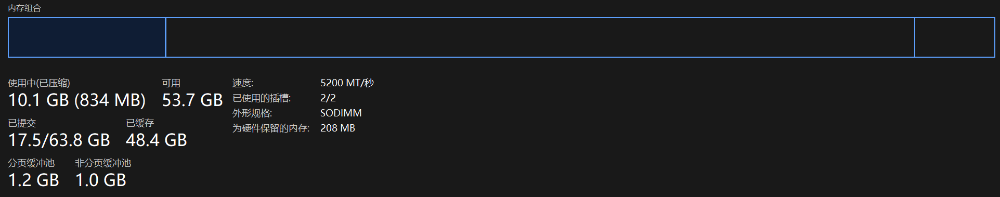

# Komari 从入门到入土

[<-前往本博客获取更好阅读体验->](https://genmin.icu/p/komari-intro/)

请务必务必前往博客，并在电脑端查看文章以获得最好体验，论坛平台对 Markdown 支持有限: <https://genmin.icu/p/komari-intro>

## 前言

>[Komari](https://github.com/komari-monitor/komari) 是一款轻量级的自托管服务器监控工具，旨在提供简单、高效的服务器性能监控解决方案。它支持通过 Web 界面查看服务器状态，并通过轻量级 Agent 收集数据。

简单来说就是探针监控，算是最近比较热门的探针服务了

由于一些问题太过小白，遂有本文

请注意，以下是你寻找帮助的渠道，从前往后尝试: ([详情请看本博客古老文章](https://genmin.icu/p/ask-for-help/))

1. [Komari Docs](https://komari-document.pages.dev/)
2. [Nodeseek 论坛](https://nodeseek.com)搜索
3. [Bing](https://bing.com) / [Google](https://google.com)
4. [Telegram 群组](https://t.me/komari_monitor)

### Why Komari

所以，为什么选择 Komari 而不是 Nezha、Beszel、Akile Monitor 呢？

老实说我完全没有需要监控服务的需求，为 Komari 开发各种奇奇怪怪的东西以及为 Komari 写这篇文章也是完全出于兴趣

作为一个监控服务，其实还是有很多优点的:

- `开发者活跃`: 包括在 Maintainers、主题开发者、Agent 开发者以及 7788 的社区开发者，**在目前都还在积极活跃**。所以比一些比较烂尾的项目好多了 (对比的是 Akile Monitor，主仓库已 9 月没更新)
- `轻量化`: 当然吹的是本人开发的 [komari-monitor-rs](https://github.com/GenshinMinecraft/komari-monitor-rs)，作为一个 Agent 可以保证是同类中最低占用的
- ... 挺多的

现在的功能是越来越多了，流量统计、到期日设置等均已实现

## 安装主控

首先，你需要一台机器来安装**主控**，不论是 ClawRun 这类容器云服务、还是 VPS、抑或是实体机都好...

并且该节均使用 Linux 安装主控，其他系统自行研究

对于安装方式的选择，我不建议所有人都使用 *一键脚本* 来安装环境，不论是小白还是希望**规范化自己机器的环境**的大佬，但我仍会介绍该种方式

### 一键脚本安装

一键脚本适用于 systemd 发行版，且架构需要为 `amd64 / x86 / arm64 / riscv64` 其一

若你的 Linux 为现代且主流的版本即可直接使用 (Ubuntu / Debian 等)

```bash
curl -fsSL https://raw.githubusercontent.com/komari-monitor/komari/main/install-komari.sh -o install-komari.sh
chmod +x install-komari.sh
sudo ./install-komari.sh
```

若机器环境无法访问到 Github，可以尝试下面的命令:

```bash
curl -fsSL https://ghfast.top/https://raw.githubusercontent.com/komari-monitor/komari/main/install-komari.sh -o install-komari.sh
sed -i 's|https://github.com|https://ghfast.top/https://github.com|g' install-komari.sh
chmod +x install-komari.sh
sudo ./install-komari.sh
```


全新安装，在此处选择 `1` 并回车即可:


到了这一步，即可进行下一步

### Docker 安装

#### Docker 环境
这需要你安装 Docker 环境，这里不再赘述，只给出相关一键脚本:

```bash
# 下载并执行Docker官方安装脚本
curl -fsSL https://get.docker.com -o get-docker.sh
sudo sh get-docker.sh

# 启动Docker服务
sudo systemctl start docker
sudo systemctl enable docker
```

#### Docker 创建容器

创造新的文件夹以存放数据: 

```bash
mkdir -p /opt/komari/data
```

创建新的容器:

```bash
docker run -d \
  -p 25774:25774 \
  --restart=always \
  -v /opt/komari/data:/app/data \
  --name komari \
  ghcr.io/komari-monitor/komari:latest
```

若机器环境无法访问到 Github，可以尝试下面的命令:

```bash
docker run -d \
  -p 25774:25774 \
  --restart=always \
  -v /opt/komari/data:/app/data \
  --name komari \
  ghcr.linkos.org/komari-monitor/komari:latest
```

你可以*使用自己的数据目录*，建议存放到 `/opt/komari`，这同样也是官方一键脚本使用的，可以将上面命令的 `/opt/komari` 改为其他路径

如果你需要*监听其他端口*，可以将第一个 `25774` 改为你需要的端口


#### 获取账号密码

若成功创建 Docker 容器，即可通过以下命令输出的日志来获取随机生成的账号密码:

```bash
docker logs komari
```

#### 总流程图


### 二进制 Binary 安装

一些极度的小白就不要尝试了

#### 初始化环境

找个文件夹放 Binary 与数据，这里还是以 `/opt/komari` 举例:

```bash
mkdir -p /opt/komari
cd /opt/komari
```

#### 下载 Binary

从 [Release](https://github.com/komari-monitor/komari/releases) 获取对应系统、架构的 Binary 下载链接:


比如我是 Linux Arm64，复制出来下载链接长这样:

```
https://github.com/komari-monitor/komari/releases/download/1.0.7/komari-linux-arm64
```

若机器环境无法访问到 Github，可以尝试在链接前加 `https://ghfast.top/`

随后使用 `wget` / `cUrl` 下载即可:

```bash
# 任选一个即可
wget -O ./komari [PASTE UR LINK HERE]
curl -o ./komari [PASTE UR LINK HERE]
```

给 Binary 添加可执行权限: 
```bash
chmod +x ./komari
```

#### 初次执行

在 Binary 所在目录执行:

```bash
./komari server -l 0.0.0.0:25774
```

待到输出如图即可 `Ctrl-C` 直接停止:


保存好展示的随机生成的账号密码

#### 保活服务

这同样需要系统使用 SystemD，若不是，请自行寻找方法

```bash
cat <<EOF > /etc/systemd/system/komari.service
[Unit]
Description=Komari Monitoring Service
After=network.target

[Service]
ExecStart=/opt/komari/komari server -l 0.0.0.0:25774
WorkingDirectory=/opt/komari
Restart=always
User=root

[Install]
WantedBy=multi-user.target
EOF

systemctl daemon-reload
systemctl enable komari --now
```

这是三条命令，直接执行即可，默认直接启动并打开开机自启 (记得替换必要的路径、端口等参数)

随后即可用 `systemctl` 管理该服务:

- 开机自启：`systemctl enable komari`
- 启动服务：`systemctl start komari`
- 服务状态：`systemctl status komari`

## 初次登录到 Komari

### 登录

不论通过什么方式安装了 Komari，你应该都会在上面的命令输出的尾部找到带有 `Username: admin, Password: xxxxx` 这一行，这就是默认的初始账号密码

访问你的后台: `http://[IP]:25774` (在当前步骤应该**直接为 IP** 或**未经 CDN 等服务代理的域名**，若未更改过端口即为 **25774**)

点击右上角登录，输入初始账号密码:


有一大部分人在此处报告使用默认密码无法登录，请注意在终端不要复制多余字符

### 更改用户名和密码


在左侧栏中找到 `账户`，先修改用户名，后修改密码

请注意，*修改用户名并不需要重新登陆*，而**修改密码需要以新密码登录** (刷新后)

### 更改基础信息


在左侧栏中找到 `设置-站点`，修改站点名称以及描述

最好打开跨域请求开关，并关闭私有模式，这对以后的基于 Komari 的 API 服务非常有帮助 (当然并不强制)

## 设置反向代理与 CDN

初次登录 Komari 主要是为了验证服务以及建立，接下来我们需要根据自己需求来配置，这非常个性化，**不要尝试直接套用本文参数**

**请应用在生产环境用户仔细阅读该篇，目前大部分的配置问题都来源于反代或 CDN 配置错误**

下面的步骤是可选的，但建议做

在可选择的情况下，我的推荐度 (上者推荐度高):

1. Komari 监听 80 端口 + CDN 80
2. 非常规端口实现 CDN 代理
3. 任意端口与 Cloudflare Tunnels 联动
4. 在 80 端口反代 25774 的 Komari + CDN 80
5. 其他方案

### 在 80 端口反代 25774 的 Komari

若你的 80 端口还需要运行其他的服务，则可以通过 反向代理 实现

由于 Komari 需要大文件上传以及 Websocket 支持，所以较难配置

如果你是直接运行 Nginx 等核心的用户，相信你不会需要该教程，直接移步 [Komari Doc](https://komari-document.pages.dev/faq/nginx.html)

如果你使用 `1Panel` / `BTPanel` 等服务，自行研究配置即可

### Komari 直接监听 80 端口

若你的服务器 80 端口不被其他服务所占用，直接让 Komari 服务监听于 80 端口即可

通过更改部署命令，可以实现该效果，详情请见上文

### CloudFlare CDN

Cloudflare CDN 是使用最广泛的 CDN，所以用来举例，其他 CDN 自行研究

为什么推荐使用 CDN？

因为探针服务特殊性，需要全世界各地的 Agent 连接并最好需要双栈服务，CDN 是最简单的方式

#### 普通 80 端口直接 CDN 代理

在 `DNS` 处直接添加解析，并打开小黄云即可

默认情况下，Cloudflare 会打开 Websocket 开关，并配置好证书，所以不需要其他操作

最后访问域名查看效果

#### 非常规端口实现 CDN 代理

Cloudflare 支持非常用端口的代理，配置还算简单

对于不想使用反向代理，或反向代理不会配置的用户来说是最好的选择

用常规方法解析到 IP 并打开小黄云后，来到 `域名-规则-创建规则-源服务器规则`:


名称随意填写，选择 `自定义筛选表达式`，规则写成 `主机名-等于-[你的 Komari 使用的域名]`:


最后的重定向端口写成 Komari 服务的端口即可 (默认为 25774):


默认情况下，Cloudflare 会打开 Websocket 开关，并配置好证书，所以不需要其他操作

最后保存，访问域名查看效果

#### 任意端口与 Cloudflare Tunnels 联动

Cloudflare Tunnels 类似于内网穿透服务，若你的机器没有公网 IP 或者 CF 回源困难可尝试

在 Cloudflare 账户主页找到 `Zero Trust`:


左侧栏目 `网络-Tunnels-新建隧道`:


选择 Cloudflared:


名字随便起，根据自己系统和架构选择，然后执行 Cloudflare 所提供的命令即可:


按照如图配置你的域名、本地的 Komari 服务链接:


默认情况下，Cloudflare 会打开 Websocket 开关，并配置好证书，所以不需要其他操作

最后保存，访问域名查看效果


## 为被监控机安装 Agent

### 选择 Agent

Agent 有[官方](https://github.com/komari-monitor/komari-agent)与第三方之分，目前较为主流的第三方 Agent 为本人编写的 [komari-monitor-rs](https://github.com/GenshinMinecraft/komari-monitor-rs) ~~(有点吹牛逼了哈)~~

本文的第三方 Agent 会以 [komari-monitor-rs](https://github.com/GenshinMinecraft/komari-monitor-rs) 为例

官方 Agent 优点:
- 都是官方的了，当然最适配 Komari
- 兼容性较好

[komari-monitor-rs](https://github.com/GenshinMinecraft/komari-monitor-rs) 优点:
- `占用小`: 不论是可执行文件大小、还是运行时的 CPU / 内存占用，都是比官方的不止低了一点
- `支持虚假倍率`: 简单来说就是把本机的信息都翻倍然后传输到主控，可以伪装高性能机器 ~~(拳打太湖之光)~~
- `Prebuilt 架构多`: 由于 Rust 语言的特性，可以轻松地交叉编译，**覆盖了可以编译通过的所有架构**。*官方仅仅提供了 `Linux / Darwin / Windows / FreeBSD` 的 `amd64 / x86 / arm / arm64` 的架构支持*
- `获取机器信息方式优雅`: 说实话这个有点牵强，但我举例下就知道了:
	- 官方在 Agent 使用了大量**平台特化**与**命令执行**的方式来获取信息，**并且依赖于第三方软件包**
	- 第三方 Agent 使用了健全第三方库，并保证了**最小体积**，不会擅自执行外部命令
	- 比如有关网络信息获取，官方 Agent 直接执行了 `vnstat` 命令以获取，并解析其输出。我个人**不认为这是一个正确的方式**来获取系统信息。而第三方 Agent 则使用了系统级库，直接读取网卡信息

所以，你需要根据自己需要来选择 Agent:

- 若你是纯纯的小白，请使用**官方 Agent**
- 若你不希望依赖第三方软件，请尝试使用**第三方 Agent**
- 若你的机器环境较为恶劣，可用的资源较少，请尝试使用**第三方 Agent**
- 若你的机器架构较为少见，官方无 Prebuilt 的情况下，请使用**第三方 Agent** (不论是官方还是第三方，均不建议自行编译)
- 若你需要虚假倍率的功能，请务必使用**第三方 Agent**
- 若你是一个极客，并且知道自己在做什么，请务必使用**第三方 Agent**

### 在后台创建新的服务器


如图，在 `后台-服务器-添加节点`，输入自己想要的服务器名称，随后添加节点即可


成功后，会在后台展示一个带有联合国旗帜的图标。在没有任何数据传输到 Komari 之前，这是正常的

### 官方 Agent

#### 一键脚本安装

官方 Agent 提供了方便的一键脚本，并与 Komari 主控绑定在一起

点击服务器右侧的类似下载一样的图标，即可获取自动安装的一键脚本:


首先选择你需要的系统，目前仅支持 Linux 和 Windows 主流架构一键脚本安装

这里有很多选项，我们来一一解释一下:

- `禁用远程控制`: 如果你不需要使用到网页终端 (俗称 WebSSH) 功能，请禁用它以更安全
- `禁用自动更新`: 在一些需要稳定的场景下，可以禁用自动更新，但长期不更新可能有安全隐患以及有可能无法连接至更高版本的主控
- `忽略不安全证书`: 若服务端已配置 HTTPs，该选项才有效，否则无效。可以忽略与主控通信的证书，安全性自己保证
- **`包含缓冲区内存`**: 这里需要一些计算机常识，内存一般分为三部分: `使用中-已缓存-可用`
	- 虽然但是拿的是 Win 任务管理器举例 
	- 使用中的部分，是应用程序真正在使用的部分，该部分无论如何都会被统计
	- 已缓存部分，可以被随时清理出来用来供给应用程序使用，这个选项有关的就是这里
	- 可用的部分，可以供给应用程序使用
	- 若开启该选项，则会统计 `使用中的部分+已缓存部分` 的内存总量，反之为 `使用中的部分`
	- 若你不知道或不想了解这是什么，请关闭该开关
- `Github 代理`: 若你的网络环境无法直接访问 Github，请打开该选项，不建议更改 Github 代理·链接
- `安装目录` 与 `服务名称`: 顾名思义，若需要自定义可使用
- `只监测特定网卡` 或 `排除特定网卡`: 这两个选其一即可，可以根据网卡名来获取网络信息，以 `,` 分割。若你不知道这选项有何用，请保持关闭
- `只监测特定挂载点`: 该选项关于磁盘获取，若仅需要监测特定挂载点，可使用，以 `;` 分割 。若你不知道这选项有何用，请保持关闭
- `网络统计月重置日`: 若不需要使用流量监控服务，可关闭。每个月的第一天清零流量统计

配置完后，下方会生成一个可执行的一键命令，在被控机器上运行即可:


#### 手动安装

##### 获取 Token

在 Komari 中，一个服务器对应一个 Token，这是**主控与被控端通信的重要令牌**

可以在后台，点击服务器条目右侧第三个铅笔按钮 `编辑信息` 来查看:


每一个服务器的 Token 都是独一无二的，下文需要使用

##### 下载 Binary

找个文件夹放 Binary 与数据，这里还是以 `/opt/komari` 举例:

```bash
mkdir -p /opt/komari
cd /opt/komari
```

从 [Release](https://github.com/komari-monitor/komari-agent/releases) 获取对应系统、架构的 Binary 下载链接:

比如我是 Linux Arm64，复制出来下载链接长这样:

```
https://github.com/komari-monitor/komari-agent/releases/download/1.0.72/komari-agent-linux-arm64
```

若机器环境无法访问到 Github，可以尝试在链接前加 `https://ghfast.top/`

随后使用 `wget` / `cUrl` 下载即可:

```bash
# 任选一个即可
wget -O ./komari-agent [PASTE UR LINK HERE]
curl -o ./komari-agent [PASTE UR LINK HERE]
```

给 Binary 添加可执行权限: 
```bash
chmod +x ./komari-agent
```

在 Binary 所在目录执行可执行文件，获取帮助信息:

```bash
./komari-agent --help
```

成功输出即表示下载成功

##### 构建执行命令

对于官方 Agent，至少需要提供 2 个参数以正常运行，即*主控地址* 和 *Token*

```bash
./komari-agent -e http://192.168.31.2:25774 -t RSe6wsEcF7xTKblV
```

请按照上面的格式，替换主端的 URL 以及上面获取的 Token

剩余的参数请通过 `./komari-agent --help` 获取，与上文一键脚本安装时的参数解析相差不大，查看即可

随后先在本地测试执行命令，保证其可以连接到主控，若输出类似下方即算完成:


即可 `Ctrl-C` 直接停止

##### 保活

这同样需要系统使用 SystemD，若不是，请自行寻找方法

```bash
cat <<EOF > /etc/systemd/system/komari-agent.service
[Unit]
Description=Komari Monitoring Agent Service
After=network.target

[Service]
ExecStart=/opt/komari/komari-agent -e http://192.168.31.2:25774 -t RSe6wsEcF7xTKblV
WorkingDirectory=/opt/komari
Restart=always
User=root

[Install]
WantedBy=multi-user.target
EOF

systemctl daemon-reload
systemctl enable komari --now
```

请自行替换其中的执行命令、执行目录

这是三条命令，直接执行即可，默认直接启动并打开开机自启 (记得替换必要的路径、端口等参数)

随后即可用 `systemctl` 管理该服务:

- 开机自启：`systemctl enable komari-agent`
- 启动服务：`systemctl start komari-agent`
- 服务状态：`systemctl status komari-agent`

### 第三方 Agent

还是以 [komari-monitor-rs](https://github.com/GenshinMinecraft/komari-monitor-rs) 举例

#### 获取 Token

在 Komari 中，一个服务器对应一个 Token，这是**主控与被控端通信的重要令牌**

可以在后台，点击服务器条目右侧第三个铅笔按钮 `编辑信息` 来查看:


#### 一键脚本

当然，我们也有一键脚本:

##### 交互式

该脚本会逐步询问你有关 Agent 连接的信息

```bash
wget -O setup-client-rs.sh "https://ghfast.top/https://raw.githubusercontent.com/GenshinMinecraft/komari-monitor-rs/refs/heads/main/install.sh" && chmod +x setup-client-rs.sh && sudo bash ./setup-client-rs.sh
```


##### 传入参数式

该脚本也可以类似官方 Agent 的脚本一样传入参数

```bash
bash install.sh --http-server "http://your.server:port" --ws-server "ws://your.server:port" --token "your_token" [--terminal]
```

需要注意与官方 Agent 不同的一点是，官方的 Websocket URL 是从 HTTP URL 推导出来的，而第三方 Agent 可以自定义，所以你需要同时写

当然也支持 HTTPs 与 WSs，更改协议头即可

`--terminal` 为可选参数，若打开则启用 Terminal 功能 (WebSSH)


#### 手动安装

##### 下载 Binary

找个文件夹放 Binary 与数据，这里还是以 `/opt/komari` 举例:

```bash
mkdir -p /opt/komari
cd /opt/komari
```

从 [Release](https://github.com/GenshinMinecraft/komari-monitor-rs/releases) 获取对应系统、架构的 Binary 下载链接

需要注意的是，如果你的系统使用的并非 GlibC 运行库，请下载带有 `musl` 后缀的文件

>后缀有 `musl` 字样的可以在任何 Linux 系统下运行

>后缀有 `gnu` 字样的仅可以在较新的，通用的，带有 `Glibc` 的 Linux 系统下运行，占用会小一些

比如我是 Linux Arm64，复制出来下载链接长这样:

```
https://github.com/GenshinMinecraft/komari-monitor-rs/releases/download/latest/komari-monitor-rs-linux-aarch64-gnu
```

若机器环境无法访问到 Github，可以尝试在链接前加 `https://ghfast.top/`

随后使用 `wget` / `cUrl` 下载即可:

```bash
# 任选一个即可
wget -O ./komari-agent-rs [PASTE UR LINK HERE]
curl -o ./komari-agent-rs [PASTE UR LINK HERE]
```

给 Binary 添加可执行权限: 
```bash
chmod +x ./komari-agent-rs
```

在 Binary 所在目录执行可执行文件，获取帮助信息:

```
./komari-agent-rs --help
```

成功输出即表示下载成功:


##### 构建执行命令

对于第三方 Agent，至少需要提供 3 个参数以正常运行，即*主控 HTTP 地址*、*主控 WS 地址* 和 *Token*

```bash
./komari-agent-rs --http-server "http://192.168.31.2:25774" --ws-server "ws://192.168.31.2:25774" -t "RSe6wsEcF7xTKblV"
```

请按照上面的格式，替换主端的 URL 以及上面获取的 Token

剩余的参数请通过 `./komari-agent-rs --help` 获取:

- `--terminal`: 开启 Terminal 功能 (WebSSH)，默认关闭以保证安全性
- `--terminal-entry <COMMAND>`: Terminal 的可执行文件，默认在 Linux 下为 `bash`
- `--fake <F64>`: 虚假倍率，**主要功能之一**，可接受小数点
- `--realtime-info-interval <MS>`: 每隔多少 ms 上传一次信息，默认为 1000 ms
- `--ignore-unsafe-cert`: 忽略通信证书验证

随后先在本地测试执行命令，保证其可以连接到主控，若输出类似下方即算完成:


即可 `Ctrl-C` 直接停止

##### 保活

这同样需要系统使用 SystemD，若不是，请自行寻找方法

```bash
cat <<EOF > /etc/systemd/system/komari-agent-rs.service
[Unit]
Description=Komari Monitoring Agent Service
After=network.target

[Service]
ExecStart=/opt/komari/komari-agent-rs --http-server "http://192.168.31.2:25774" --ws-server "ws://192.168.31.2:25774" -t "RSe6wsEcF7xTKblV"
WorkingDirectory=/opt/komari
Restart=always
User=root

[Install]
WantedBy=multi-user.target
EOF

systemctl daemon-reload
systemctl enable komari --now
```

请自行替换其中的执行命令、执行目录

这是三条命令，直接执行即可，默认直接启动并打开开机自启 (记得替换必要的路径、端口等参数)

随后即可用 `systemctl` 管理该服务:

- 开机自启：`systemctl enable komari-agent-rs`
- 启动服务：`systemctl start komari-agent-rs`
- 服务状态：`systemctl status komari-agent-rs`

## 安装之后

恭喜你，你已经完全设置了一个生产环境下的 Komari，接下来的操作是可选的，但能让你使用的体验大幅提高

### 安装主题

说到监控服务，界面美观是肯定需要的

若你以及看烦了官方的主题，开发者也提供了众多的主题给你使用:

<https://komari-document.pages.dev/community/theme.html>


展示的主题分别为 [`PurCarte`](https://github.com/Montia37/komari-theme-purcarte) 与 [`Mochi`](https://github.com/svnmoe/komari-web-mochi/releases)

我们以 `Mochi` 为例，展示如何安装主题:

来到主题的 Github [Release](https://github.com/svnmoe/komari-web-mochi/releases)，下载最新的主题包 (`.zip` 格式):


随后来到 Komari 后台 `设置-主题管理-上传主题-上传 zip 文件`，成功后即可在主题列表切换到新主题:


一些主题还有丰富的可配置项目:


效果如图:


### 更换壁纸

默认的背景太单调了，确实

与众多的监控服务类似，Komari 提供了前端嵌入代码的方式，所以我们可以轻易地改变壁纸:

在后台 `设置-站点-自定义-自定义头部` 下，填入如下代码并保存:

```css
    <style>
      body {
        /* 背景图片地址,替换成你喜欢的 */
        background-image: url("https://img.genmin.icu/117610969_p0.jpg");
        background-size: cover;
        background-position: center center;
        background-repeat: no-repeat;
        background-attachment: fixed;
      }
      .layout {
        background-color: transparent;
      }
    </style>
```


效果如图:


### 配置延迟监测

Komari 一大亮点即为支持延迟监测

#### 选择 Ping 方式

Komari 现在支持三种 Ping 方式:

- `ICMP Ping`: 最普通的，使用 ICMP 的 Ping
- `TCPing`: 发送包到握手成功建立连接的延迟，需要 TCP 端口
- `Http Ping`: 发送请求到收到回复的延迟，简单的可以理解为网页首页加载时间，这需要被测服务器有 HTTP 服务

一般来说，对于同一个服务器，`ICMP Ping` < `TCPing` < `Http Ping`

若你不清楚这三个的区别，**请选择 `ICMP Ping`**

#### 选择 Ping 服务器

Ping 的目标地址可以是任何地址，不论是内网还是外网

比较常用的检测方式为测试到*国内各个省份三网*的 `ICMP Ping` 延迟

对于该种方式，可以到 <https://tcping.wuxie.de/> 去寻找需要的地区的服务器

我们以 `河南移动` 为例:


它提供了 IPv4 / IPv6 的检测地址，我们可以用 `ICMP Ping` / `TCPing` 来测试该网站提供的所有地址，但不可使用 `Http Ping`

对于河南移动，我们可以这样设置:

- `ICMP Ping v4`: `111.7.88.239` / `v4-ha-cm.oojj.de`
- `ICMP Ping v6`: `2409:8c44:b00:ff2f:3::7d0` / `v6-ha-cm.oojj.de`
- `TCPing v4`: `111.7.88.239:80` / `v4-ha-cm.oojj.de:80`
- `TCPing v6`: `[2409:8c44:b00:ff2f:3::7d0]:80` / `v6-ha-cm.oojj.de:80`

当然，也不一定需要这里的地址，任何地址都是接受的

####  创建 Ping 任务

来到 Komari 后台 `延迟监测-添加`


名称可自定义，比如我想监测 `河南移动 V4`，即可将这个作为名字

类型即为你选择的 Ping 方式，目标即为上面确定的地址

请注意，这两个选项**必须匹配**，比如 `ICMP Ping` 必须为单独的一个域名或者地址，不能带端口和协议头

随后可以选择服务器，可以为多个服务器同时配置监测服务:


随后填写间隔时间，不建议小于 30 sec，有可能会导致数据库过大 (特别是多服务器、多监测点、保存时间长的环境)

最终设置结果如图:


保存即可

等待一定时间后，即可在主页的特定服务器下找到 延迟监测结果:


#### 关于结果保存

默认情况下，Komari 会保存 24 Hours 内的所有 Agent、所有监测点的上报数据

这会导致 Komari 数据库非常大

以 `10 台被控机、每台机器三个地区的三网监测点 (共 9 个)、每 60 sec 测试一次、数据保存 7 天` 这样的环境为例，需要使用约 `181 MB` 的硬盘空间

所以，你应该合理分配数据库保存时间、监测点数量、以及测试时间

关于数据库保存时间，可以在 Komari 后台 `设置-通用-历史记录-Ping 数据保存时间` 来设置:


如果你恰巧财力雄厚，服务器磁盘大且不担心性能下降问题，7 Days = 168 Hours 是一个不错的选择


当然我们贴心的 Komari 也给我们在 `延迟监测` 界面配上了预计的数据库使用量

请不要尝试设置类似于 `每秒监测` 的东西，不仅对自己磁盘有较大的读写负担，而且还有可能引起性能下降等问题

### 配置 OAuth 登录

OAuth 可使用第三方账号登录到 Komari，而不用输入 Komari 的账号密码

本文以 Github OAuth 为例，这需要你拥有一个 Github 账户

#### 获取 Callback URL

来到 Komari 后台 `设置-登录-单点登录`，服务商选择 `Github`:


下方有生成的 `Callback 回调 URL`，请复制备用

#### Github 设置

来到 [Github Developers Settings](https://github.com/settings/developers)，登陆账号后点击 `New OAuth APP`:


名字、网址等自己填写，然后 `Authorization callback URL` 处填写上面复制的 `Callback 回调 URL`


如图所示，填写完成后，点击 `Register application` 即可

此处的 `Client ID` 复制保存:


然后点击 `Generate a new client secret`，此处可能被要求验证 totp 或密码


输出的 `Client Secret` 请妥善保存，复制备用

#### 配置 Komari

回到 Komari，将上面获取到的信息填写回后台并保存:


记得打开 `启用单点登录` 的开关

不要着急退出，还需要绑定账号

来到 Komari 后台 `账户-单点登录-绑定外部账户`:


授权后，回到该界面，看到自己的账户被绑定成功即可:


#### 测试登录

右上角登出 Komari 后，即可尝试使用 Github 登录到 Komari:


跳转授权:


即可成功登录

##### 关于 Callback 长期转圈

在主控网络无法访问到 Github 的情况下，授权 Github 后可能出现长期等待并返回如下错误:

```
{"error":"Invalid state","status":"error"}
```

请尝试令主控可以访问 Github，或者更换其他 OAuth 服务商

### 连接到 Komari Telegram Bot

目前，应该也是唯一的 Komari Telegram Bot 应该是我的 [komari-tg-bot](https://github.com/GenshinMinecraft/komari-tg-bot)

我创建了一个公共服务位于 [@komaritgbot](https://t.me/komaritgbot)，当然你也可以自己部署，但我不建议 (因为我根本没写文档，自行研究去吧)

请注意，该 Bot 不需要任何鉴权，你的所有服务器数据都是安全的，仅读取公开信息 ~~(除非你甚至不希望你的 Komari 面板 URL 出现在任何人面前)~~

#### 要求

你至少需要达成以下要求才可使用本 Bot:

- 服务器部署在公网，并拥有良好的可访问性 (说白了就是公网可以看到你的 Komari 面板)
- 未开启私有模式 (本文的 `初次登陆到 Komari - 更改基础信息` 有提到)
- Komari 主控版本高于 `1.0.7` (若你是根据本文来安装的，大概率是的)

还有，服务器位于中国境内，通过香港代理访问各位的 Komari

#### 连接

很简单，对 [@komaritgbot](https://t.me/komaritgbot) 发送 `/connect <你的服务器 URL>` 即可:


URL 必须以 `http(s)` 开头，可以带端口，仅读取协议头、Host、端口部分，其他部分会忽略

当输出 `成功读取 Komari 服务信息！` 与 Komari 信息后即为完成绑定

#### 使用

可以通过 `/help` 指令获取所有帮助信息

##### 获取总览信息

`/total_status`:


##### 获取单台服务器信息

`/status [服务器名称]`:

*PS: 服务器名称可以不写全，为第一个包含了传入字符串的服务器*


若不提供 `[服务器名称]`，则为列表内第一个服务器

##### 根据 ID 获取单台服务器信息

可以通过 `/get_node_id` 获取每个服务器对应的 ID，再通过 `/status_id [id]` 来获取信息:


同样地，若不提供 `[id]`，则为列表内第一个服务器

你还可以通过 Bot 消息下方的按钮来切换服务器或刷新

就这样

##### 关于数据准确性

本人保证 [@komaritgbot](https://t.me/komaritgbot) 获取的信息均从用户提供的 URL 中获取，不存在修改行为。

所有来自 [@komaritgbot](https://t.me/komaritgbot) 的消息准确性请用户自行判断


### 配置通知

Komari 可以为服务器配置告警通知、临期通知、上下线通知等

#### 配置通知渠道

Komari 提供了非常多的同时发送渠道，我建议使用 Telegram Bot 或者 [@komaritgbot](https://t.me/komaritgbot) 提供的通知服务，这样查询与通知可以绑定在一个 Bot 内

##### Telergam Bot

这需要你的主控访问得了 Telegram 或者自建 Telegram API 代理 (这与本文无关)

来到 Komari 后台 `设置-通知`，打开通知总开关，通知渠道选择 `telegram`，并在下方填入你的 Bot 信息:


- `Telegram Bot Token`: 创建 Bot 的方式本文不提，谷歌搜索 `Telegram Bot 创建` 即可获取该 Token
- `Chat ID`: 对话 ID
  - 若需要发送给 Telegram 用户，则为 `用户 ID` (可私聊 [@nmnmfunbot](https://t.me/nmnmfunbot) 发送 `/id` 获取)
  - 若发送到群组，则为群组 ID (需要 Bot 在群组内，群组 ID 可拉入 [@nmnmfunbot](https://t.me/nmnmfunbot) 并在群组内发送 `/id` 获取)
- `请求端点`: 若你的机器可以访问到 Telegram API，则无需理会；若无法访问，可谷歌搜索 `反代 Telegram API`

 保存后，点击下方的 `GO` 测试发送，并检查是否收到信息即可 ~~(为什么不是点击 Rust)~~


##### [@komaritgbot](https://t.me/komaritgbot) 提供的通知服务

我推荐使用该种方式，可以将服务器状态查询与消息通知结合在一起，还不需要创建新的 Bot

在通过本文教程 `安装之后-连接到 Komari Telegram Bot` 绑定服务器后，发送 `/generate_notification_token`:


这可以获取到 Webhook 回调 URL，例如:

```url
https://komari-bot.c1oudf1are.eu.org/telegrambot/5965795367/f0f9344d-05ab-4d2a-99fb-d9162fdd0929/CHAT_ID
```

来到 Komari 后台 `设置-通知`，打开通知总开关，通知渠道选择 `webhook`，并在下方填入你的信息，请记得将 `method` 改为 `POST`:


仅有 `url` 字段与 `method` 字段需要更改，其他保持不变

请替换从 Telegram Bot 中获取的  WebHook URL 中的 `CHAT_ID`:

- 若需要发送给 Telegram 用户，则为 `用户 ID` (可私聊 [@nmnmfunbot](https://t.me/nmnmfunbot) 发送 `/id` 获取)
- 若发送到群组，则为群组的用户名 (类似 `@komari_monitor`) 或群组 ID (需要 Bot 在群组内，群组 ID 可拉入 [@nmnmfunbot](https://t.me/nmnmfunbot) 并在群组内发送 `/id` 获取)

比如我要发给自己即为:

```url
https://komari-bot.c1oudf1are.eu.org/telegrambot/5965795367/f0f9344d-05ab-4d2a-99fb-d9162fdd0929/5965795367
```

我要发送到 `@komari_monitor` 即为:

```url
https://komari-bot.c1oudf1are.eu.org/telegrambot/5965795367/f0f9344d-05ab-4d2a-99fb-d9162fdd0929/@komari_monitor
```

 保存后，点击下方的 `GO` 测试发送，并检查是否收到信息即可


#### 配置通知项

##### 离线通知

来到 Komari 后台 `通知-离线通知`，可以选择服务器批量进行修改:


需要启用掉线通知开关，`宽限期` 指的是当被控掉线后在该期限内重连的话不会发送掉线信息，默认 5min，可按照自己的需要调整

##### 负载通知

来到 Komari 后台 `通知-负载通知`，可以选择服务器进行修改:


名称随意填写即可

监控项目可为 `CPU` / `MEM` / `DISK` / `NET` 等各项目，下面这么多空其实意思是:

在 `间隔 (分钟)` 内，若 `监控项` 的占用率超过 `阈值 (%)`，且持续时间高于 `时间占比 * 间隔 (分钟)`，则发送告警

请记得还要选择服务器，支持批量选择

如果不理解，保持默认不动即可

##### 通用通知

来到 Komari 后台 `通知-通用`:


这里的解释都很清楚了，按需开启即可

### 计费

在 Komari 后台 `服务器` 中可以为每一台服务器设置费用、账单、到期日等，点击右侧第四个钱钱图标即可:


前三个项目为费用计算相关，按需填写和付费周期即可

到期时间与告警有关，若为长期可点击右侧按钮

自动续费建议开启，若过了到期时间，Agent仍然在线，可以直接在 `原先的到期日期上` 加上 `付费周期` 的时间

### 流量统计

在 Komari 后台 `服务器` 中可以为每一台服务器设置流量限制，点击右侧第三个铅笔图标，找到 `流量阈值` 即可:


此处有很多统计方式:


这取决于服务商的流量统计，有的服务商仅 `单向计费`，也有的以 `双向计费`，请自行了解是哪一种

若在不了解的情况下，建议选择 `总和`

比如我设置了 `1000 GB 总和`，就会在首页显示:


### 远程控制

现有两种远程控制方式:

- `网页终端`: 也就是 `WebShell`，与 SSH 基本无异
- `远程执行`: 可批量执行，但无法交互

#### 网页终端

在 Komari 后台 `服务器` 中可以连接到每一台服务器的终端 (除非其关闭了远程终端功能):

右侧第二个终端按钮:


请注意，这里等同于拥有了**与运行 agent 用户同等的权力** (一般为 Root)，所以请自行保证安全性


#### 远程执行

远程执行适用于多服务器执行同一个命令

在 Komari 后台 `远程执行` 中可以批量让服务器运行命令


请注意，这里等同于拥有了**与运行 agent 用户同等的权力** (一般为 Root)，所以请自行保证安全性

## 卸载 Komari

### 卸载主控

#### 一键脚本

若你是使用的一键脚本安装 Komari，直接使用一键脚本卸载即可:

```bash
curl -fsSL https://raw.githubusercontent.com/komari-monitor/komari/main/install-komari.sh -o install-komari.sh
chmod +x install-komari.sh
sudo ./install-komari.sh
```

若机器环境无法访问到 Github，可以尝试下面的命令:

```bash
curl -fsSL https://ghfast.top/https://raw.githubusercontent.com/komari-monitor/komari/main/install-komari.sh -o install-komari.sh
sed -i 's|https://github.com|https://ghfast.top/https://github.com|g' install-komari.sh
chmod +x install-komari.sh
sudo ./install-komari.sh
```

在选择界面选择 `3` 即可:


如果你已经确认你的数据不再被需要，可强制删除 `/opt/komari` 文件夹:

```bash
rm -rf /opt/komari
```

#### Docker

若你是使用的是 Docker 安装 Komari，可以按照如下方法卸载:

```bash
docker rm -f komari
docker image prune -a # 删除不被需要的镜像
```

如果你已经确认你的数据不再被需要，可强制删除 `/opt/komari` 文件夹 (如果根据本文安装，默认路径位于此):

```bash
rm -rf /opt/komari
```

#### 二进制 Binary 安装

若你是使用的是 Binary 安装 Komari，可以按照如下方法卸载:

首先停止并删除 Komari 服务:

```bash
systemctl stop komari.service
systemctl disable komari.service
rm /etc/systemd/system/komari.service
systemctl daemon-reload
```

如果按照本文教程安装，则数据与 Binary 存放于 `/opt/komari`

如果你已经确认你的数据不再被需要，可强制删除 `/opt/komari` 文件夹:

```bash
rm -rf /opt/komari
```

### 卸载 Agent

#### 官方 Agent

若使用本文的一键脚本 / Binary 安装方法，可以通过下面的方式卸载

执行 Bash 命令:

```bash
systemctl stop komari-agent.service
systemctl disable komari-agent.service
rm /etc/systemd/system/komari-agent.service
systemctl daemon-reload
```

若未更改，一键脚本安装目录位于 `/opt/komari`

如果你已经确认你的数据不再被需要，可强制删除 `/opt/komari` 文件夹:

```bash
rm -rf /opt/komari
```

#### 第三方 Agent

##### 一键脚本

若使用本文的一键脚本安装方法，可以通过下面的方式卸载

执行 Bash 命令:

```bash
systemctl stop komari-agent-rs.service
systemctl disable komari-agent-rs.service
rm /etc/systemd/system/komari-agent-rs.service
systemctl daemon-reload
```

若未更改，一键脚本安装目录位于 `/usr/local/bin/komari-monitor-rs`

如果你已经确认你的数据不再被需要，可强制删除 `/usr/local/bin/komari-monitor-rs` 文件:

```bash
rm -rf /usr/local/bin/komari-monitor-rs
```

##### Binary 安装

Binary 安装与一键脚本安装区别仅为安装路径的改变

执行 Bash 命令:

```bash
systemctl stop komari-agent-rs.service
systemctl disable komari-agent-rs.service
rm /etc/systemd/system/komari-agent-rs.service
systemctl daemon-reload
```

若未更改，一键脚本安装目录位于 `/opt/komari`

如果你已经确认你的数据不再被需要，可强制删除 `/opt/komari` 文件夹:

```bash
rm -rf /opt/komari
```

## 常见问题

### 重置密码

移步 <https://komari-document.pages.dev/faq/chpasswd.html>

### 强制取消2FA

移步 <https://komari-document.pages.dev/faq/disable2fa.html>

### 强制允许密码登录

移步 <https://komari-document.pages.dev/faq/permit-login.html>

### 我能否在 XX 设备 XX 系统上安装 Agent?

如果你在阅读完本文与[文档](https://komari-document.pages.dev/)之后提出该问题，则该设备 / 系统大概率不能以一键脚本或普通方式运行，请带着环境上网搜索或者来 [Komari 群组](https://t.me/komari_monitor)提问

## 贡献到 Komari

Komari 需要新鲜血液，下面是你可以参与贡献的方式:

- [官方主控](https://github.com/komari-monitor/komari)
- [官方 Agent](https://github.com/komari-monitor/komari-agent)
- [官方 Web 前端](https://github.com/komari-monitor/komari-web)
- [第三方 Agent](https://github.com/GenshinMinecraft/komari-monitor-rs)
- 主题开发
- [Telegram 群组](https://t.me/komari_monitor)

## 小结

我不需要一个监控服务，但我仍然为 Komari 开发了相关的周边项目

虽然 Komari 的问题还是有很多，开发者虽然并非 CS 出身但也足够保持活跃，不能算不是一个活跃的项目

鉴于翻遍全网没有任何一个 Komari 的全面教程，遂有本文

### 一个小插曲

在本文编写期间，我临时创建了一个 Komari 服务在本地

单单写这些文字就已经发现了 **1 个 Typo** 和 **1 个安全性问题**，所以 Komari 任重而道远啊