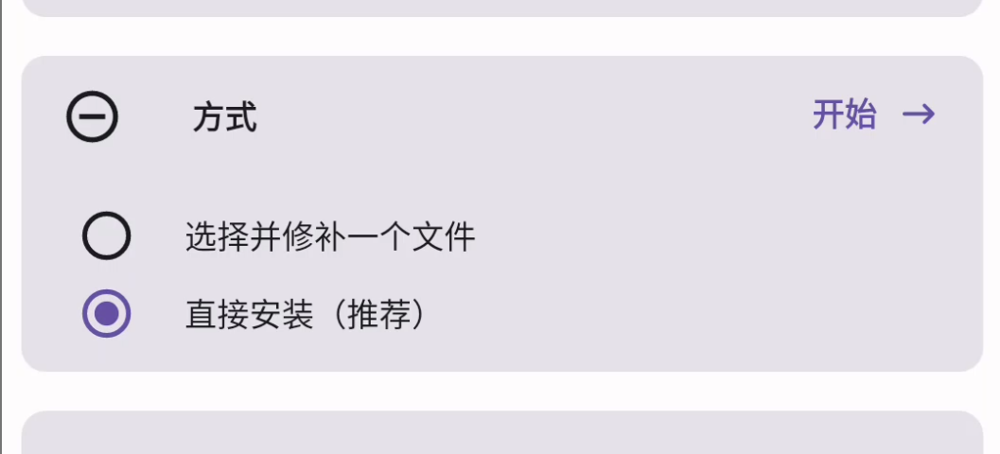
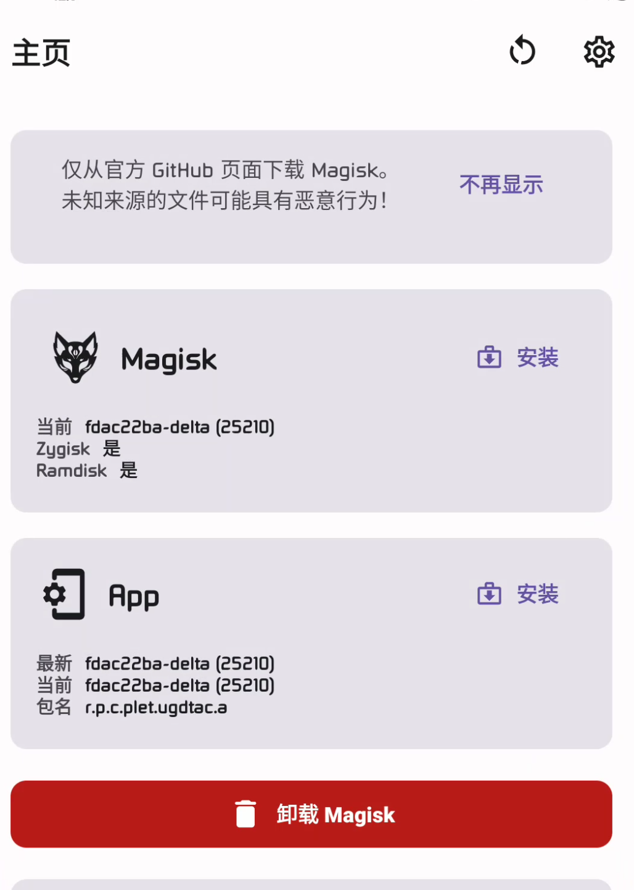
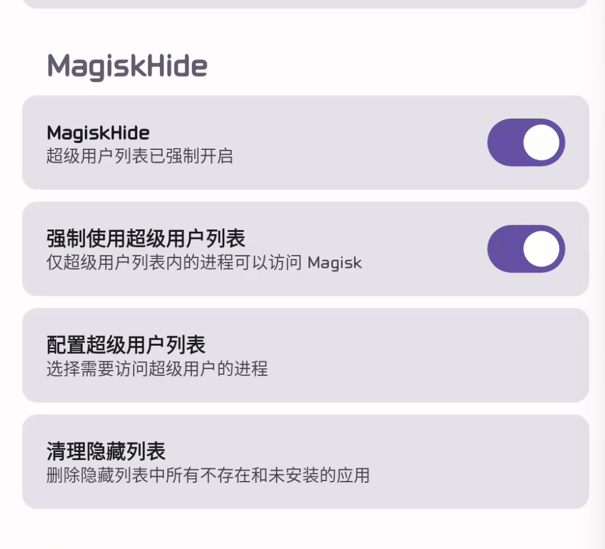
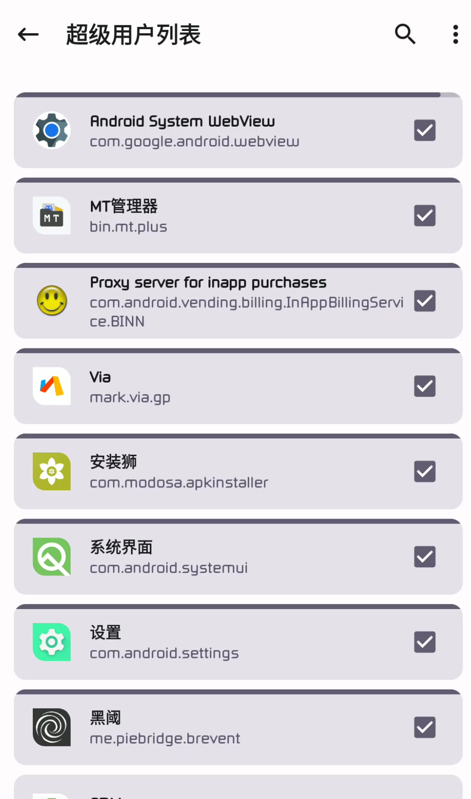

# 从Magisk转入Magisk Delta

本文由 `High Ping Network` 的小伙伴 GenshinMinecraft 进行编撰，首发于 [本博客](https://blog.c1oudf1are.eu.org)

## 前言
手机端比较完善的root方法就只有**Magisk**了（Kernelsu暂不讨论）

但是由于众所周知的原因，Magisk官方版本的**Magisk Hide**被砍掉了

所以就有了**Magisk Delta**的出现

**Magisk Delta**总结来说有以下的优点：
1. 拥有**Magisk Hide**;
2. Ui改版（个人觉得还不错）;
3. ...（忘了）

## 安装Magisk Delta
首先去到[Github官网](https://github.com/HuskyDG/magisk-files/releases)，下载*app-release.apk*

安装在安卓设备上

打开就可以授权*Root*权限并安装**Boot**了

*注：初次进入Magisk Delta也许没有`直接安装`选项，可以杀死后台再进入Magisk Delta，修复环境后，即可直接安装！*

## 转移Magisk模块
理论上来说，安装*Magisk Delta*后，*原版Magisk*的模块会自动转移到*Magisk Delta*。各种设置也可以同步！

但是如果有模块未同步的情况，可以手动添加

## 开启Magisk Hide

在右上角`设置图标-MagiskHide`中，打开`MagiskHide`与`强制使用超级用户列表`

然后重启手机，回到设置中的MagiskHide界面，就可以找到**配置超级用户列表**

在里面可以设置需要使用**Root权限**的应用，可以说是最强劲的*隐藏root*！

## 小结
**Magisk Delta**是一个还不错的*Magisk*分支，具有已经被阉割掉的**Magisk Hide**功能。适合养老使用！

欢迎加入 High Ping 大家庭:
- [官网](https://highp.ing)
- [Blog](https://blog.c1oudf1are.eu.org)
- [@HighPingNetwork](https://t.me/HighPingNetwork)
- [@HighPingChat](https://t.me/highpingchat)