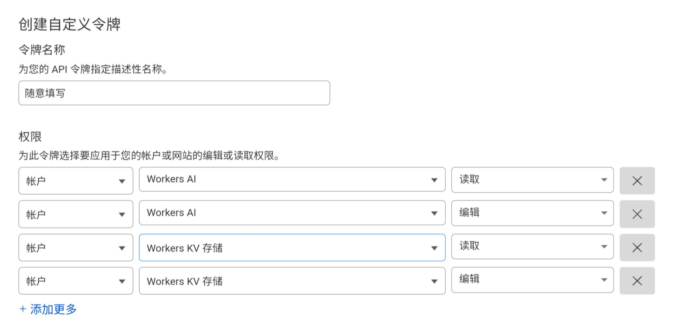
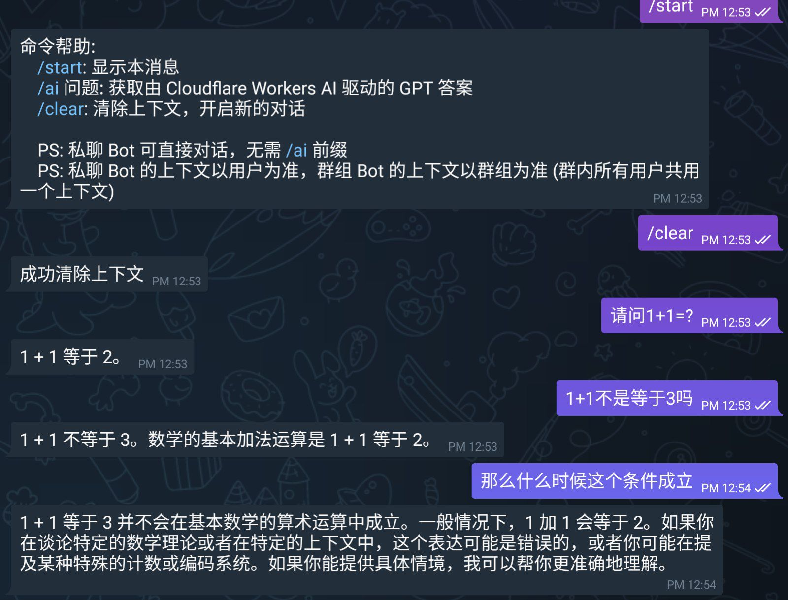

# 搭建属于自己的 Cloudflare Workers AI Telegram Bot

本文由 `High Ping Network` 的小伙伴 GenshinMinecraft 进行编撰，首发于 [本博客](https://blog.c1oudf1are.eu.org)

项目地址: <https://github.com/GenshinMinecraft/Rust-Cloudflare-Workers-AI-Telegram-Bot>

DEMO BOT: [@cloudflareworkersaibot](https://t.me/cloudflareworkersaibot)

## 前言

前几天用 Rust 写了个调用 Cloudflare Workers AI REST API 的 Bot，后面逐渐完善了一下上下文支持和答案解析

该项目使用的工具有:
- [Rust](https://www.rust-lang.org/): 主语言
- [Workers AI]: Cloudflare 提供的 GPT 大模型服务
- [Workers KV]: Cloudflare 提供的键值对储存服务，用于储存上下文
- 其他的 Rust 库: 比如 `reqwest`、`teloxide` 等

感谢各位**开源工作者**以及 **Cloudflare** 的付出！

该 Bot 相关实现请看 [该博客](https://blog.c1oudf1are.eu.org/p/rustcfwksaibot/)

## 准备工作

你至少需要以下几样东西:
- Cloudflare 帐号
- 一台用于运行 Bot 的机器
- **合适的**网络环境
- Telegram Bot Token (请自行找 [@BotFather](https://t.me/BotFather) 获取)

### 获取 Cloudflare  ACCOUNT_ID 与 API_KEY

关于 `ACCOUNT_ID`，在 Cloudflare Dashboard 主界面的 URL 中的**那串字符**即为你的账户 ID

比如 URL 为 `https://dash.cloudflare.com/d200068eebcc260e65928333xxxxxxxx`，则 `ACCOUNT_ID` 就是 `d200068eebcc260e65928333xxxxxxxx`

API_KEY 需要自己申请: 

- 来到 [用户 API 令牌](https://dash.cloudflare.com/profile/api-tokens)界面
- 创建令牌
- 创建自定义令牌
- 填写如下信息: 
	
- 其他保持默认即可，无需更改
- 创建令牌，复制好令牌并**保存好**

### 新建 Workers KV

来到 [Workers KV](https://dash.cloudflare.com/5a8421b2b4feb05ce0a8dc0d4c8c2664/workers/kv/namespaces)

在这里新建一个命名空间，名字随便起

新建完后查看该命名空间，复制 `命名空间 ID` **留作备用**

## 下载并运行

在[仓库的 Release](https://github.com/GenshinMinecraft/Rust-Cloudflare-Workers-AI-Telegram-Bot/releases/tag/main) 中，已经编译好常用的架构，如果没有找到您所需要的系统或架构，请尝试自行编译

有关于下载就不多说了，这里选择 Linux-AMD64 来举例子

```bash
wget https://github.com/GenshinMinecraft/Rust-Cloudflare-Workers-AI-Telegram-Bot/releases/download/main/amd64-linux -O ./Rust-TGAIBOT && chmod +x ./Rust-TGAIBOT
```

这样就可以下载二进制文件并赋予可执行权限了

请注意，该程序从环境变量中读取固定的参数设置 (即为之前获取的那些)

所以，需要在执行可执行文件前配置好变量:

- `API_KEY` (必须): Cloudflare 用户 API 令牌
- `USER_ID` (必须): Cloudflare 账户 ID
- `PROMPT` (非必须): AI 提示词
- `MODEL` (非必须): 对话使用的大模型，默认是阿里云的通义千问，可以在[这里](https://developers.cloudflare.com/workers-ai/models/)查看支持的模型
- `KV_NAMESPACE_ID` (必须): Workers KV 的 Namespace ID
- `TELEGRAM_BOTTOKEN` (必须): TG BOT TOKEN

在之前就已经获取完这些东西了，按需填入以下的命令即可！(其他系统请自行寻找设置环境变量方法)

```bash
API_KEY="xxx" \
USER_ID="xxx" \
PROMPT="xxx" \
MODEL="xxx" \
KV_NAMESPACE_ID="xxx" \
TELEGRAM_BOTTOKEN="xxx" \
./amd64-linux
```

注意！这是一条命令，不要分开复制，有风险

当输出下面的 Log 时，即为成功读取所有信息:

```bash
2024-06-21T04:50:26.244Z INFO  [Rust_Cloudflare_Workers_AI_Telegram_Bot] Bot 初始化中
2024-06-21T04:50:26.244Z INFO  [Rust_Cloudflare_Workers_AI_Telegram_Bot::config] 成功读取 API_KEY 的值
2024-06-21T04:50:26.244Z INFO  [Rust_Cloudflare_Workers_AI_Telegram_Bot::config] 成功读取 USER_ID 的值
2024-06-21T04:50:26.244Z WARN  [Rust_Cloudflare_Workers_AI_Telegram_Bot::config] 无法获取 PROMPT 的值，将使用默认值: "你是一个中文大模型，不管我用什么语言提出问题，你必须使用中文回答！"
2024-06-21T04:50:26.244Z WARN  [Rust_Cloudflare_Workers_AI_Telegram_Bot::config] 无法获取 MODEL 的值，将使用默认值: "@cf/qwen/qwen1.5-14b-chat-awq"
2024-06-21T04:50:26.244Z INFO  [Rust_Cloudflare_Workers_AI_Telegram_Bot::config] 成功读取 KV_NAMESPACE_ID 的值
2024-06-21T04:50:26.244Z INFO  [Rust_Cloudflare_Workers_AI_Telegram_Bot::config] 成功读取 TELEGRAM_BOTTOKEN 的值
2024-06-21T04:50:26.376Z INFO  [Rust_Cloudflare_Workers_AI_Telegram_Bot] Bot 初始化完毕
2024-06-21T04:50:26.377Z DEBUG [reqwest::connect] starting new connection: https://api.telegram.org/
2024-06-21T04:50:27.994Z DEBUG [teloxide::dispatching::dispatcher] hinting allowed updates: [Message]
```

## 使用

当你做完上面的一切的时候，就可以正常使用 Bot 了，具体的使用方法可以向 Bot 发送 `/start` 查看:



## 小结

就这样吧，后期还会添加绘图或者其他好玩的，够用就行

欢迎加入 High Ping 大家庭:
- [官网](https://highp.ing)
- [Blog](https://blog.c1oudf1are.eu.org)
- [@HighPingNetwork](https://t.me/HighPingNetwork)
- [@HighPingChat](https://t.me/highpingchat)
