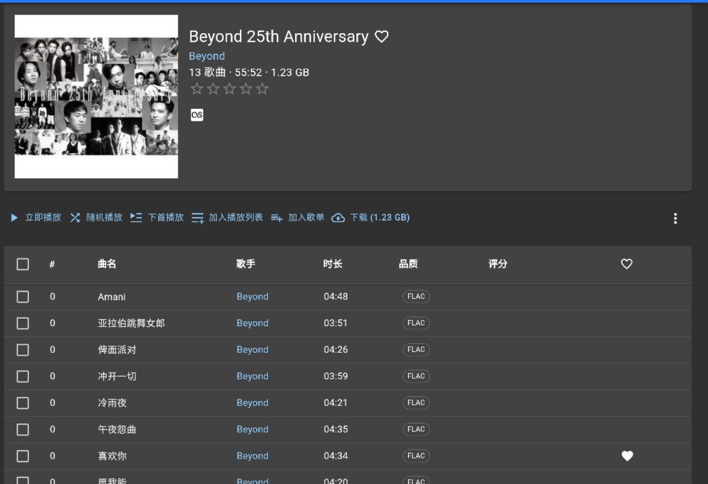
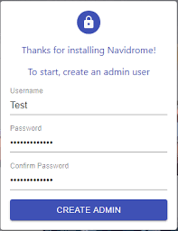
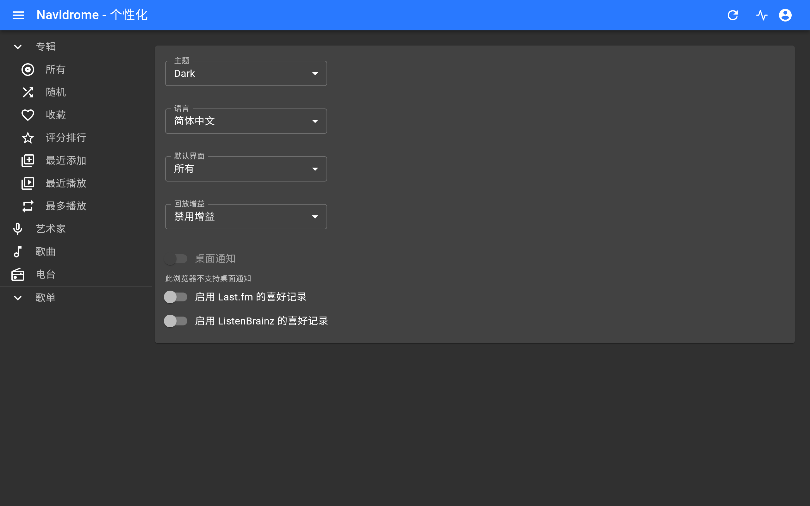
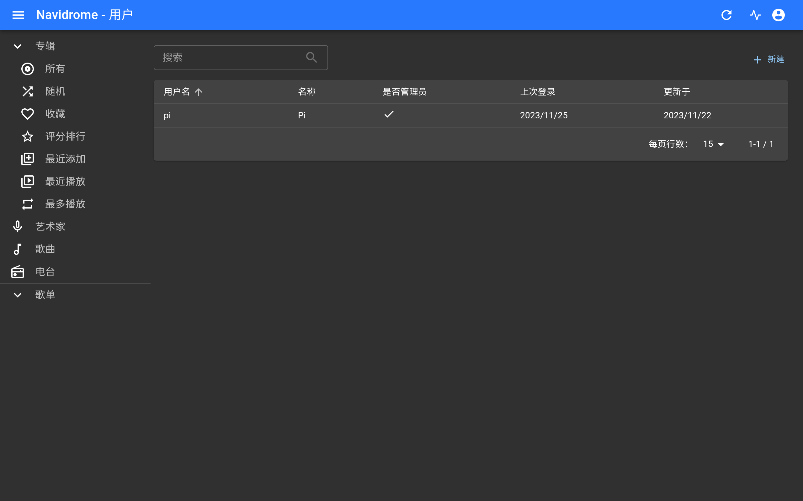
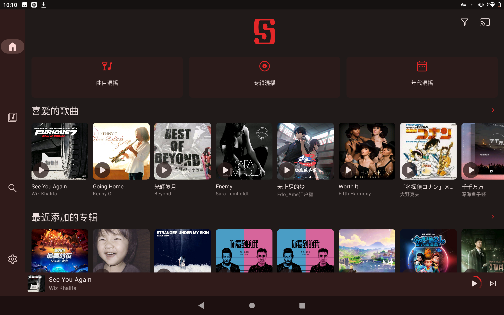
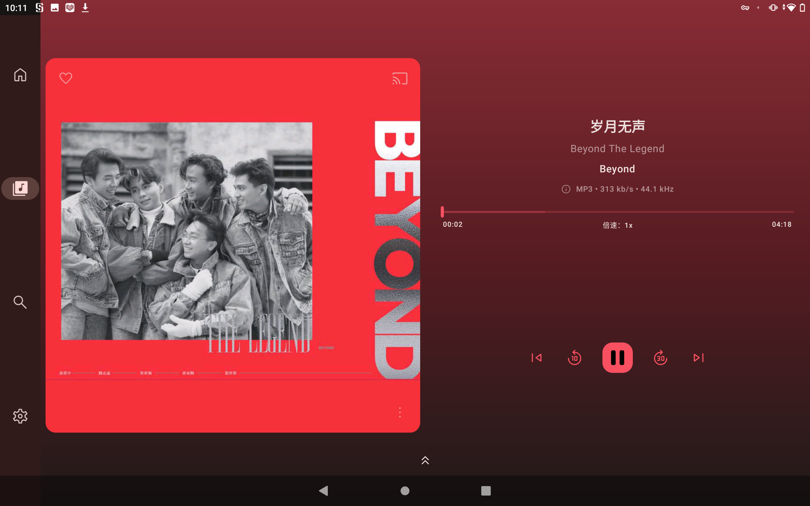
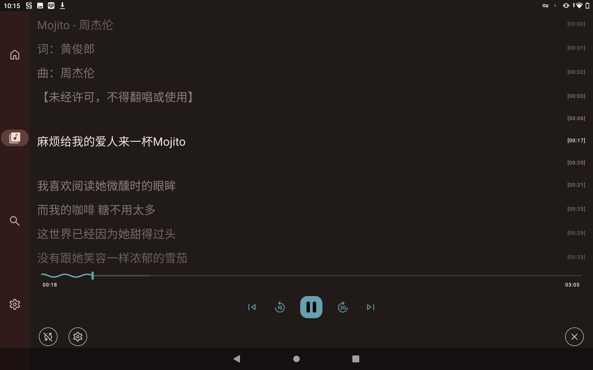
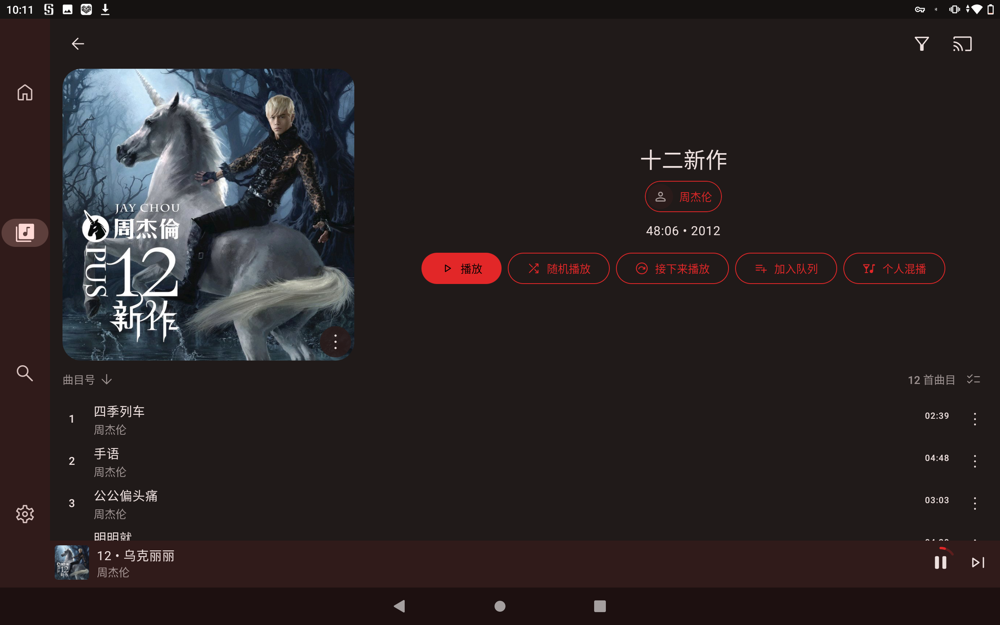
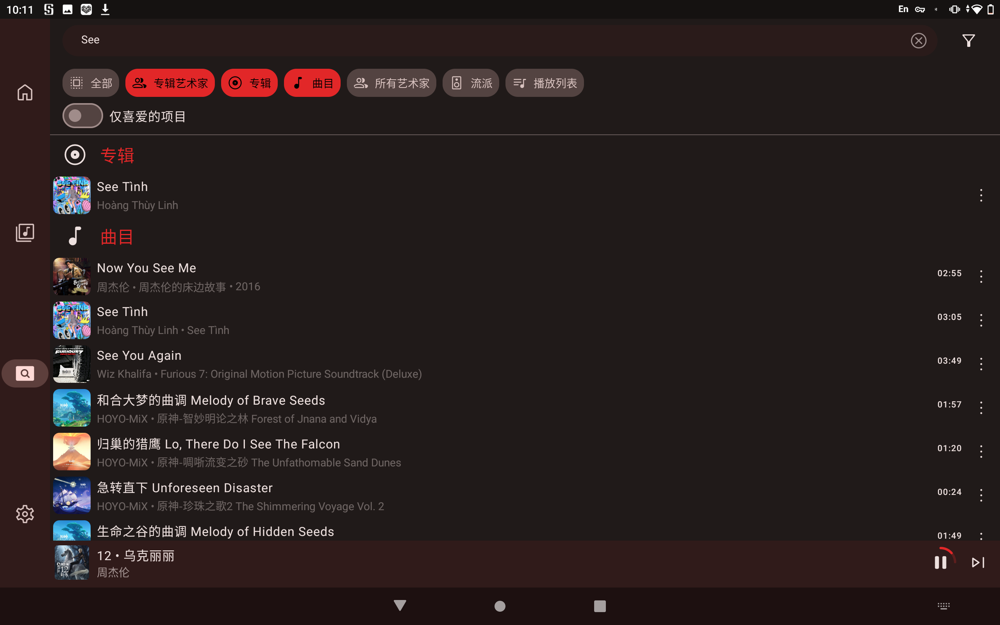

# Navidrome 家庭音乐云 | 从入门到入土

## 前言

本文由 `High Ping Network` 的小伙伴 GenshinMinecraft 进行编撰，首发于 [本博客](https://blog.c1oudf1are.eu.org)

**注：本文为 Ubuntu 22.04 系统环境，Debian 系列可照抄**

**Navidrome**是一个自托管(Self-Hosted)、低占用、兼容**Subsonic**的开源音乐流媒体服务，常被用于家庭云、NAS等内网服务器上。

### 与其他自建流媒体服务的比较：
- Plex: 开源，没话说
- Emby: 开源，没话说
- Jellyfin: `Jellyfin` 一般来说是影视服务器，而且**占用很高**，不适合运用在单纯音乐云的环境下
- Subsonic: 这么古老的东西你还在用？
- Airsonic: 开源版Subsonic，长得差不多，也挺古老

### 先来看看所需要的东西：
- 脑子
- 机器一台（需要拥有足够的硬盘，如无硬盘可用Alist挂载网盘等代替，详见[这里](https://c1oudf1are.link/p/alist/)和[那里](https://c1oudf1are.link/p/rclone-fuse/)
- 一个音乐平台账号（本文用 Netease 网易云音乐 CVIP 做演示）
- 会使用 音乐 Metadata 编辑器（之所以用网易云因为自带 Metadata，不用自己找了）

*请注意：最重要的还是硬盘，一般来说一首**无损flac**轻轻松松**150M**以上，所以对于一般人歌单300首歌曲来说，一个50G的空间还是要有的*

## 安装Navidrome
**请使用root用户执行下列的命令!**

顺序执行下列命令：
```bash
apt install ffmpeg

sudo install -d -o `whoami` -g `whoami` /opt/navidrome
sudo install -d -o `whoami` -g `whoami` /var/lib/navidrome

# 请自行从 https://github.com/navidrome/navidrome/releases 获取最新的版本以及你机器所对应的架构，替换下面的下载链接
sudo wget https://github.com/navidrome/navidrome/releases/download/v0.50.1/navidrome_0.50.1_linux_amd64.tar.gz -O Navidrome.tar.gz
bash
sudo tar -xvzf Navidrome.tar.gz -C /opt/navidrome/
sudo chown -R `whoami`:`whoami` /opt/navidrome
```

然后用你喜欢的编辑器打开(没有就新建) `/var/lib/navidrome/navidrome.toml`
```
MusicFolder = "/music"
Port = 4533
```
请自行修改 音乐目录 和 端口号，一般的，Navidrome 的端口号默认为`4533`

然后，再用你喜欢的编辑器打开(没有就新建) `/etc/systemd/system/navidrome.service`
```systemd
[Unit]
Description=Navidrome Music Server and Streamer compatible with Subsonic/Airsonic
After=remote-fs.target network.target
AssertPathExists=/var/lib/navidrome

[Install]
WantedBy=multi-user.target

[Service]
User=root
Group=root
Type=simple
ExecStart=/opt/navidrome/navidrome --configfile "/var/lib/navidrome/navidrome.toml"
WorkingDirectory=/var/lib/navidrome
TimeoutStopSec=20
KillMode=process
Restart=on-failure

DevicePolicy=closed
NoNewPrivileges=yes
PrivateTmp=yes
PrivateUsers=yes
ProtectControlGroups=yes
ProtectKernelModules=yes
ProtectKernelTunables=yes
RestrictAddressFamilies=AF_UNIX AF_INET AF_INET6
RestrictNamespaces=yes
RestrictRealtime=yes
SystemCallFilter=~@clock @debug @module @mount @obsolete @reboot @setuid @swap
ReadWritePaths=/var/lib/navidrome
ProtectSystem=full
```

或直接使用下列命令来快速完成配置:
```bash
wget -O /etc/systemd/system/navidrome.service https://c1oudf1are.link/navidrome/navidrome.service
```

随后，即可使用`systemctl`来管理 `Navidrome` 了！
```bash
systemctl daemon-reload #重载服务
systemctl start navidrome.service #启动服务
systemctl stop navidrome.service #关闭服务
systemctl status navidrome.service #查看日志

systemctl enable navidrome.service #开启开机自启动
systemctl disable navidrome.service #关闭开机自启动
```

随后，在浏览器内访问 http://IP:PORT 查看，请注意放行 本机防火墙与服务商面板防火墙 （如果有）

然后整个账号就行了！

## 获取音乐
虽然但是，这应该是自建音乐服务都要做的，但是我还是顺便提一下网易云获取Metadata

为什么要选择网易云呢，是因为网易云下载下来的 `NCM` 文件包含Metadata，而QQ音乐等一众音乐平台的**自有音乐格式**都是没有Metadata

### 什么是Metadata：
Metadata，中文名元数据
一般来说，一个`音乐文件`仅包含音乐就可以 正常播放
而 `Metadata` 是包含在音乐文件内的 ***歌曲详细数据***
包括但不限于：
- 歌曲名（非文件名）
- 歌手
- 专辑
- 专辑图片
- 歌曲图片
- 歌词
- 专辑序号
- 年代（时间）
而 `Navidrome` 会自动搜索歌曲的 `Metadata` ，用于展示歌曲信息
如：
这些就是自动从 `Metadata` 中检索出来的数据
而如果**没有 `Metadata`**，就会导致***不美观***，且***无法正确检索音乐信息，无法正确分类与排序歌曲***

### 转换
在网易云客户端内下载所需要的音乐，会发现某些是 `NCM` 后缀名的文件
我们这个时候就要找到一个 `NCM to MP3/FLAC` 的工具

经过我的测试，仅有来自 [crmmc](https://github.com/crmmc/) 的[这一项目](https://github.com/crmmc/nqdumpgo.git)可以正确完全地转换 `NCM` 文件

由于其 Release 的文件比较古早，所以本文采用自行编译的方法：
```bash
apt install golang
go get nqdumpgo
go build -ldflags="-w -s"
```
在Windows下为`nqdumpgo.exe`
在Linux下为`nqdumpgo`

将在本地下载的音乐上传到与 `nqdumpgo`同级的目录下
```
.
├── music
│   └── xxx.ncm
└── nqdumpgo
```

然后输入
```
./nqdumpgo ./music
```

稍等一下，音乐便自动转换完成！
转换出来的音乐与 `NCM` 文件同目录，可使用 `cd music/ && rm -rf *.ncm *.NCM` 来清理已经转换了的音乐文件

然后再将其移动到原先在 `navidrome.toml` 中设定的 `MusicFolder` 目录下

大功告成！

## 初步设置 Navidrome
通过 `systemctl start navidrome` 打开 `Navidrome` 后，在浏览器访问你所设置的 IP 与 Port，如出现`设置管理员`界面即为成功


在`右上角-个性化`设置项中，可以调整自己喜欢的**主题**与**界面语言**等，**还可以和其他流媒体音乐平台进行互通**，不过一般来说，比较不常使用


`Navidrome` 是一个多用户的系统，每个账号都有独自的**喜欢列表**，**歌单**等，我们可以在`用户`设置项中***管理帐号***，包括但不限于：**新增账号、管理帐号、修改密码**等
~~其实好像在 Homecloud 没啥用（~~


还有一个设置项叫做`转码`，需要 `FFmpeg` 的支持，一般来说不太会用到，可以*自行研究*

## 客户端

### 选择
由于**开源**和**兼容`Subsonic`**的特性，所以我们只要选择可以**连接到`Subsonic`/`Airsonic`**的客户端即可！

在安卓平台下，我一般会选择
- [音流](https://meta.appinn.net/t/topic/44401/) 挺新的一个客户端，界面颜值还不错
- [Symfonium](https://symfonium.app/) 个人目前在使用的，整体体验还算不错(需付费)

Windows
- [sonixd](https://github.com/jeffvli/sonixd) Github上 开源的一个兼容 `Subsonic` 播放器，颜值尚可，并且还在持续更新
- Web 界面 其实后台开一个浏览器听歌也不是不行（

其他平台就自行翻找咯，可以到 Github 的这个 [Topic](https://github.com/topics/subsonic-client) 看看！

### 客户端连接到服务器

这个每个客户端都不一样，不过大同小异
找到有 `Subsonic`/`Airsonic`/`Navidrome` 等字样的按钮

只需要提供以下的信息即可：
- 地址 (eg. http://192.168.11.127:4533/)
- 账号
- 密码
其他的就是补充或辅助说明，一般不需要填写

然后就可以尽情享用这自建 `Navidrome` 了！

	Shut on Android Symfonium







欢迎加入 High Ping 大家庭:
- [官网](https://highp.ing)
- [Blog](https://blog.c1oudf1are.eu.org)
- [@HighPingNetwork](https://t.me/HighPingNetwork)
- [@HighPingChat](https://t.me/highpingchat)