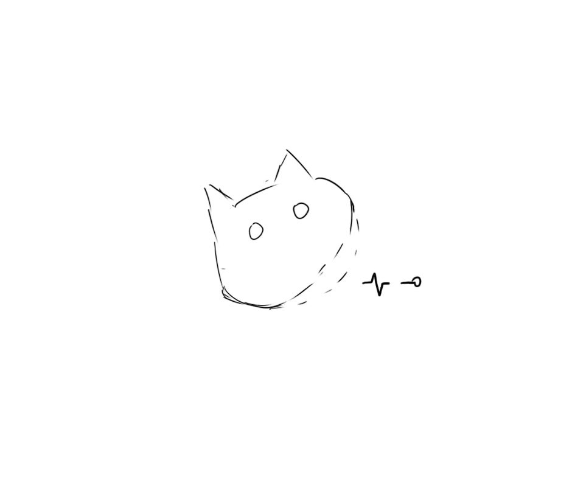
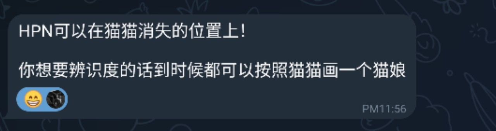
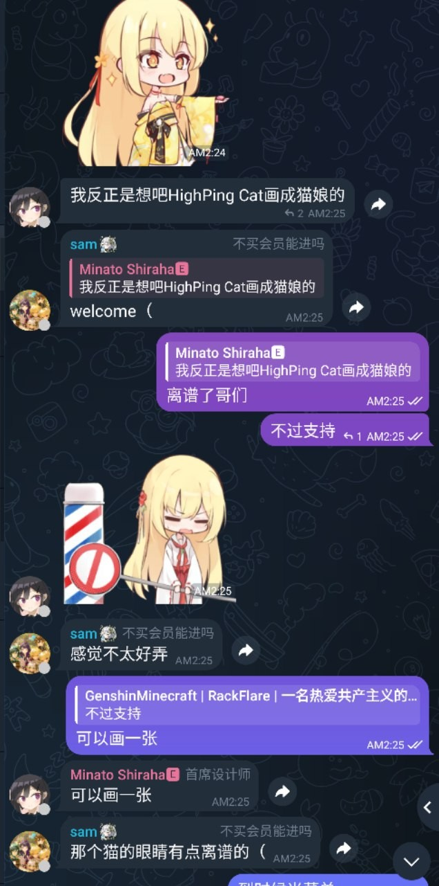

# High Ping Network 的新 Logo

## Logo 介绍

看！我们的 Logo 是不是很可爱？

它是来自 [Minato Shiraha🅴](https://t.me/minatoshiraha) 的作品，为 High Ping Network 绘制的

当然，也围绕这个视觉形象设计衍生出了许多作品:

> 因为网络波动的原因导致猫猫没有完全加载，有一半不见了！

> 它的尾巴设计为因为延迟导致波动的数据流，表达了HighPing名称的意义

> High Ping Cat被定义为服务器主机，而后面的感叹号圆点则是用户的客户端！

这一 Logo 比较有创意，就算不看上面的介绍我也认为它非常好看

详细的设计详情可以查看 [Shiro Atelier 白翎工作室](https://www.shiroaudio.eu.org/2024/02/20/视觉设计作品集highping-network视觉设计/)

***本视觉设计著作权归白翎工作室所有，授权 HIGH PING LTD 使用，未经许可禁止使用***

## 设计经历

### 初版

我们仅用了两次就敲版定稿了，初版是这样的: 

虽然但是，这个 Logo 也不错，但是还是稍微有点复杂了

而且不是很好地体现出 High Ping 的感觉（

并且，其与我们团队的喜好也不是非常相同，我们团队 11 个人，其中有 6 个人都是用的与 猫 有关的头像，所以我们还是决定推掉第一版

### 第二版

第二版的手稿就与现在差不多了: 

加载一半的猫猫，网络波动，网线等要素都集合了，第一眼看到的时候感觉不是很喜欢，当了解到背后设计思路后，就定稿了

真的，就算这只猫猫与 High Ping Network 无关，但也是非常可爱（

### 最终版

最终版当然就是现在的 Logo

整体采用了渐变色的形式，橙色也比较有活力，就定稿了

当然，我们的设计师还不忘整点花活: 

非常期待他的作品（

## 小结

要总结？要就是

***猫猫天下第一！***

***WE LOVE CAT***