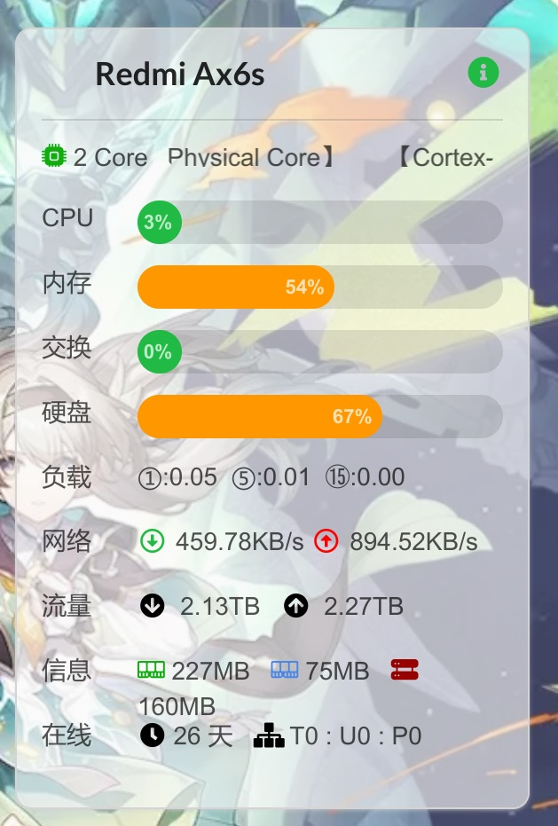

# 使用 nezha-agent-rs

本文由 `High Ping Network` 的小伙伴 GenshinMinecraft 进行编撰，首发于 [本博客](https://blog.highp.ing/)

## 前言

[nezha-agent-rs](https://github.com/GenshinMinecraft/nezha-agent-rs) 是一个 Rust 编写的，用于连接 Nezha Panel 的监控，基于 [Nezha](https://github.com/naiba/nezha) 以及 [Nezha Agent](https://github.com/nezhahq/agent)

写这个纯粹是为了好玩，只是想用 Rust 写个小项目来练习读取系统占用等情况，所以 nezha-agent-rs 这个项目就非常自然地产生了

相比于官方的 Agent，这一项目仅实现了首页面板的基础功能，如 CPU / RAM / 网速 等，未实现如 Task / 终端等功能 (写来也是为了玩，其他功能懒得写咯)

带来的优点就是比官方 Agent 占用更小，约为 50% 的内存 (自测)，适合极低配置的设备使用

请注意: **虽然我自己正在一些性能低下的设备使用它，但由于各种原因我将不会长期维护它，没有必要还是请使用官方 Agent**

## 下载

首先，请下载 nezha-agent-rs 的二进制文件，其位于[本项目的 Action](https://github.com/GenshinMinecraft/nezha-agent-rs/actions) 栏下的 Artifacts 中

点击最新的 Action 编译，并在 Summary 下的 Artifacts 找到你所需的系统与架构对应的二进制压缩文件

请务必根据自己的系统以及架构选择，否则将不会运行成功

请注意，常见的架构有 `musl` 与 `gnu` 之分: 
- `musl` 适用于所有的 Linux 系统，其使用的是静态库，无需动态库的支持
- `gnu` 适用于大部分 Linux 系统，其使用的是 Glibc，需要动态库的支持
- 常见的如 Ubuntu / Debian 等都可以选择 `gnu`，而 Openwrt / Alpine 等系统则必须选择 `musl`

总之，将其下载下来并上传到服务器目录即可

## 安装

首先为二进制文件添加可执行权限: 
```bash
chmod +x nezha-agent-rs
```

然后将其移动到 PATH 中指定的目录，例如 `/usr/bin`:
```bash
mv nezha-agent-rs /usr/bin/
```

然后运行它:
```bash
nezha-agent-rs --help
```

如果不出意外，将会打印出帮助信息

## 运行

运行十分简单，仅需指定 `-s` 与 `-p` 参数即可，分别是主端 RPC 地址和密钥，如:
```bash
nezha-agent-rs -s example.com:5555 -p 114514
```

就这样，你已经成功运行了 nezha-agent-rs 了，请自行去 Nezha Panel 中查看:


## 保活

当然，nezha-agent-rs 需要长时间的运行，你也许需要使用各种奇技淫巧来为其设置服务等，当然这里不再赘述

也可以参考 [这一 Screen 教程](https://blog.highp.ing/p/screen/) 来为其进行简单的配置

## 小结

还是那句话: 非必要请不要使用本项目，为了更稳定与简单，请使用官方 Agent！

欢迎加入 High Ping 大家庭:
- [官网](https://highp.ing)
- [Blog](https://blog.highp.ing)
- [@HighPingNetwork](https://t.me/HighPingNetwork)
- [@HighPingChat](https://t.me/highpingchat)