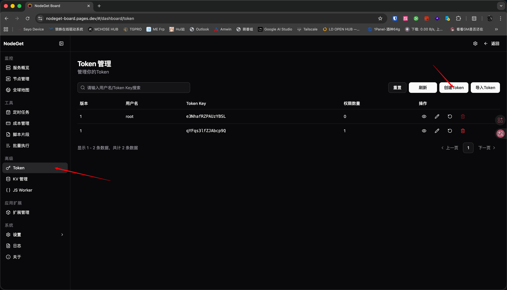

# NodeGet Status Show 搭建

Hi，这里是 GenshinMinecraft，NodeGet 后端已经没啥大改动了，所以临危受命来写写前端展示面板的搭建指南

- **官方文档**：<https://nodeget.com>
- **设计 Intro**：<https://www.nodeseek.com/post-704497-1>
- **Telegram 频道**：[@NodeGetProject](https://t.me/NodeGetProject)
- **Telegram 讨论组**：[@NodegetGroup](https://t.me/NodegetGroup)
- **前端 Dashboard 仓库**：[NodeSeekDev/NodeGet-board](https://github.com/NodeSeekDev/NodeGet-board)
- **前端 Status Board 仓库**：[NodeSeekDev/NodeGet-StatusShow](https://github.com/NodeSeekDev/NodeGet-StatusShow)
- **Nodeseek 社区**：<https://nodeseek.com>

现在是 26.4.30 22:37，明天就要发版，我已疲弊，此诚危急存亡之秋也


问题不大，这就来了

## 简介

NodeGet 的不仅是前后端分离，其前端也在正常情况下 (官方想让你这么用的情况下) 分为两个部分: 

- Dashboard: 用于持有 SuperToken，以最高权限管理所有设置
- StatusShow: 持有一个极度受限的 Token，对公众展示。也就是日差意义上的探针展示界面，所有人只要可以访问都可以查看到该界面，但无法修改任何东西

在一些其他项目 (如 Komari) 中，其实具有这两个概念，但是已经被弱化了。我记得 Komari 中 Web `/admin` 就是其管理面板，而根目录则为展示界面

但是在本项目，最正常最被推荐的方式是:

- 用 Server 连接到官方提供的 Dashboard 中进行日常的管理和配置 (纯静态纯本地，我们无法也不可能收集到任何信息)
- 然后使用你自己的域名提供 StatusShow 服务，可以自定义为各种主题

本文介绍的是 StatusShow 的搭建，假设你已经搭建好了自己的 NodeGet 服务，并且在 Cloudflare 有自己的域名，拥有 Github 账户

请注意：本文使用 Cloudflare Pages，部署的是官方前端展示界面，如有第三方展示界面请查看对应 Readme

## 创建 Token

首先来到你的 Dashboard，来到左侧 `Token` -> `创建 Token`



对于一般的情况 (使用官方 StatusShow)，使用预设的 Visitor 权限模版即可


这个预设的 Token 提供了以下权限:

对于所有 Agents
- 可以读取所有 Dynamic / Static / Dynamic Summary 数据
- 可以读取所有 Kv 中**所有 Namespaces** 下以 `metadata_` 开头的 Key (这不会造成什么安全性问题，并未给出列出所有 Namespaces 的权限，只能依据 Agent UUID 来读取，并且一般只有 Agent Namespace 才有该字段)
- 读取所有 Agent UUID

预设的模版权限给的非常之小，如果第三方前端提供者提供了额外的展示项，请根据其指示配置

随后创建 Token


你应该会看到一个这样的界面，复制其以备用


## 修改 Config

前往 <https://github.com/NodeSeekDev/NodeGet-StatusShow/releases> 下载最新构建


打开这个压缩包，解压并修改 `config.json` 文件


```json
{
  "site_name": "GM LOVE NodeGet",
  "site_logo": "",
  "theme_name": "default",
  "theme_repo": "",
  "theme_config": {
    "footer": "Powered by NodeGet"
  },
  "site_tokens": [
    {
      "name": "master server node 1",
      "backend_url": "wss://we-love-open-source.trycloudflare.com",
      "token": "P6R8Fkxxxxx:Ntt0NcLTkZVMtbb1bxxxxxxxxx"
    }
  ]
}
```

重点修改 `site_name` / `backend_url` / `token` 字段

需要注意的是，`backend_url` 在一般情况下应该为 `wss` 协议头，即为 TLS 加密的 WebSocket，并且强力建议部署于 CDN 后侧，这不仅是为了安全，也是浏览器的硬性要求

修改完后打包回该压缩文件

## 创建 Cloudflare Pages

转到 Cloudflare Dashboard，`计算` -> `Workers 和 Pages` -> `创建应用程序`


`Upload Your Static Files`


直接将刚才修改后的压缩文件拖入框中


然后修改为自己喜欢的 Pages 域名前缀，部署即可


部署成功后，在主面板直接跳转到部署的网站即可


最终成果:


PS: 这只是对外展示的面板，真正管理面板功能更多，我自己是挺喜欢的。

## 绑定域名

老生常谈，来到刚才的面板 `设置` -> `域和路由` -> `添加` -> `自定义域`


输入域名后，添加即可


## 小结

貌似还算挺充分的，简单到爆炸

如果你有点技术，那这文章纯流水账

不过酒神要求是面向小白，那就这样吧