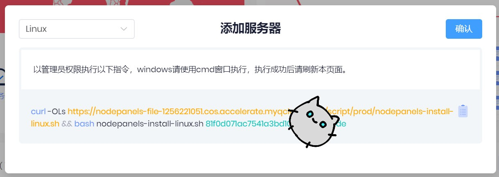
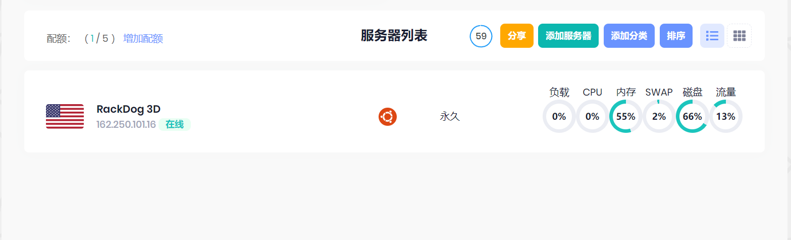
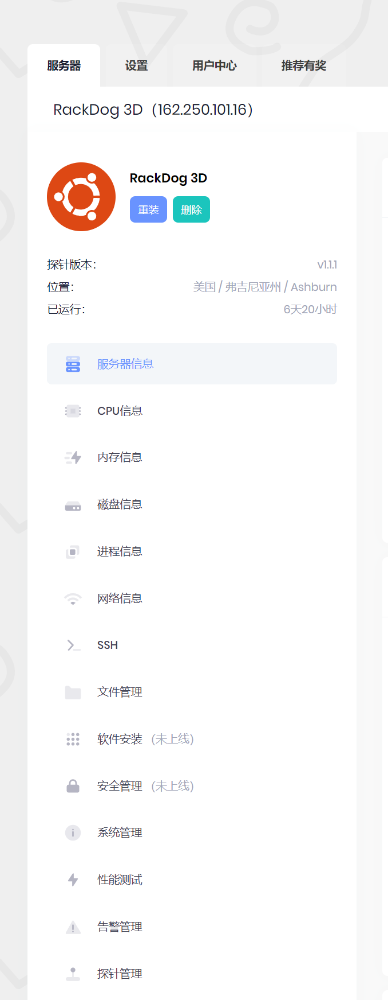
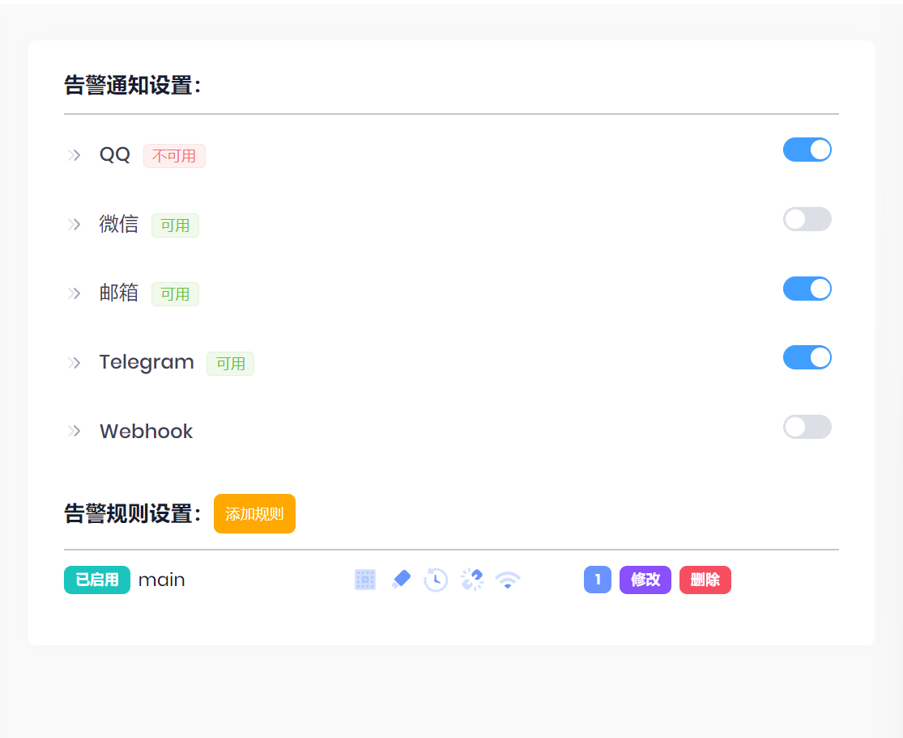
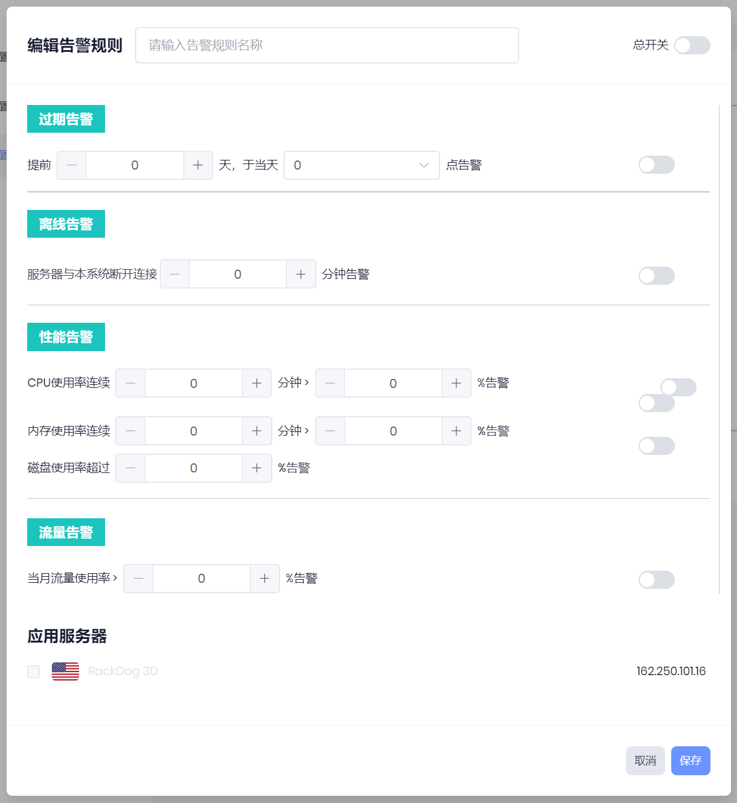
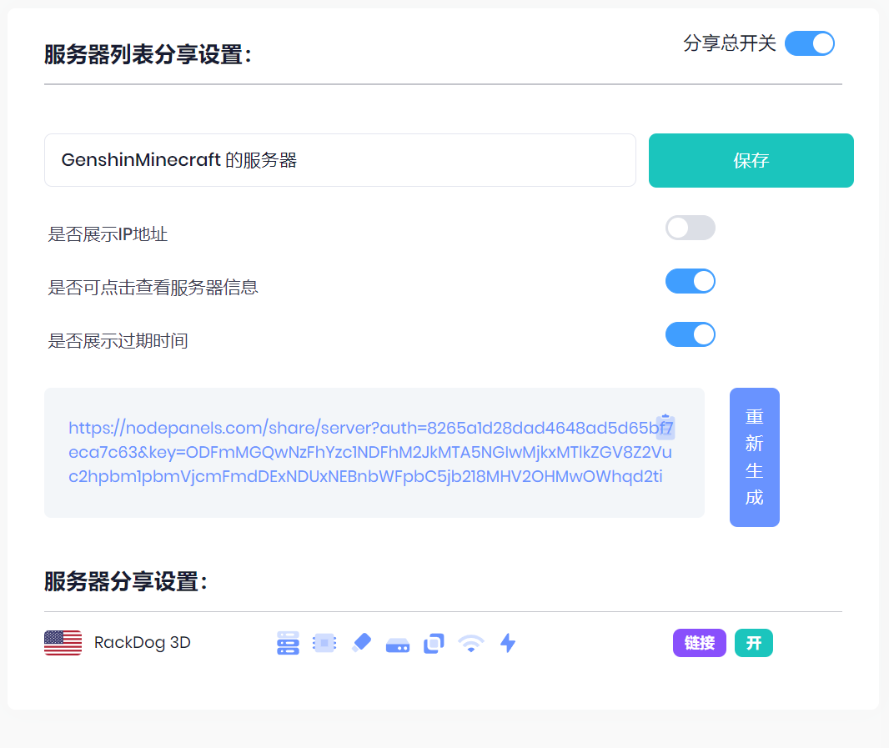
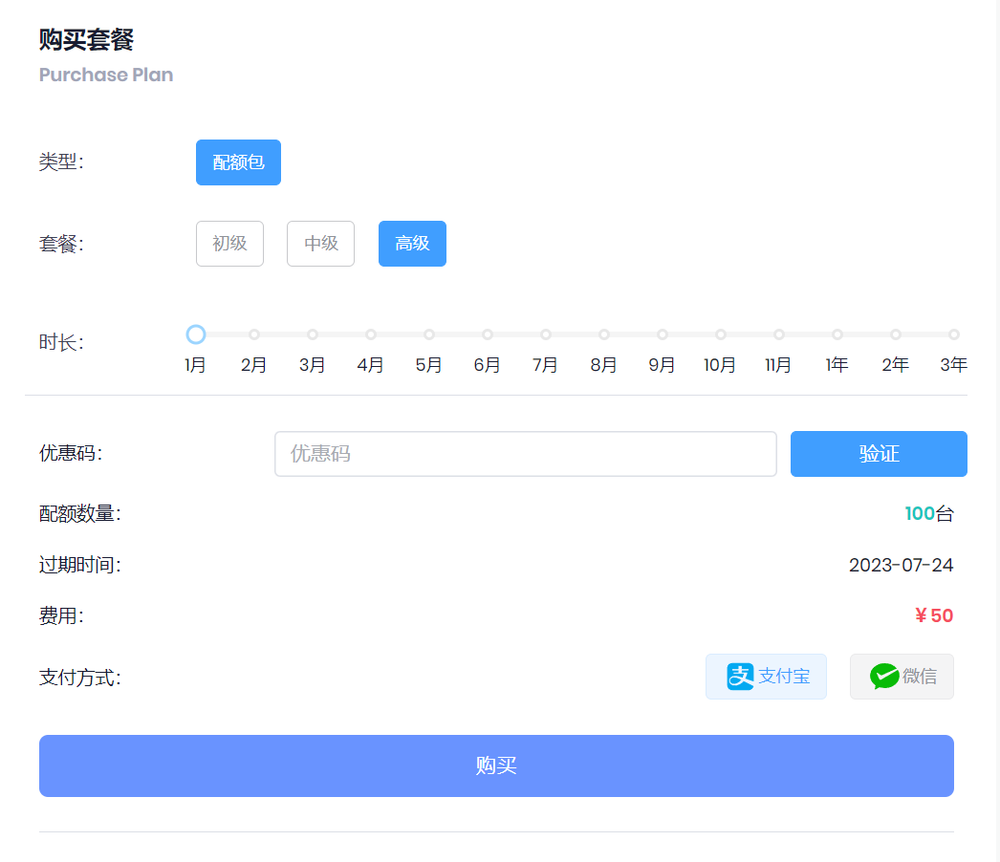

# Nodepanels-一个免费的双平台探针

本文由 `High Ping Network` 的小伙伴 GenshinMinecraft 进行编撰，首发于 [本博客](https://blog.highp.ing)

## 前言
探针是管理并查看服务器状态的重要工具，十分适合网站运维和服务器监视。

而免费且完全开源无限制的***哪吒面板***，就是其中的代表。

但是***哪吒面板***有诸多的缺点，例如*需要自己搭建主端；维护难*等问题。

所以就会出现***Nodepanels***这一新型探针，它有以下的优点
- 无需自己搭建主端
- 支持Linux/Windows一键脚本搭建探针端
- 免费版有**5个**服务器的额度
- 在线管理服务器（文件管理、性能测试等）
- 免费官方**微信/QQ/Email/TeleGramBot**告警通知
- 可以自定义分享服务器状态

所以说，***Nodepanels***非常适合服务器少，但是也有*管理、监测需求*的人！

你只需要以下的东西：
1. 脑子和手
2. 一个邮箱
3. 用于挂探针（监测）的服务器（可选）
   
## 创建账号
进入到[Nodepanels官网](https://nodepanels.com/)

注册一个账号

收完验证码后即可完成注册！

## 连接到服务器
登入[面板](https://nodepanels.com/server)，点击`服务器列表`左侧的`添加服务器`

按需选择**Linux or Windows**

**Linux**可以直接复制并在*终端*执行；

**Windows**可以使用*cmd/powershell*执行。

执行完成后，刷新界面，在`服务器列表`下**能看见自己的服务器并且显示在线**即为添加完成！

## 设置服务器（可选）
我们还可以在***Nodepanels**中设置服务器

点击**列表的右侧**部分来进行对服务器的设置

也可以点击服务器名称，对服务器进行更加详细的监测与调试

这么多功能，就不一一详细讲解了，有需要的朋友可以自行研究这些功能！

## 设置告警（可选）
对于一些网站服务器来说，当遭遇攻击时更需要及时地提醒。

在顶部导航栏的`设置-告警设置`中，可以使用**QQ/微信/邮箱/Telegram/Webhook**多种方式进行提醒，只需要把右边的按钮打开即可

点击下面的`添加规则`，详尽地添加需要告警地条件以及需要告警的服务器，可以做到更有规则地管理

## 分享服务器状态
我们可以把服务器状态分享~~炫耀~~给朋友们看

在顶部导航栏的`设置-分享设置`中，可以对需要分享的服务器进行选择，还可以根据需要*隐藏信息*

然后就会生成一条**分享连接**，就可以分享给朋友查看啦！

顺便来炫耀一下我的服务器（偷笑）：[GenshinMinecraft 的服务器](https://nodepanels.com/share/server?auth=8265a1d28dad4648ad5d65bf7eca7c63&key=ODFmMGQwNzFhYzc1NDFhM2JkMTA5NGIwMjkxMTlkZGV8Z2Vuc2hpbm1pbmVjcmFmdDExNDUxNEBnbWFpbC5jb218MHpxNDhpYTg5dTR3)

## 总结
***Nodepanels***基础的功能就这么多啦，作为日常的探针还是足足够用的。

对于一些***比较懒（belike me）的人***，或者是***服务器较少的人***来说就是不二之选！

有需要也可以付费支持，在此附上价格表：

欢迎加入 High Ping 大家庭:
- [官网](https://highp.ing)
- [Blog](https://blog.highp.ing)
- [@HighPingNetwork](https://t.me/HighPingNetwork)
- [@HighPingChat](https://t.me/highpingchat)
