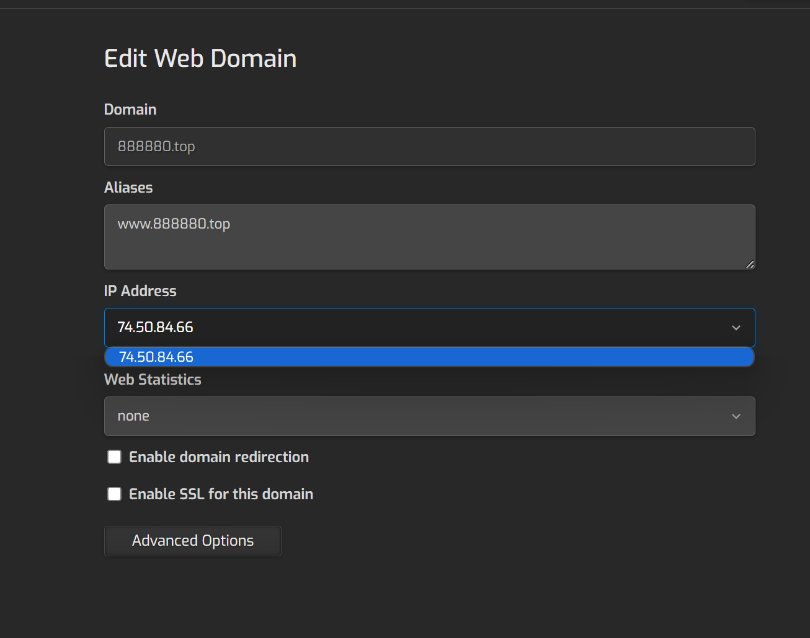

# 使用虚妄猫 1.9/Year 虚拟主机搭建博客 | 新手向

本文由 `High Ping Network` 的小伙伴 GenshinMinecraft 进行编撰，首发于 [本博客](https://blog.highp.ing)

本文由 虚妄猫 赞助，本文所提到的虚拟主机购买链接: <https://port.moonport.top/index.php/store/qu>

## 前言

受小埋之邀，写一篇用虚妄猫 1.9Rmb 一年的虚拟主机写一篇搭建博客教程的博客

介绍一下虚拟主机信息: 
- 3GB 空间
- 3 个数据库
- 3 个域名
- 无限流量
- 本机本地备份 1 次

请注意: 本博客是为了没有博客的朋友们写的"新手教程"，对于站长大牛来说这可能就是有手就行，但本文面对对象并非站长大牛，请理智看待

本文会讲的非常详细 (非常非常)

## 开始

### 登录到后台

购买小埋 1.9R 虚拟主机后，进入产品详情界面: 

它会告诉我们密码以及登录链接，点击 `点我登录` 即可跳转到登录界面并输入账号密码即可

### Dns 配置

进入到入口，点击你设置的域名，比如我这里就是 `888880.top`

记好这串 IP 地址: 

我分配到的 IP 地址为: 74.50.84.66

随后到你的域名注册/服务商，配置 DNS记录: 

这里使用最常见的 Cloudflare 作为演示，进入 Cloudflare 域名界面后，点击左侧栏目的 `DNS` 项目，添加记录

- 名称: 填写 @ 或 www (最好重复两步，两个都要有)
- IPv4 地址: 填写上面的地址，比如 74.50.84.66
- 关闭小黄云 (保持那朵云为`仅 DNS` 并且为灰色)

随后，保存配置

同理添加 www 与 @ 作为名称的记录，两个都要有

最后，保持成这样的状态: 

当一切配置完成的时候，用浏览器打开你的域名，理论上就可以看到初始页面了！

### 安装 WordPress

还是回到刚才的界面，点击左上角的 `Quick Install App`

向下翻一下，找到 `WordPress`，点击其 `Setup`

看到那些输入栏了吗？不要害怕，很简单，我来一个个解释一下

- `Site Name`: 你站点的名字，也就是标题
- `Wordpress Account Username`: 博客管理员账号名称
- `Wordpress Account Email`: 博客管理员账号邮箱
- `Wordpress Account Password`: 博客管理员账号密码
- `Install Directory`: 安装的目录，保持默认，不用理会
- `Language`: 语言，目前中文有些小 Bug，选择 `English`
- `Php Version`: 选择 7.4 即可
- `Database Create`: 创建数据库，打开，一定要打开
- `Database Name`、`Database User`、`Database Password`: 数据库名称、用户、密码，无需更改，保持默认的 `auto` 即可

完成填写: 

然后，点击右上角 `Save` 即可，等待一会就可以了！

### 获取数据库信息

点击最中间的 `DB`: 

默认应该会有一个数据库了，我的是 `qbqupihi_28521`

点击你所拥有的数据库，在这里设置一个密码，并记好用户名

比如我的用户名是 `qbqupihi_28521` (是下方小字部分，不是五位数字)

配置好后点击右上角的 `Save`，就算完成了

### 配置 WordPress

回到你的域名，打开应该就可以看到 WordPress 的配置界面了

第一次打开可能会出现关于 TLS 证书的问题，先忽略，后面再解决

点击 `继续前往xxx.xxx（不安全）` 即可

#### 选择语言

看这个博客的一般都是中国人吧，当然要划到最下面选择中文啦

#### 现在就开始

现在就开始！

#### 填写数据库

这个时候就需要刚才的数据库信息了，数据库名以及密码都在上一步说明了

而对于数据库主机与表前缀，不用理会默认即可

#### 开始安装程序

如果你已经填写好数据库信息并提交，就可以正式进入安装程序

点击 `运行安装程序`

#### 基本信息

这也是 `安装 WordPress` 那一步的信息，填入即可，最后一个搜索引擎不需要勾选，填写完点击 `安装 WordPress` 即可

这样就差不多了

#### 安装完成

这样就算完成了！恭喜你，你已经迈出了重要的一步

再次从浏览器访问你的域名，应该可以看见预设的界面，即代表安装成功:

### 登陆管理后台

前往 <http://[你的域名]/wp-admin/>

填写刚才设置的 邮箱与密码

登录就可以前往 WordPress 的后台

### 更改主题

前往 外观-主题，建议切换为 `Twenty Twenty-Three` 主题，简洁大方，当然也有其他的主题供你选择

### 写下第一篇博客

前往 `文章-所有文章`，点击 `新增文章`，开始第一次写作吧！

这就是 WordPress 引以为傲的 区块编辑器，在这里你无需了解什么 Markdown 语法，都可以随心随意所见即所得、像编辑一篇 Word 文档一样编辑一篇博客

在这里，你可以插入包括但不限于以下的东西

- 标题
- 图库
- 图片
- 视频
- 列表
- 段落
- 引用
- 代码
- 详细信息
- 表格
- 音频
- 文件
- 按钮
- 超链接
- .......................

总之，你可以在这里编辑任何你想要的东西！

我写了一篇简单的博文，作为演示

编辑完成后，右上角发布就就算完成了！

### 完成 "新手教程"

这样，你就可以在你的博客发布一篇文章了！

新手教程就到这里，接下来，请一步步探索 WordPress 的功能，毕竟刚才所说的仅是 WordPress 的九牛一毛，根本不值一提

## 小结

虽然 High Ping Blog 并非使用 WordPress 建立的，但是我也有多年折腾 WordPress 的经验，希望互联网的每一个人都有一个博客，或是用于知识分享、学术交流、又或是仅是图一乐，都是一次值得记录的折腾经历

在搭建过程中，有疑问可以进入 Telegram 群组: [@HighPingChat](https://t.me/highpingchat) 或 [虚妄猫交流群组](https://t.me/xuwangmao) 请求帮助

说实话 1.9Rmb 算上开机费也才 2.2RMB，一包辣条不到的一年虚拟主机还是性价比拉满的

欢迎加入 High Ping 大家庭:
- [官网](https://highp.ing)
- [Blog](https://blog.highp.ing)
- [@HighPingNetwork](https://t.me/HighPingNetwork)
- [@HighPingChat](https://t.me/highpingchat)

也欢迎加入 虚妄猫: 
- [官网](https://port.moonport.top)
- [Telegram 群组](https://t.me/xuwangmao)
- [虚妄猫博客](https://blog.nomao.top)