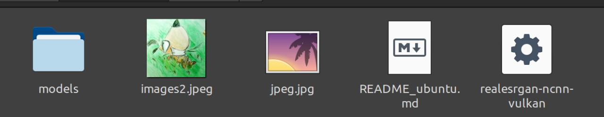

# 通过 Real-ESRGAN 给图像/视频超分辨率

本文由 `High Ping Network` 的小伙伴 GenshinMinecraft 进行编撰，首发于 [本博客](https://blog.highp.ing)

## 前言

[Real-ESRGAN](https://github.com/xinntao/Real-ESRGAN/) 是一个开源的用于实用的图像/视频修复工具

我们这次使用的是 [Real-ESRGAN-ncnn-vulkan](https://github.com/xinntao/Real-ESRGAN-ncnn-vulkan) 提供的已编译好的主程序与模型

不管那么多，先看看例子: (例图为开发者 Xintao 的 Github 头像)

原图: 


超分修复后: (使用 `realesrgan-x4plus` 模型超分)


而要想达到上面所看到的效果，仅需一些小东西: 

- 一台电脑
- 一张显卡 (核显/独显均可，与超分速度有关)

## 安装 Real-ESRGAN-ncnn-vulkan

直接前往 [Releases](https://github.com/xinntao/Real-ESRGAN-ncnn-vulkan/releases) 下载最新的对应你系统版本的压缩包

下载后解压，一般会有以下的文件:


*如果是 Linux 系统，则应该先使用 `chmod +x realesrgan-ncnn-vulkan` 来设置可执行权限*

在终端执行 `realesrgan-ncnn-vulkan`，当看到以下输出即为安装完成

```
Usage: realesrgan-ncnn-vulkan -i infile -o outfile [options]...

  -h                   show this help
  -i input-path        input image path (jpg/png/webp) or directory
  -o output-path       output image path (jpg/png/webp) or directory
  -s scale             upscale ratio (can be 2, 3, 4. default=4)
  -t tile-size         tile size (>=32/0=auto, default=0) can be 0,0,0 for multi-gpu
  -m model-path        folder path to the pre-trained models. default=models
  -n model-name        model name (default=realesr-animevideov3, can be realesr-animevideov3 | realesrgan-x4plus | realesrgan-x4plus-anime | realesrnet-x4plus)
  -g gpu-id            gpu device to use (default=auto) can be 0,1,2 for multi-gpu
  -j load:proc:save    thread count for load/proc/save (default=1:2:2) can be 1:2,2,2:2 for multi-gpu
  -x                   enable tta mode
  -f format            output image format (jpg/png/webp, default=ext/png)
  -v                   verbose output
```

## 对图片超分

基础的命令格式:
```bash
./realesrgan-ncnn-vulkan -i [输入图片] -o [输出图片] -n [模型名称]
```

对于可选的模型，有以下几个:

- `realesrgan-x4plus`: 通用模型，建议选择 (时间较长)
- `realesrgan-x4plus-anime`: 动画通用模型，动画建议选择 (时间中等)
- `realesr-animevideov3-x[234]`: 动画模型，当图片较多时可使用，后面数字越大品质越好

一般来说，只需要使用 `realesrgan-x4plus` 即可

比如，我现在要超分 `Input.jpg` 图片，输出为 `Output.jpg`，我就可以使用:

```bash
./realesrgan-ncnn-vulkan -i Input.jpg -o Output.jpg -n realesrgan-x4plus
``` 

等待一会，进度条跑完后即可在当前目录下看见已经超分的 `Output.jpg`

## 对视频超分

对于视频，操作也和对图片超分类似，只是把视频的每一帧提取成图片后超分

所以，可能一些大视频需要超分很久很久......

### 查看帧率

首先，安装 [FFmpeg](https://ffmpeg.org/)，Linux 用户可通过包管理器直接安装，其他不赘述

再使用 FFmpeg 查看需要超分的视频的帧率:

```bash
ffmpeg -i [视频文件名]
```

其中，下面这行中的 `24.92` 就是该视频帧率:
```
  Stream #0:0(und): Video: h264 (High) (avc1 / 0x31637661), yuv420p(tv, bt470bg/unknown/unknown), 384x288 [SAR 1:1 DAR 4:3], 640 kb/s, 24.92 fps, 24.92 tbr, 19136 tbn, 49.83 tbc (default)
```

记住它，留着备用

### 拆分

这一步会将视频内的每一帧提取出来

在同目录新建两个文件夹，分别是 `Input` 与 `Output`

随后，拆分该视频: 
```bash
ffmpeg -y -i [视频文件名] ./Input/%04d.png
```

### 超分

对文件夹内所有图片进行超分:
```bash
./realesrgan-ncnn-vulkan -i Input/ -o Output/ -n realesrgan-x4plus
```

模型选择列表同上，当视频较长时建议选择较小模型

*PS: 你可以添加 -j 参数来进行多线程超分，格式为 `-j [加载]:[超分]:保存` ，如 `-j 8:8:8`*

耐心等待，~~有的时候一块好的GPU真的很重要~~

### 合并

超分完后，即可合并所有图像为视频文件:
```bash
ffmpeg -y -framerate [上面查看帧率] -i Output/%04d.png [新视频文件名]
```

比如我的命令是:
```bash
ffmpeg -y -framerate 24.02 -i Output/%04d.png ./Roundhay_Garden_Scene.GAN.mp4
```

随后即可在本地看到超分完的文件了

### 音频合并 (可选)

在经过拆分后再合并的步骤下，视频原本的音频是没有的了，我们需要提取出源视频音频并合并到新视频:
```bash
ffmpeg -i [未超分视频文件] -vn -ac 2 out.mp3
ffmpeg -i [已超分视频文件] -i out.mp3 -c copy -map 0:v:0 -map 1:a:0 [最后视频文件]
```

### 成果

本次示例超分视频为 《朗德海花园场景》(世界上第一部电影)

原视频:

<video width="320" height="240" controls>
  <source src="Roundhay_Garden_Scene.ogv.360p.mp4" type="video/mp4">
</video>

超分后:

<video width="320" height="240" controls>
  <source src="Roundhay_Garden_Scene.GAN.mp4" type="video/mp4">
</video>

## 小结

不管怎么说，超分都是有显著效果的

如果你觉得效果不够炸裂，也可以多次超分 (超分出 10GB 一张图也不是不行)

就这样吧

欢迎加入 High Ping 大家庭:
- [官网](https://highp.ing)
- [Blog](https://blog.highp.ing)
- [@HighPingNetwork](https://t.me/HighPingNetwork)
- [@HighPingChat](https://t.me/highpingchat)