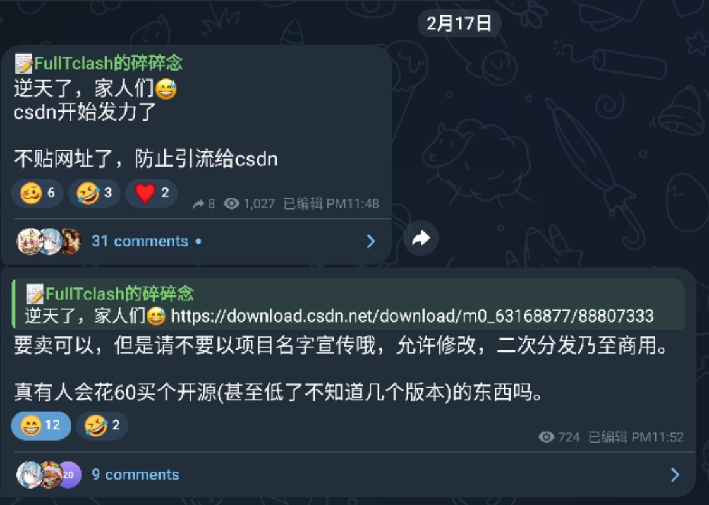
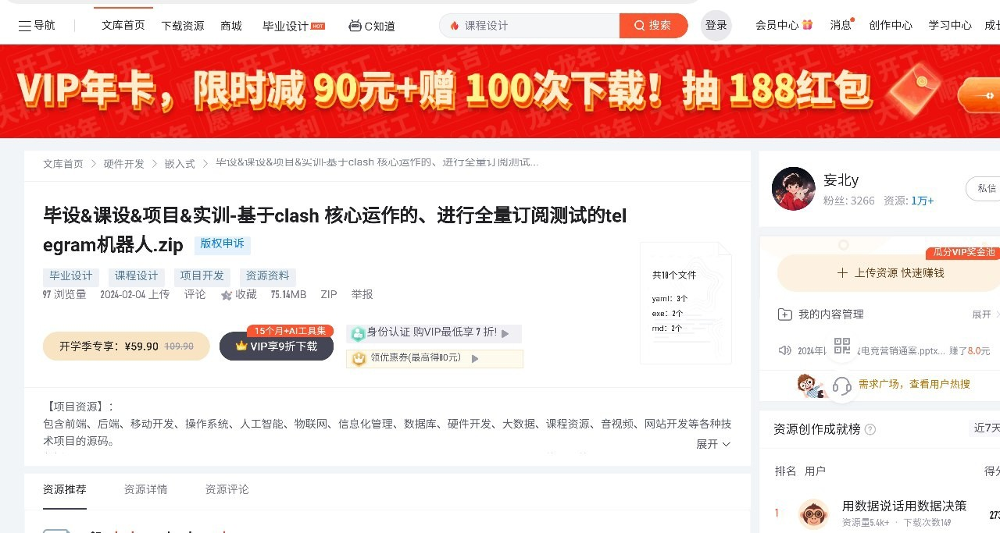
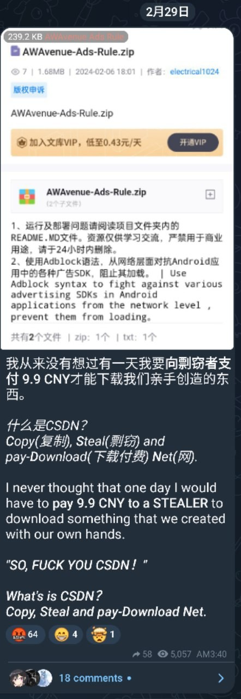

# 锐评 CSDN

本文由 `High Ping Network` 的小伙伴 GenshinMinecraft 进行编撰，首发于 [本博客](https://blog.c1oudf1are.eu.org)

## 免责声明

今后，`High Ping Blog` 会有一个专门的 Tag `RuiPing`，里面会存放一些对于最近事件的吐槽以及评价，非常主观，仅代表编撰者个人意见，不代表 High Ping LTD

## 前言

CSDN 想必各位都知道，很符合我对中国开源社区的想象

CSDN 造成现在这样开发者们人人唾弃的国内平台是有原因的，包括但不限于: 
- 发布者(有时候是剽窃者)
- CSDN 本身
- 阅读者

## 为什么要锐评它

### FullTclash

它最近搞出来的动作有点多，比如我比较喜欢的 FullTclash 服务

很抽象，案发链接: <https://download.csdn.net/download/m0_63168877/88807333>

一个在 Github 以 BSD2 协议开源的一个服务，在 CSDN 公然标价 60CNY

而且，由于这一项目接触敏感性较高，CSDN 能够上架带有 `Telegram` 字眼的压缩包也是抽象

### AWAvenuv

还有另一个项目，AWAvenuv

很喜欢他的一句话: 

> 什么是CSDN？  

> **_C_**_opy(复制),_ **_S_**_teal(剽窃) and pay-_**_D_**_ownload(下载付费)_ **_N_**_et(网)._  

## 我的评价

我觉得，导致 CSDN 变成目前这一情况的原因有多个

1. CSDN 官方
	如果你有见过 CSDN 网站的话，你会发现: 广告比例太严重了
	
	最经典的就是各种云服务商的广告，比如阿里云
	
	可以让人阅读的区域，最多仅有三分之一，其余全是杂乱信息流以及无用玩意
	
	还有各种的限制，比如**登录后复制**，**付费阅读全文**等

2. 内容创作者
	当然，这里并不是指全部的内容创作者
	
	但是个别创作者，为了敛财，把已经开源的东西，直接搬过来，付费下载
	
	很佩服他们的勇气，难道 License 就不是一个具有法律效应的文件吗？
	
	这种剽窃他人劳动成果的行为，你会喜欢吗？

3. 搜索引擎
	当你在搜索引擎使用中文检索技术向问题时，大概率在前五个网站中就有一个是 CSDN
	
	其中，最突出的就是国内搜索引擎
	
	当然，搜索引擎并不是主要原因，但也确实为 CSDN 引流了很多

4. 这就是中国
	中国由于政治等各方面的原因，导致了国内用户/开发者参阅外国网站获取知识的道路并不多
	
	其他我不好说

## 小结

我不知道 CSDN 以及剽窃他人劳动成果发布至 CSDN 的剽窃者挣了多少钱

但我知道，大部分开发者(们)，都是用爱发电，没有收过一分钱，全依靠开源平台的世界各地的参与者们支持

当他们看见自己的作品被 CSDN 剽窃去之后，他们会是什么心情？

开源界中流传着一个笑话，说的是当你的项目已经被 CSDN 拿走了之后，你这个项目就已经逐渐开始有人气了

我觉得说的很有道理

最后，我想送 CSDN 一首歌曲:

> CSDN 你听我说
> 就让我来说说你
> 这个"开源"是你创造的
> 求求你把"付费"关闭
> 用户是钱真多
> 开发者是怒火中烧
> 一天到晚都在数钱
> 嘴里就笑呵呵

**WE LOVE OPEN-SOURCE**

欢迎加入 High Ping 大家庭:
- [官网](https://highp.ing)
- [Blog](https://blog.c1oudf1are.eu.org)
- [@HighPingNetwork](https://t.me/HighPingNetwork)
- [@HighPingChat](https://t.me/highpingchat)