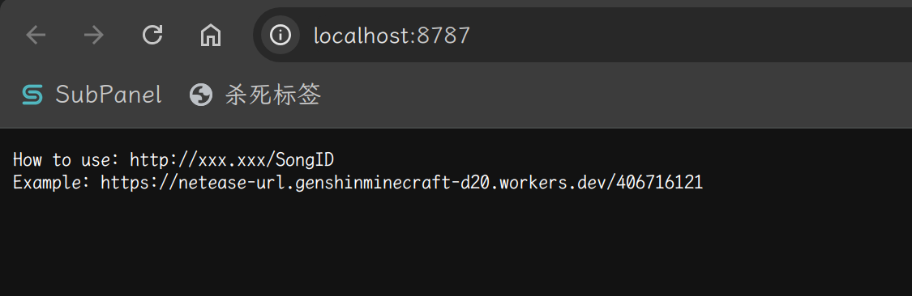
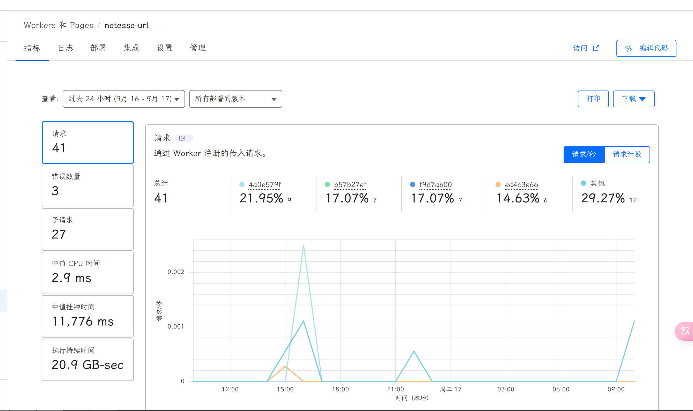

# Re0: 从零开始的 Rust For Cloudflare Workers 教程

本文由 `High Ping Network` 的小伙伴 GenshinMinecraft 进行编撰，首发于 [本博客](https://blog.highp.ing)

## 前言

很久很久以前，我就已经想当一位 Workers 开发者了

可惜苦于不会 JavaScript 与 TypeScript，因为用 Workers 开学也不咋好，所以一直搁置着

忽然想起 Cloudflare 官方已经支持我最爱的 Rust 了，但互联网上相关内容似乎不多，遂写本文

首先你要有这么些东西:

- Rust 开发环境 (最新的 Stable)
- Node.js 开发环境 (20 的 LTS)
- 合理的网络环境
- Cloudflare 账号
- 一点点的 Rust 基础

本文会以一个 网易云音乐 直链 API 为教程内容，基本讲解 Rust On Cloudflare Workers 的使用

## 初始化项目

首先安装一下 Rust Wasm 的 Toolchain，用于编译 Wasm

```bash
rustup target add wasm32-unknown-unknown
```

顺便安装下 `cargo-generate`: 

```bash
cargo install cargo-generate
```

随后根据 `workers-rs` 的模板创建项目

```bash
cargo generate cloudflare/workers-rs
```

如果它提问 `🤷   Which template should be expanded?`，用上下箭选择 `templates/hello-world` 即可

随后自定义项目名称，这个项目名称会影响你部署到 Cloudflare 的项目名称以及域名。因为我们写的是 网易云音乐 API，所以我这里就取名为 `netease-url`

```
❯ cargo generate cloudflare/workers-rs
⚠️   Favorite `cloudflare/workers-rs` not found in config, using it as a git repository: https://github.com/cloudflare/workers-rs.git
✔ 🤷   Which template should be expanded? · templates/hello-world
🤷   Project Name: netease-url
🔧   Destination: /tmp/netease-url ...
🔧   project-name: netease-url ...
🔧   Generating template ...
🔧   Moving generated files into: `/tmp/netease-url`...
🔧   Initializing a fresh Git repository
✨   Done! New project created /tmp/netease-url
```

大概这样即可

## 编写代码

选择自己喜欢的编辑器就好啦！本文以 RustRover 为例

### 获取直链的函数

在这里，我们调用一个 API: <https://oiapi.net/API/Music_163?id=NETEASEMUSICID&n=1>

其中，`NETEASEMUSICID` 就是 网易云音乐的 ID，使用 GET 方法访问即可获取音乐 MP3 直链

我们使用 Reqwest 作为请求的库，需要在在 `Cargo.toml` 中事先添加 `reqwest` 和 `serde_json` i的依赖，并附带上一些 features

```Cargo.toml
[dependencies]
...
reqwest = { version = "0.12.7", features = ["json"]}
serde_json = "1.0.128"
```

随后直接在 `src/lib.rs` 以正常开发的方式编写 API 调用函数即可:

```rust
pub async fn get_163_url(id: u64) -> std::result::Result<String, String> {
    let client = Client::new();

    let url = format!("https://oiapi.net/API/Music_163?id={}&n=1", id);

    let resp = match client.get(&url).send().await {
        Ok(resp) => resp,
        Err(_) => return Err(String::from("Failed to fetch data")),
    };

    if !resp.status().is_success() {
        return Err(String::from("Failed to fetch data"));
    }

    let json: Value = match resp.json().await {
        Ok(json) => json,
        Err(_) => return Err(String::from("Failed to parse JSON")),
    };

    let data = match json["data"].as_array() {
        Some(data) => data,
        None => return Err(String::from("No data found")),
    };

    let song = match data.get(0) {
        Some(song) => song,
        None => return Err(String::from("No song found")),
    };

    let url = match song.get("url") {
        Some(url) => url.to_string(),
        None => return Err(String::from("No URL found")),
    };

    let url = &url[1..url.len()-1];

    Ok(url.to_string())
}

```

由于本文不是来讲解 Reqwest 是如何使用的，所以对这里的代码不会过多解释。

这个函数需要一个 `id` 参数，即为网易云音乐 ID，并将请求发送到 API，并从 API 中提取音乐的 URL 直链

返回值为 `Result<String, String>`，T 为音乐直链，E 为错误信息

*至于为什么在这里是 `std::result::Result`，因为在默认引用的 `workers::*` 中也有 `Result`，别搞混了*

### 编写主函数

Workers 是基于路由的，所以你需要一个路由才可以响应请求，比如:

```rust
#[event(fetch)]
pub async fn main(req: Request, env: Env, _ctx: Context) -> Result<Response> {
    let router = Router::new();
    router.run(req, env).await
}
```

这就是主函数，主函数需要接收并处理路由，`router` 即为路由，我们需要在里面实现我们的业务逻辑

#### 主页

首先来写个简单的主页，返回一个字符串:

```rust
#[event(fetch)]
pub async fn main(req: Request, env: Env, _ctx: Context) -> Result<Response> {
    let router = Router::new();
    router
        .get_async("/", |_, _| async move {
            Response::ok("How to use: http://xxx.xxx/SongID\nExample: https://netease-url.genshinminecraft-d20.workers.dev/406716121")
        })
        .run(req, env).await
}
```

`router` 的 `get_async()` 需要两个参数，第一个为路径，第二个为处理的函数，我们这里使用一个闭包

该闭包不需要任何参数，所以参数中使用 `_` 代替，并使用了 `Response::ok()` 来返回一个字符串

如果现在在该项目下执行 `npx wrangler dev`，应该可以在本地的 8787 端口上查看实例:



在该模式下，一旦源代码有更新，就会自动编译并部署，可以在浏览器实时查看情况


#### 处理歌曲请求


写完了主页，下面就是处理逻辑，这是关键代码:

```rust
let router = Router::new();
router
    .get_async("/", |_, _| async move {
        Response::ok("How to use: http://xxx.xxx/SongID\nExample: https://netease-url.genshinminecraft-d20.workers.dev/406716121")
    })
    .get_async("/:id", |_, ctx| async move {
        let id = match ctx.param("id") {
            Some(id) => match id.parse::<u64>() {
                Ok(id) => id,
                Err(_) => return Response::error("Invalid ID", 400),
            },
            None => return Response::error("Invalid ID", 400),
        };
        let url = match get_163_url(id).await {
            Ok(url) => url,
            Err(err) => return Response::error(err, 400),
        };
        Response::ok(url)
    })
    .run(req, env)
    .await
```

在这里，我们新加了一个 `get_async()`，路径为 `/:id`，其中 `id` 为变量，可以接收并处理，后面闭包中的 `ctx` 可以用来接收路径中 `id` 的值


这里我们使用 `ctx.param("id")` 来接收 路径中 `id` 的值，并调用上面的函数返回错误或 URL


### 代码总结


最后，代码大概这样的:

```rust
use reqwest::Client;
use serde_json::{json, Value};
use worker::*;

#[event(fetch)]
pub async fn main(req: Request, env: Env, _ctx: Context) -> Result<Response> {
    let router = Router::new();
    router
        .get_async("/", |_, _| async move {
            Response::ok("How to use: http://xxx.xxx/SongID\nExample: https://netease-url.genshinminecraft-d20.workers.dev/406716121")
        })
        .get_async("/:id", |_, ctx| async move {
            let id = match ctx.param("id") {
                Some(id) => match id.parse::<u64>() {
                    Ok(id) => id,
                    Err(_) => return Response::error("Invalid ID", 400),
                },
                None => return Response::error("Invalid ID", 400),
            };
            let url = match get_163_url(id).await {
                Ok(url) => url,
                Err(err) => return Response::error(err, 400),
            };
            Response::ok(url)
        })
        .run(req, env)
        .await
}

pub async fn get_163_url(id: u64) -> std::result::Result<String, String> {
    let client = Client::new();

    let url = format!("https://oiapi.net/API/Music_163?id={}&n=1", id);

    let resp = match client.get(&url).send().await {
        Ok(resp) => resp,
        Err(_) => return Err(String::from("Failed to fetch data")),
    };

    if !resp.status().is_success() {
        return Err(String::from("Failed to fetch data"));
    }

    let json: Value = match resp.json().await {
        Ok(json) => json,
        Err(_) => return Err(String::from("Failed to parse JSON")),
    };

    let data = match json["data"].as_array() {
        Some(data) => data,
        None => return Err(String::from("No data found")),
    };

    let song = match data.get(0) {
        Some(song) => song,
        None => return Err(String::from("No song found")),
    };

    let url = match song.get("url") {
        Some(url) => url.to_string(),
        None => return Err(String::from("No URL found")),
    };

    let url = &url[1..url.len()-1];

    Ok(url.to_string())
}
```

## 发布到 Cloudflare Workers


在该项目目录下执行:

```bash
npx wrangler deploy
```

在期间，Wrangler 可能会让你登录 Cloudflare 账户，跳转浏览器登录即可


当部署完成，你就可以在 Cloudflare Dashboard 与控制台下看见对应的 Workers 了: 

```
⚡ Done in 7ms
Total Upload: 672.52 KiB / gzip: 266.48 KiB
Worker Startup Time: 1 ms
Uploaded netease-url (6.98 sec)
Deployed netease-url triggers (0.51 sec)
  https://netease-url.genshinminecraft-d20.workers.dev
Current Version ID: dffa2bd9-ee72-4a1f-99aa-8251379cea93

```




## 小结

就这样吧，Rust Wasm 可玩性还是很高的，Worker-rs 的 `req` 与 `ctx` 有更多的功能，终于让我这个 JS / TS 全都不会的也玩上 Workers 了


欢迎加入 High Ping 大家庭:                                                                                                                                                                    

- [官网](https://highp.ing)                                                                                                                                                                   

- [Blog](https://blog.highp.ing)                                                                                                                                                              

- [@HighPingNetwork](https://t.me/HighPingNetwork)                                                                                                                                            

- [@HighPingChat](https://t.me/highpingchat)
