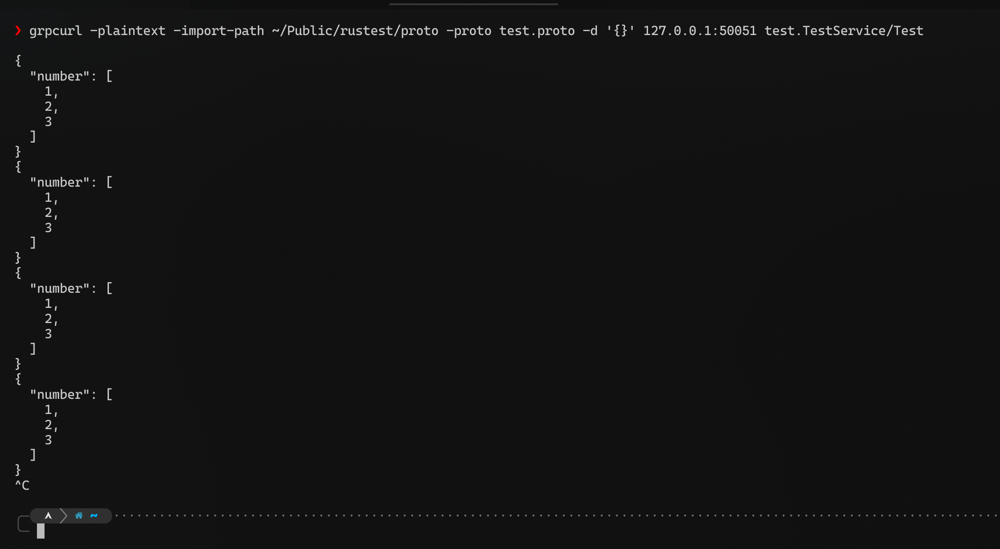

# 在 Rust Tonic 中实现 gRPC 服务端流式传输

本文由 GenshinMinecraft 进行编撰，首发于 [本博客](https://blog.c1oudf1are.eu.org/)

## 前言

由于一些心血来潮的一些想法，希望在 Rust 实现 gRPC 的服务器流式传输，遂有本文

在这里，你至少需要五个依赖以实现流式传输:

```toml
[dependencies]
tonic = { version = "0.12.3", features = ["transport", "server"] }
prost = "0.13.3"
tokio = { version = "1.40.0", features = ["full"] }
tokio-stream = "0.1.16"

[build-dependencies]
tonic-build = "0.12.3"
```

## 实现

### 定义一个 Demo Protobuf

为了演示方便，这里随便定义一个 Protobuf 即可:

```protobuf
// proto/test.proto
syntax = "proto3";
package test;

service TestService {
  rpc Test (TestRequest) returns (stream TestResponse); // 注意这里的 "stream" 关键字
}

message TestRequest {}

message TestResponse {
  repeated int32 number = 1;
}
```

随后，写个 `build.rs` 以编译该 Protobuf 为 Rust 源文件:

```rust
use std::io::Result;

fn main() -> Result<()> {
    tonic_build::configure()
        .build_client(true)
        .build_server(true)
        .build_transport(true)
        .out_dir("src")
        .compile_protos(&["proto/test.proto"], &["proto"])?;

    Ok(())
}
```

### 编写主程序代码

为了不占用过多篇幅，我们这里直接贴出除**流式传输实现**部分外的代码:

```rust
#[derive(Default)]
pub struct TestService {}

#[tonic::async_trait]
impl test_service_server::TestService for TestService {
    // 这里为流式传输实现
}

#[tokio::main]
async fn main() {
    Server::builder()
        .add_service(test_service_server::TestServiceServer::new(
            TestService::default(),
        ))
        .serve("0.0.0.0:50051".to_socket_addrs().unwrap().next().unwrap())
        .await
        .unwrap();
}
```

这里定义了 `TestService` 服务以及新建了一个监听与 `50051` 端口的 gRPC 服务器

### 核心实现

我们需要在 `TestService` 的内部先定义一个 `TestStream` 的 Type，用于定义流的类型:

```rust
type TestStream = Pin<Box<dyn Stream<Item = Result<TestResponse, Status>> + Send>>;
```

需要注意的是，需要一个**实现了 `Stream` 特性的**、**内部类型为 `Result<TestResponse, Status>` 的**、**可以安全传递的、被固定内存且动态大小**的类型

最简单的方法就是定义一个 `Pin<Box<dyn Stream<Item = T + Send>>`，已经满足需求

随后，再来实现处理流逻辑的代码:

```rust
async fn test(
        &self,
        request: Request<TestRequest>,
) -> Result<Response<Self::TestStream>, Status> {
    // 函数内部
}
```

同样的，`test` 函数返回一个 `Result<Response<Self::TestStream>, Status>`，即 `Result<Response<Pin<Box<dyn Stream<Item = Result<TestResponse, Status>> + Send>>>, Status>`

不要看它很长，其实都是被一层层包裹住的，我们只需要实现一个 `dyn Stream<Item = Result<TestResponse, Status>` 再层层包回去即可

说到流传输，我们第一时间想到的应该会是 `std` 中的通道，也就是 `tx / rx`，我们就用通道来实现基本的流传输

来新建一个通道: (这里使用了 `Tokio` 的通道，`std` 中也行)

```rust
let (tx, mut rx): (Sender<Result<TestResponse, Status>>, Receiver<Result<TestResponse, Status>>) = tokio::sync::mpsc::channel(1);
```

最好是在定义的时候就指定好内部的类型，避免之后 Rust 编译器无法猜测内部类型导致报错

随后，新建一个异步任务来模拟向流中发送信息:

```rust
tokio::spawn(async move {
    loop {
        let response = TestResponse {
            number: vec![1, 2, 3],
        };
        tx.send(Ok(response)).await.unwrap();
        tokio::time::sleep(std::time::Duration::from_secs(1)).await;
    }
});
```

这里写了个死循环，每隔一秒钟向通道发送一个 `Ok(TestResponse)`，其中包含三个数字

在实际情况下，你可以将该部分代码转换为实际生产代码

最后，我们就可以返回 `rx` 当作我们的流了:

```rust
Ok(Response::new(Box::pin(
    tokio_stream::wrappers::ReceiverStream::new(rx),
)))
```

其中，`tokio_stream::wrappers::ReceiverStream::new()` 用于将接收器转换为流，即支持 Stream 特性

大功告成！

### 另一种方式

我们也可以不使用 `tokio_stream`，转而使用 `async_stream` 进行流传输

在这上面，同样需要使用通道，所以刚才有关通道的定义以及异步任务**无需改动**

```rust
let stream = stream! {
    while let Some(item) = rx.recv().await {
        yield item;
    }
};
Ok(Response::new(Box::pin(stream)))
```

相对于 `tokio_stream`，`async_stream` 更加符合我个人的美感 (?)

主要就是使用 `yield` 返回其中的值，当然也可以摒弃通道，直接在 `stream!` 内部循环也可以

### 实际代码

```rust
use std::net::ToSocketAddrs;
use std::pin::Pin;
use tokio::sync::mpsc::{Receiver, Sender};
use tokio_stream::wrappers::ReceiverStream;
use tokio_stream::StreamExt;
use tonic::codegen::tokio_stream::Stream;
use tonic::{transport::Server, Request, Response, Status};

mod test;
use test::*;

#[derive(Default)]
pub struct TestService {}

#[tonic::async_trait]
impl test_service_server::TestService for TestService {
    type TestStream = Pin<Box<dyn Stream<Item = Result<TestResponse, Status>> + Send>>;

    async fn test(
        &self,
        request: Request<TestRequest>,
    ) -> Result<Response<Self::TestStream>, Status> {
        let (tx, mut rx): (
            Sender<Result<TestResponse, Status>>,
            Receiver<Result<TestResponse, Status>>,
        ) = tokio::sync::mpsc::channel(1);

        tokio::spawn(async move {
            loop {
                let response = TestResponse {
                    number: vec![1, 2, 3],
                };
                tx.send(Ok(response)).await.unwrap();
                tokio::time::sleep(std::time::Duration::from_secs(1)).await;
            }
        });

        Ok(Response::new(Box::pin(ReceiverStream::new(rx))))
        // let stream = stream! {
        //     while let Some(item) = rx.recv().await {
        //         yield item;
        //     }
        // };
        // Ok(Response::new(Box::pin(stream)))
    }
}

#[tokio::main]
async fn main() {
    Server::builder()
        .add_service(test_service_server::TestServiceServer::new(
            TestService::default(),
        ))
        .serve("0.0.0.0:50051".to_socket_addrs().unwrap().next().unwrap())
        .await
        .unwrap();
}
```

## 测试

在这里，我们使用 `grpcurl` 来测试流服务器的实际情况:



可以看见，已经可以正常使用

## 小结

就这样吧，我个人更喜欢以 `async_stream` 的形式处理流

Thanks!