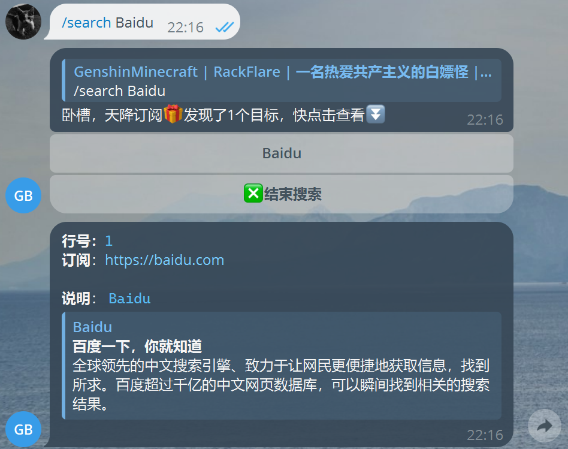

# SubManager 的搭建和使用

## 前言

SubManager 是一个由 adm1nSQL (来自 Telegram 的一位熟人?) 开发的基于 Telegram Bot 的开源订阅管理平台，可以方便、快捷地管理你的订阅，非常适合订阅多的人使用

虽然是一个比较老的项目 (你猜为什么我要写它) ，但还是非常好用的

我的一位朋友继续开发了这项目，但是并不开源，比起原版拥有了更多的功能，But WE DO NOT LOVE OPEN-SOURCE

你只需要: 
1. 一台机器 (直连/代理至 Telegram)
2. 一个 Telegram 账号

## 搭建

搭建非常简单，仅需要安装简单的环境即可，以 Ubuntu 20.04 为例

```
apt install -y python3-pip git
```

然后拉取项目:

```
git clone https://github.com/adm1nSQL/Sub_Manger.git && cd Sub_Manger
```

配置 Pypi 模块: 

```
pip3 install -r requirements.txt
```

前往 `@Bot_Father` 获取一个 Bot 的 BOT_TOKEN，这里不再赘述

然后获取你的 Telegram ID，部分第三方 Telegram 客户端有这一功能，你也可以通过 `@getmyid_bot` 进行查询

第一次启动: 

```
python3 main.py -s [超级管理员的 Telegram ID] -a [普通管理员的 Telegram ID] -t [BOT_TOKEN]
```

需要注意的是，[普通管理员的 Telegram ID] 可以填写你朋友的 Telegram ID，这样他也会有权限使用这一 Bot，使用 `,` 分割

请注意，也要把超级管理员的 Telegram ID 填入 [普通管理员的 Telegram ID] 处

## 使用

接下来就可以开始使用了！

命令教程: 

```
    1. 添加数据：/add url 备注
    2. 删除数据：/del 行数
    3. 查找数据：/search 内容
    4. 修改数据：/update 行数 订阅链接 备注
    5. 导入xlsx表格：发送xlsx或xls表格（注意文件格式！A列为订阅地址，B列为对应的备注）
    6. 备份数据库：私聊发送 /backup ，该功能仅限超级管理员
    7. 日志输出： 私聊发送 /log ，该功能仅限超级管理员
```

简单好用爱用



## 结尾

如果你有兴趣，可以看看我的 Fork 的修改版: <https://github.com/GenshinMinecraft/Sub_Manger>

相比原版多了一些功能，比如查询订阅信息之类的

