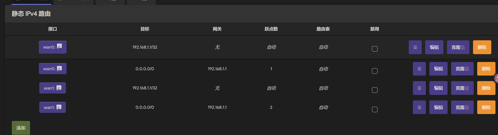

# 记一次家庭网络更新 2000mbps

Hi，这里是 GenshinMinecraft

## 前言

初中后升上高中的最后一个暑假，看着家里全千兆的网络设备，气急败坏

还需要一个家庭 NAS 系统，遂由此文。

先介绍下原有的家庭网络系统：

- 光猫拨号，用着**老掉牙的旧光猫**，很怀疑是否可以跑满 1000M，从 500M 升级到 1000M 的，咨询客服后得知理论可跑 1000M，但是由于是免费升级不保证速率。日常测速 800M
- 光猫下接两个路由，Xiaomi BE3600 Pro + Redmi AX6s (老演员了)
- 路由下接入 R4s，也是老掉牙的东西，跑**现代的代理**几乎不太可能，只能当个小服务器用，千兆对他来说都是灾难

这套虽然说不是不能用，R4s 跑小服务的性能和功耗也都十分够看，但是都暑假了，还闲的没事，直接上

## 再接一条宽带

咨询移动客服，广西/全国移动现在有一个业务 (不是套餐)，大概如下:

- 资费: 26RMB/月
- 宽带: 1000M，有 90% 速率保证 (跑不满 900M 算故障的意思)
- 机顶盒: 免费送一个，不包含机顶盒会员
- 安装费: 100RMB 一次性
- 合约: 三年
- 光猫/网线/光纤 已包含

其实还是很便宜的，不过你要说贵州的那个 8R/月的 1000M 那我没话说 (据说暴毙了)

第一次移动师傅来的时候，是想在原有的开发商预留的管道内部再拉一条光纤到这栋楼的分光器，可惜的是**没有成功**，只好退单，这个计划又被搁置了一个月

第二次来的移动师傅明显专业许多，直接上分光器，从原有的光猫的光纤上分出两条，**完成了配置**

顺手还把原有的光猫升级了一手，两个同型号的光猫

美中不足就是我这个光猫是 **tewa-7160a**，后台配置少的可怜，仍旧是光猫拨号，甚至**连网段 IP 也无法修改**，为后面买了个大雷

不过两条宽带的速率都是**达标**的，可能是由于仍然是 1000mbps 的网口，仍然只能跑 950mbps，还是没有多播的情况下，只能这样了 (就算是路由器拨号也被物理限制)

最坑人的是光猫，以前的光猫我都早破解并有超级密码了，这光猫网络上**几乎没有资料**，均无可用的，也不想去闲鱼买超级密码，就先这样吧

## 电视盒子

送的电视盒子型号是来自海信的贴牌 **IP810N**，该机器采用**海思 MV320** 的芯片，拆机如下

主板上留有 ttl 接口，可直接用海信的 HiTool 刷机，不过确实挺累的，晚上十点刷机刷到早上五点

刷完即为正常的安卓系统

不过这盒子也砍了很多东西，只有 100mbps 的网口，无 Wi-Fi 支持，**刀法厉害得很**

值得一提的是移动这个盒子的**做工以及散热非常好**

有覆盖大面积的铝片 (应该是铝吧) 和散热垫，日常使用完全不用担心过热

海思 **MV320** 的性能还是很 OK 的，Kodi 播放器硬解码 NAS 中的 40GB 天气之子 4K 60fps HEVC MKV 完全无压力，HDR / 4K@60Hz / 5.1 声道输出完全正常工作

刷机其实建议直接 TTL 刷机，比什么卡刷的成功概率高了一大倍

## 软路由

给 R4s 卖了，买了个 EasePi R1 PRO，完全满足我现有的需求，购入价 480RMB

8+32 的配置比原来的 EasePi R1 PRO 翻了一倍，估计是工厂测试机，价格也很可以

两个 1000mbps 和两个 2500mbps 电口，可惜没有 SFP+

刷了官方的 iStoreOS，使用上还是可以的，我对软路由的工作就是:

- DHCP 主路由
- 链路聚合
- 运行 HomeBox 测速服务器
- 也许会跑 miaospeed

其实没必要上这么高配置的软路由，8G 内存日常 10% 占用都没有，后续可能跑点其他服务

光猫留下的大坑来了，由于我的两个千兆网口连接到了光猫，并从光猫 DHCP IP，获取到的**都是** 192.168.1.0/24 网段下的 IP，导致 MWAN3 在正常配置链路聚合的情况下，**只会认定为两个网口接入了同一个网关** (实际是两个)，只能跑其中一台光猫·

很气啊，去研究了一下 MWAN3 的逻辑，原来的大坑有个问题，自动分配了 `192.168.1.0/24 dev eth0` 和 `192.168.1.0/24 dev eth1`，这样他们就是**主备关系**而不是**链路聚合**

只能按照下面的方式修改:

- 改为固定 IP，只能分配 `192.168.1.3/32 dev eth0` 和 `192.168.1.5/32 dev eth1`
- 必须设置 `net.ipv4.conf.ethX.rp_filter = 2`，开放 rp_filter
- 在 OpenWrt 的路由添加`静态 IPv4 路由`，设置转发路径和网关 `192.168.1.1` 和掩码 `255.255.255.255` 
    
- 随后正常配置 MWAN3

太坑了这个玩意，不过效果还是很好的，聚合后测速如下 (应该不是极速，必须要开代理，国内测速服务器均跑不到这个速度):

大概就是 1000+1000=1766，知足了

至于上传，管他呢！

在这里我要点赞一下 Xiaomi BE3600 Pro 路由器，它自带的双 WAN 链路聚合功能完全不需要上述麻烦的配置，两条宽带接入，不用配置即可自动识别并且使用，不会出现因为网段一致而无法聚合的问题，爆赞

## NAS

NAS 是这次支出的重头戏，所有的网络设备基本上都是为了这套 NAS 搭配的

下面是配置:

- 主板 B150 Gaming K4 116R
- CPU i37100T 20R
- 电源 500GT 40R
- 网卡 8125 15R
- RAID 2208 55R
- 风扇 12cm*7 23R
- 散热 9.8R 
- 机箱 半岛铁盒 F20 187R
- 硬盘 2T\*4 3T\*2 6t\*4 4300R
- 内存 8G DDR4 顺手的事
- 线材 50R

总共 4816R

硬盘方面，2T\*4 和 3T\*2 都是 SAS 盘，剩下的 6t\*4 是 SATA

用的是 FnOS，虽然前不久才暴雷安全问题，但是国产的 NAS 系统确实有且只有这玩意能用，TrueNas 和黑群晖啥的我也懒得折腾，直接梭哈了

- 最大的 6t\*4 当然是存重要的照片资料啥的，组成 RAID5，**绝对不能丢**，所以和夸克网盘做同步
- 2T\*4 存放**游戏** (iSCSI 到我的电脑)，一些小东西，有的时候作为临时盘，组成 RAID5
- 3T\*2 组成 RAID0，跑 BT，放临时文件，不重要的就丢上面

用起来还是很不错的，不过随便哪一个阵列都是可以**榨干**所有的网络带宽的，可惜这次没有全升级 10gbps 网路

这台机器不得不说也是**电老虎**，满载功耗 150W，由于 SAS 盘无法休眠，待机功耗也有 130W，满载也要 150W，一个星期需要 15R 左右的电费，不过可以接受。至少 SATA 6t\*4 可以休眠，存的也都是静态数据，不太经常读写，所以可以接受

这台机器完全可以榨干软路由性能，运行外网下载服务可完全保持在 230MB/s 的速度上:

此时软路由占用如下:

不太能接受啊，RK3568 转发性能还是不行，也许是链路聚合的锅

我家的 miaospeed 运行在 NAS 上，测速也是无压力: (ikuuu 太好用了+人们，打打广告费)

## 光纤

上面的设备都是满足 2.5G 内网的需求的，但是我的房间距离客厅 / 弱电箱距离实在**过于遥远**，Wi-Fi 用现有的设备 Mesh 到我房间最多只有 600mbps，实在是难以接受

再买一台高性能 Wi-Fi 路由器到我的房间明显不太可能，Wi-Fi 7 设备在国内还是残血的，所以直接**光模块**方案

总成本 200RMB 左右，包括以下设备

- 四电口 2.5g + 10g SFP+ 交换机 * 2 (原先已有一台)
- SC-SC 光纤
- LC 单纤单模模块一对
- SC-LC 法兰

虽然肯定是要走明线的，但是由于是隐形光纤，平常在家也不会看得见，属于可接受范畴

10G 的光模块跑 2.5g 也是轻轻松松了，光纤入房间后接入原有的 Xiaomi BE3600 Pro 路由器，Wi-Fi 7 性能在近距离跑没毛病的

## 整体布局

弱电箱不要问为什么有瓶水，光纤买长了没地方卷，找个瓶子卷起来（（（

## 买新机

全屋 Wi-Fi 7 + 2.5g 肯定要有设备用啊，我的设备是 R7000P，配的网卡 7925 虽然是低配版，跑 2G 还是没压力的

手机方面是 K90 Max，同样支持 2.4G+5G 的 Wi-Fi 7，跑 2G 也没毛病

我爸在用 OPPO Find N2，只有 Wi-Fi 6，近期没换机想法，不管了

我妈从原先的 Huawei Mate 50 换到了 Redmi K100 Pro，提升巨大，支持 Wi-Fi 7，顺带第一次体验了 5G (哇哇哇哇哇哇卡脖子)

## 小结

就这样吧，高中前最后一次升级，高中阶段估计也没时间去搞这堆玩意，回家都没多少时间