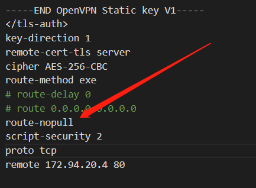
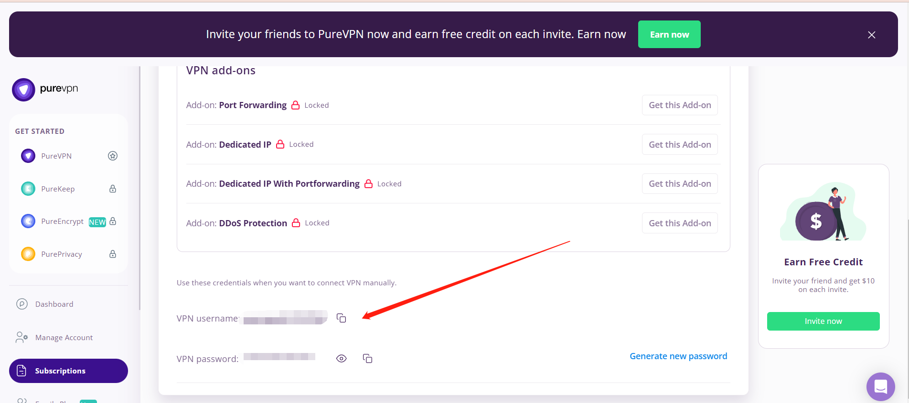
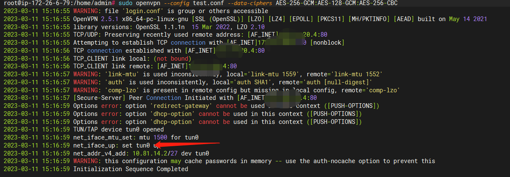

# 在 VPS 中使用 OPENVPN 内置代理

本文由 `High Ping Network` 的小伙伴 Aries 进行编撰，首发于 [Telegram @aries_init](https://t.me/aries_init)

本文的示例 OpenVPN 提供商为 `PureVPN`

## 感谢
- OpenAI 的 `ChatGPT` **太强了！**解决了大部分问题！
- `PureVPN` 为本文的示例服务提供商

## 步骤
大致可分为三步：

1. 修改 `PureVPN` 下发的conf文件(修改路由)

2. 安装配置 `OpenVPN`

3. 修改 `Xray(R)` 的 `outbound` 路由

## 修改 PureVPN 的 conf 文件

1. 去 PureVPN 下载配置文件 (选择 `OpenVPN TCP` 类型，`UDP` 貌似也可以，只要是 `OpenVPN` 配置文件就行)

2. 修改 conf 文件，**重点是修改他的路由 route**

    注意修改为 route-nopull 意味着路由需要手动配置，原来的意思是接管全局。

    

3. 上传配置文件到VPS，这里我命名为 test.conf

官方给的二进制文件虽然方便，但是*默认他的接管路由是全局*，包括 22(SSH) 端口，使得我们的*机器失联，因此需要手动配置。*

## 安装配置 OpenVPN
1. 使用 **软件包管理器** 安装 `OpenVPN` (不同系统请自行查询安装方法) 
    ```
    sudo apt-get install openvpn
    ```
2. 写一个 login.conf 文件 (Fron OpenAI)
    
    login.conf 是一个文本文件，用于存储您的 PureVPN 帐户的**用户名和密码**。可以按照以下步骤编写 login.conf：

    创建一个新文件并将其命名为 login.conf。

    打开 login.conf 并在第一行输入您的 `PureVPN` 用户名，然后在第二行输入您的 `PureVPN` 密码。例如：

    ```
    myusername
    mypassword
    ```

    请注意，您应该将实际的用户名和密码替换为 `myusername` 和 `mypassword`。

    保存并关闭文件。

    确保 login.conf 文件的权限设置为仅限当前用户可读写，使用以下命令更改其权限：

    ```
    chmod 600 login.conf
    ```

    这将确保只有您自己可以读取和写入文件。

    请注意，login.conf 中的用户名和密码**应与您在 PureVPN 网站上注册的凭据相同**。如果您不确定自己的用户名和密码，可以登录 `PureVPN` 网站并在账户资料中查找它们。

    补充: `PureVPN` 授权账号页面

    

3. 连接 OpenVPN

    ```
    sudo openvpn --config test.conf --data-ciphers-fallback AES-256-CBC
    ```

    注意：

    该警告消息指出，在未来的 `OpenVPN` 版本中，选项 `--cipher` 将被忽略，因此建议使用 `--data-ciphers` 选项进行加密算法的协商。

    更改 `--cipher` 选项：你也可以通过更改 `OpenVPN`命令中的 `--cipher` 选项来消除警告消息

出现 `Init...` 说明连接成功了，此时会创建一个tun0的虚拟网卡


> 此处 Aries 使用了 `Screen` 来进行示例保活，但本博客有更好的有关于 `Screen` 的文章，请参阅 <https://blog.c1oudf1are.eu.org/p/screen/>

## 配置路由 (Xray/XrayR)
### 配置 Xray 路由
模板配置
```
{
    "api": {
      "services": [
        "HandlerService",
        "LoggerService",
        "StatsService"
      ],
      "tag": "api"
    },
    "inbounds": [
      {
        "listen": "127.0.0.1",
        "port": 62789,
        "protocol": "dokodemo-door",
        "settings": {
          "address": "127.0.0.1"
        },
        "tag": "api"
      }
    ],
    "outbounds": [
      {
        "protocol": "freedom",
        "settings": {
            "domainStrategy": "UseIPv4"
          },
          "streamSettings": {
            "sockopt": {
                "tcpFastOpen": true,
                "interface": "tun0"
            }
          },
          "mux": {
            "enabled": false,
            "concurrency": 8
          }
      },
      {
        "protocol": "blackhole",
        "settings": {},
        "tag": "blocked"
      }
    ],
    "policy": {
      "system": {
        "statsInboundDownlink": true,
        "statsInboundUplink": true
      }
    },
    "routing": {
      "rules": [
        {
          "inboundTag": [
            "api"
          ],
          "outboundTag": "api",
          "type": "field"
        },
        {
          "ip": [
            "geoip:private"
          ],
          "outboundTag": "blocked",
          "type": "field"
        },
        {
          "outboundTag": "blocked",
          "protocol": [
            "bittorrent"
          ],
          "type": "field"
        }
      ]
    },
    "stats": {}
}
```

重点是 `outbounds` 那一块，大体可以解释为流经 Xray 的流量都会移交到 TUN0 这个虚拟网卡处理

### 配置 XrayR 路由
首先你先要确保你的 XrayR 的主配置文件使用自定义的配置

要修改的配置有两个

一个是 `custom_outbound.json` 主管流量出口

另一个是 `route.json` 主管路由

我们使用 `OpenVPN` 创建了一个名称为 `tun0` 的虚拟网卡

需要在流量传入后进行处理使得被处理的流量由 `tun0` 流出，而流出则需要指向即修改路由。

因此我们需要修改出口文件与路由文件 (注意各 TAG 要对应)

#### custom_outbound.json 配置
```
[{
        "tag": "pure",
        "protocol": "freedom",
        "settings": {
            "domainStrategy": "UseIPv4"
          },
          "streamSettings": {
            "sockopt": {
                "tcpFastOpen": true,
                "interface": "tun0"
            }
          },
          "mux": {
            "enabled": false,
            "concurrency": 8
          }
    },
    {
        "protocol": "blackhole",
        "tag": "block"
    }
]
```

#### route.json 配置
```
{
    "domainStrategy": "IPOnDemand",
    "rules": [
        {
            "type": "field",
            "outboundTag": "block",
            "ip": [
                "geoip:private"
            ]
        },
        {
            "type": "field",
            "outboundTag": "block",
            "protocol": [
                "bittorrent"
            ]
        },
        {
            "type": "field",
            "outboundTag": "pure",
            "network": "udp,tcp"
        }
    ]
}
```

欢迎加入 High Ping 大家庭:
- [官网](https://highp.ing)
- [Blog](https://blog.c1oudf1are.eu.org)
- [@HighPingNetwork](https://t.me/HighPingNetwork)
- [@HighPingChat](https://t.me/highpingchat)