# 对于博客而言的 Markdown 写作规范

本文由 `High Ping Network` 的小伙伴 GenshinMinecraft 进行编撰，首发于 [本博客](https://blog.c1oudf1are.eu.org)

**本文会严格地按照 `本文所讲述的 Markdown 规范` 进行编写**

## 关于 Markdown
> Markdown是一种轻量级标记语言，排版语法简洁，让人们更多地关注内容本身而非排版。它使用易读易写的纯文本格式编写文档，可与HTML混编，可导出 HTML、PDF 以及本身的 .md 格式的文件。因简洁、高效、易读、易写，Markdown被大量使用，如Github、Wikipedia、简书等。———— [Markdown 官方教程](https://markdown.com.cn/basic-syntax/) 

由于其可以**快速转化成为** `Html` 等基本文件格式，广泛地被博客程序所采用。在如今，**大部分的博客用的都是基于 Markdown 的编辑器**

也许是 `可视化编辑器`，也有可能是像我一样使用 `Vim` 或者 `Visual Studio Code` 进行写作的

现在的大部分博客程序，都采用了 `Markdown` 进行渲染 `Html`
- Hugo: 本博客所使用的就是 `Hugo`
- Hexo: 与 `Hugo` 类似的纯 `Html` 博客程序
- WordPress: 一款 `PHP` 博客程序，为**最受欢迎的网站内容管理系统**
- Typecho: 也是一款 `PHP` 博客程序，也被广泛地运用在个人博客上

正确地编写博客，让阅读者有*更好的阅读体验*，是内容创作者的工作之一
> PS: 各大搜索引擎也会根据用户浏览体验来进行排名的微调

## 规范
### 适当的空格与大写

可能很多内容创作者都没有意识到这一点，我们需要在 **英文/数字与汉字** 之间输入恰当的空格

正确示范: 
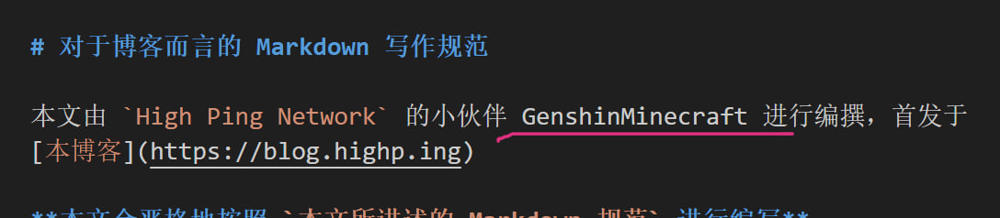

错误示范: 
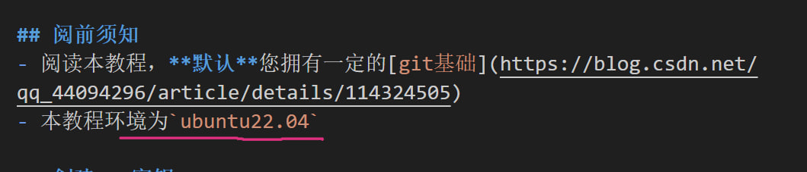
上图应改为 `本教程环境为 Ubuntu 22.04`

一般的，大部分单词开头首字母**都应该大写**，当数字与字母连接时，也应该使用空格！

### 适当的高亮

高亮不是随便整的，一般用于比较需要重点突出的文字
#### 需要高亮的地方
一些专有名词，比如本文的 `High Ping Network`

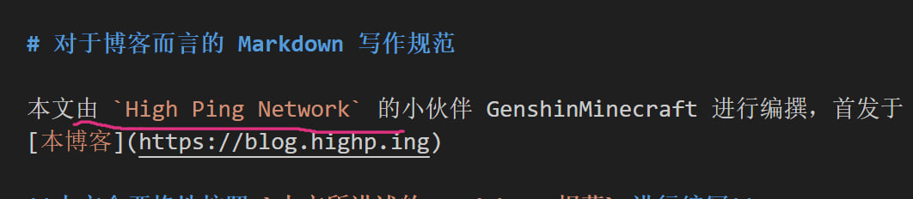

或是一些介绍的对象，都应当有适当的高亮，不然会造成阅读困难，让读者抓不住重点
#### 无需高亮的地方
不需要高亮的地方，有列表和标题

列表所介绍的东西，前面不需要，后面需要

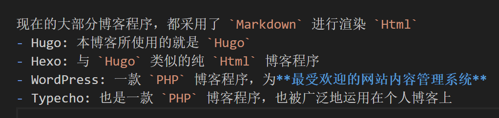

当列表没有对每个项目的介绍时 (可以想象为无冒号)，全都不需要高亮

### 图片的用法
图片的基本 `Markdown` 语法为
```Markdown

```

其中，`FileName` 并不重要，重要的是 `Alt text`

应当在 `Alt text` 中写一些关于这张图片的信息，简单介绍即可

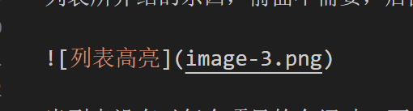

### 标题的递进

千万，千万不要乱递进标题

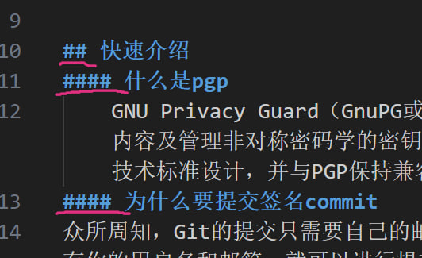

上面的图片 从两个#，直接跳到四个#了

这样的递进可能对你的行文有所帮助，但是**非常不符合规范**，而且在部分有生成目录功能的博客软件中，**目录可能会变得非常奇怪**

### 标点符号
#### 无需出现的标点符号
这里以中文的标点符号作为演示

在每一句话的*结尾*，当不需要强调突出的时候，尽量避免出现*句号与逗号*

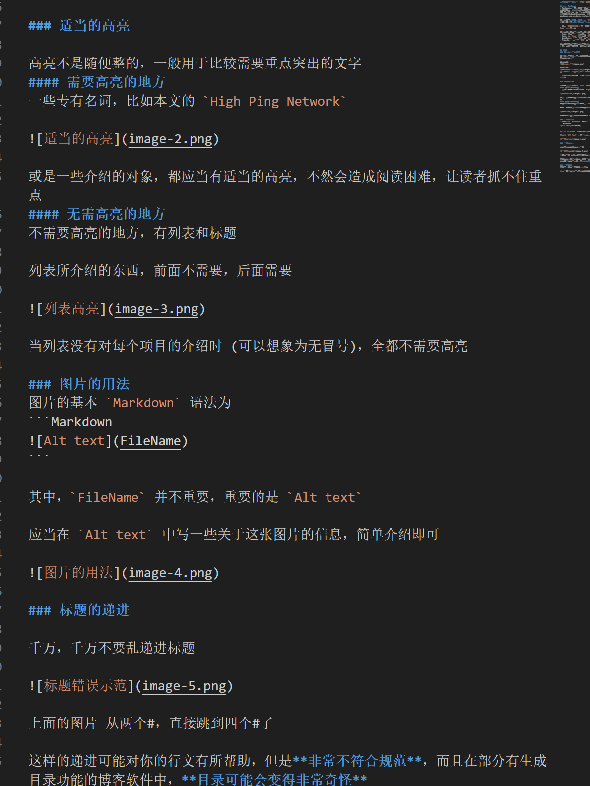

可以看到，本文每一段的结尾，从来都没有句号与逗号

**但是可以出现感叹号、省略号等具有突出强调作用标点**

#### 英文标点符号
由于 `Markdown` 的解析原因，请不要使用 **除了逗号句号以外的中文符号**，或者叫它们全角符号

这会导致不同的 `Markdown 解析器` 出现不同的结果

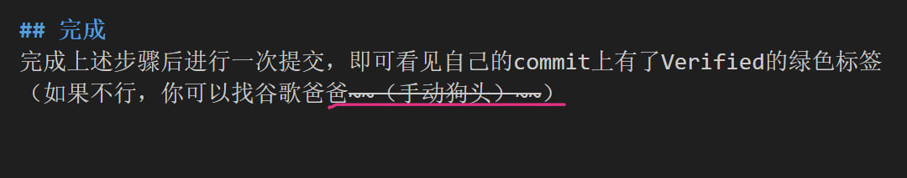

上图中的删除线，在不同的 `Markdown 解析器` 中出现了不同的结果:
- VSCode: 可以正常显示删除线
    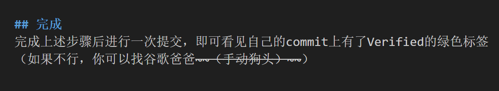
- Hexo: 可以正常显示删除线
    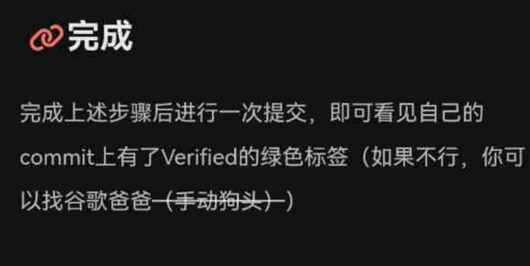
- Hugo: 无法正常显示删除线
    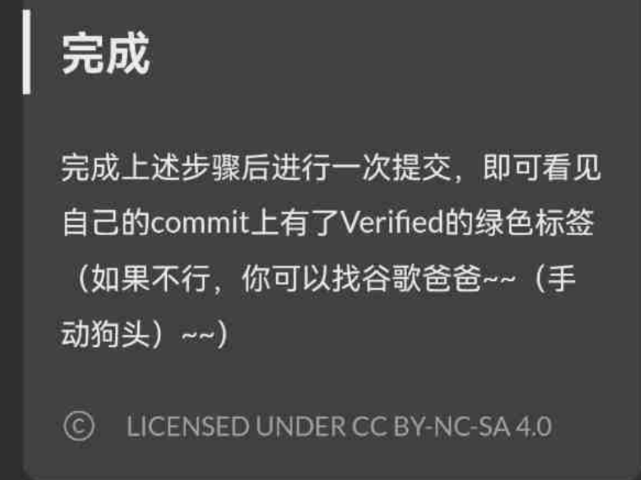

我们也可以从上图的比较中看出，使用全角标点符号会有不可预想的后果

所以，这里列出一些建议使用 `英文标点符号`:
- 冒号: 使用半角符号时候，一般需要在 半角冒号后加一个空格
    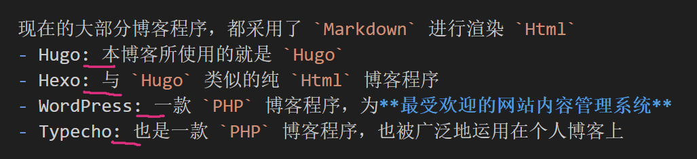
- 括号
- 下划线
- 连字符
- 其他的不常用符号 (如 `~ | \ / 等`)

### 列表
`Markdown` 的列表分为两种，`有序列表` 和 `无序列表`，最常使用的时无序列表

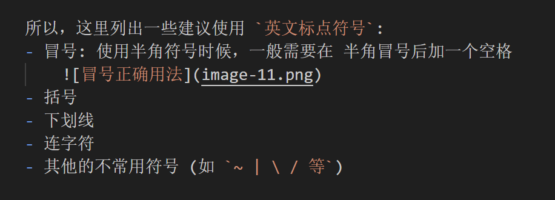

在定义一个有序列表时，建议使用 `数字.` 的形式

正确示范:

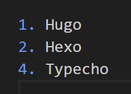

错误示范: 

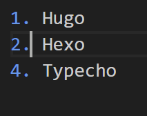

虽然是错误的示范，但是 `Markdown` 会自动帮我们纠正 (部分 `Markdown 解析器` 无此功能)

显示效果:

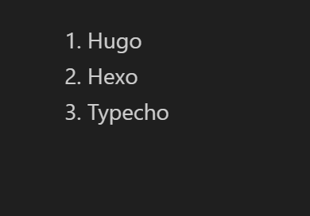

### 引用
`Markdown` 有一个专门用来引用的语法，那就是 `>`

比如:

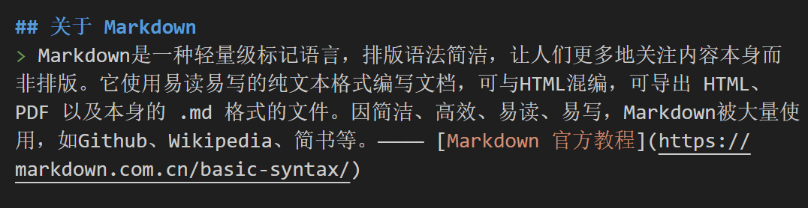

请不要简单地使用一个 `Tab` 进行引用，这样的引用会产生歧义

错误示范:

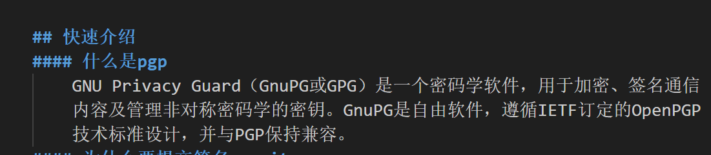

## 小结

上文提到的就是我们在使用 `Markdown` 进行内容创作时需要注意的地方，更全面的 `Markdown` 教程可以在 [Markdown 官方教程](https://markdown.com.cn/basic-syntax/) 查阅

本文收录的一些写作规范也是我平常在写作中经常遇到的，我也会帮助 `High Ping Network` 的伙伴们进行适当的修改，才可以发布到博客上

欢迎加入 High Ping 大家庭:
- [官网](https://highp.ing)
- [Blog](https://blog.c1oudf1are.eu.org)
- [@HighPingNetwork](https://t.me/HighPingNetwork)
- [@HighPingChat](https://t.me/highpingchat)