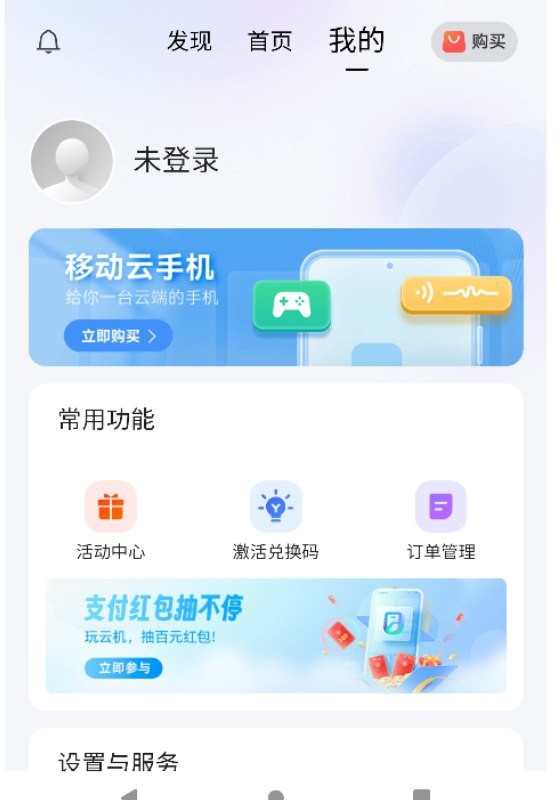
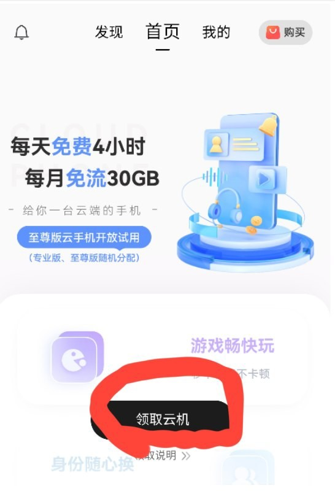

# 每日白嫖免费移动云手机

本文由 `High Ping Network` 的小伙伴 GenshinMinecraft 进行编撰，首发于 [本博客](https://blog.highp.ing)

## 前言

> 中国移动云手机是云端运行的虚拟手机，可通过实体手机操控，实现一台手机变多台。云手机是实体手机的延伸，同样可以聊天、玩游戏、看电影，还具备副号通话、应用多开等特色功能。

如果你玩过云游戏、云电脑等，应该很好理解

移动云手机每天免费 **4 小时**，而且有很多优点: 
- 如果是移动网络环境，延迟非常低
- 移动号码有 **30GB** 移动云手机免流
- 配置高，且**有几率开到更高配版**
- 云手机内网络环境好，各大游戏下载可以跑到 1000mbps

当然，也有缺点:
- 非移动还是别凑合了
- 四个小时后，数据会清零
- 仅支持安卓和网页版客户端

不过，缺点都是小事情，平常出门在外没电脑，打个崩铁还是可以的

就是要重新下载+重新登录

## 获取

获取也是十分简单，本教程以网页版为例子

首先打开[中国移动云手机官网](https://cpactiv.buy.139.com/#/fourthQuarter/getCloudPhone?code=LO6ABCG3NT0&fromHelp=true&channelSrc=Q4-help) (附带我的AFF，新用户可领取七天长期云手机)

登陆的步骤就不说了，用移动号码接收验证码即可

返回主页，点击 `领取云机`-`立即启用云手机`

马上就可以进入到云手机界面了

当你想使用云手机时，重新返回移动云手机官网再领取即可

## 小结

这个移动云手机的活动已经很久了，~~没事又水一篇博客而已~~

平时在外面玩点小游戏还是不错的，延迟表现从物理上就比其他云手机优秀多了，流畅度由于目前人不是很多，所以没有感觉到卡顿

欢迎加入 High Ping 大家庭:
- [官网](https://highp.ing)
- [Blog](https://blog.highp.ing)
- [@HighPingNetwork](https://t.me/HighPingNetwork)
- [@HighPingChat](https://t.me/highpingchat)